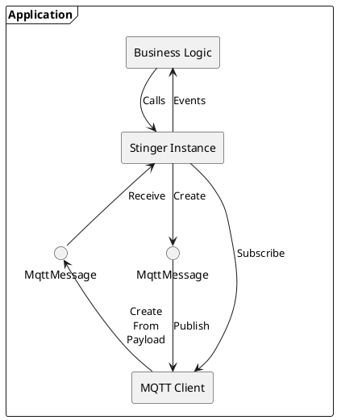
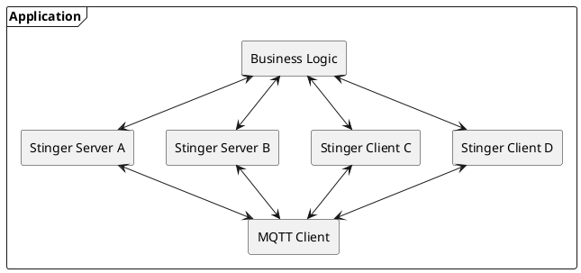
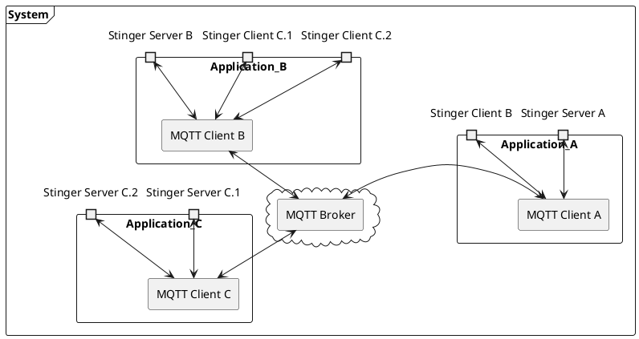

# Stinger-IPC Architecture

This document attempts to explain some of the design decisions of Stinger-IPC

## Code Application Architecture

This diagram illustrates the major components of an application.:

* **MQTT V5 Client** provides an efficient connection to an MQTT V5 Broker.  The application configures and creates an MQTT Client, and provides it to the Stinger instance.  The MQTT Client does not impose specific message formats or patterns.
* **MqttMessage** structure instances are used to convey either a received message or a message to be published.  It contains a topic, payload, and MQTTV5 Properties.
* **Stinger Instance** either provides (server) or utilizes (client) functionality to the application's business logic.  Payload serializations, data structures, API patterns (request/response, signals, etc) are implemented at this level.  Controlling how MQTT features are used (retain, QoS, MQTTv5 Properties) is also implemented at this level.  The Stinger Instance provides a language-idiomatic interface to the business logic.
* **Business Logic**  is the heart of the application, and uses the Stinger Interface to provide or utilize functionality to/from other applications.

An application can provide and/or utilize multiple Stinger Interfaces, with only a single MQTT Client, as the following diagram shows.  There may also be multiple instances of the same client or server interface.  

## System Design

A system typically has multiple applications, and Stinger IPC is the framework that allows inter-process communications between them.  

There may be multiple instances of the same Stinger Server or Stinger Client.  For example, if there is a Stinger Interface for an LED, an LED controlling application may provide multiple instances of the LED Stinger Server, one for each LED.  

## Multi-System Design

The Stinger-IPC project does not strictly define how to link multiple systems together so that applications can communicate with each other.  Doing so is somewhat problematic because of the potential for the multiple systems to not be aligned on interfaces or the revision thereof.

## Interface Design

To be written: Signals, Methods, Properties

## Interface Definition

To be written: Link to how the YAML is written and JSON Schema

## Discovery

To be written: How a Stinger Server publishes to the broker that it is providing some service functionality, and how utilizers of that service can discovery the availability of one or more instances of that service.
