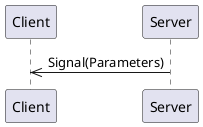
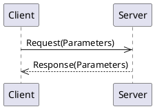

# _Example_ API Overview 

## Signals

Signals are messages from the server to clients.

### todayIs

#### Signal Parameters

|Name|Type|Description|
|----|----|-----------|
|dayOfMonth|integer||
|dayOfWeek|[Enum DayOfTheWeek](#enum-DayOfTheWeek)||

## Methods

Methods are requests from a client to a server and the server provides a response back to the client:

### addNumbers

#### Request Parameters

|Name|Type|Description|
|----|----|-----------|
|first|integer||
|second|integer||
|third|integer (optional)||

#### Return Parameters

The return parameter type is `integer`.

### doSomething

#### Request Parameters

|Name|Type|Description|
|----|----|-----------|
|aString|string||

#### Return Parameters

|Name|Type|Description|
|----|----|-----------|
|label|string||
|identifier|integer||
|day|[Enum DayOfTheWeek](#enum-DayOfTheWeek)||

## Properties

### favorite_number

|Name|Type|Description|
|----|----|-----------|
|number|integer||

### favorite_foods

|Name|Type|Description|
|----|----|-----------|
|drink|string||
|slices_of_pizza|integer||
|breakfast|string (optional)||

## Enums

### Enum `DayOfTheWeek`

 * Sunday (1)
 * Monday (2)
 * Tuesday (3)
 * Wednesday (4)
 * Thursday (5)
 * Friday (6)
 * Saturday (7)

## Structures

### Struct `Lunch`

|Name|Type|Description|
|----|----|-----------|
|drink|boolean||
|sandwich|string||
|crackers|number||
|day|[Enum DayOfTheWeek](#enum-DayOfTheWeek)||
|order_number|integer (optional)||
