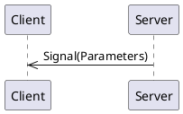
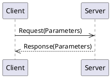
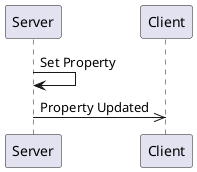

# _Full_ API Overview


## Signals

Signals are messages from the server to clients.



### Signal `todayIs`

_No documentation for this signal_

#### Signal Parameters for `todayIs`

| Name          | Type     |Description|
|---------------|----------|-----------|
|   dayOfMonth  | integer  ||
|   dayOfWeek   |[Enum DayOfTheWeek](#enum-DayOfTheWeek) (optional)||

#### Code Examples

<details>
  <summary>Python Client</summary>

```python
@client.receive_today_is
def on_today_is(dayOfMonth: int, dayOfWeek: stinger_types.DayOfTheWeek | None):
    print(f"Got a 'todayIs' signal: dayOfMonth={ dayOfMonth } dayOfWeek={ dayOfWeek } ")
```

</details>

<details>
  <summary>Rust Server</summary>

```rust
server.emit_today_is(42, Some(connection::payloads::DayOfTheWeek::Monday)).await;
```

</details>


## Methods

Methods are requests from a client to a server and the server provides a response back to the client:




### Method `addNumbers`

_No documentation for this method_

#### Request Parameters
| Name          | Type     |Description|
|---------------|----------|-----------|
|     first     | integer  ||
|     second    | integer  ||
|     third     | integer   (optional)||

#### Return Parameters

The return value type is `integer`.

### Method `doSomething`

_No documentation for this method_

#### Request Parameters
| Name          | Type     |Description|
|---------------|----------|-----------|
|    aString    |  string  ||

#### Return Parameters


| Name          | Type     |Description|
|---------------|----------|-----------|
|     label     |  string  ||
|   identifier  | integer  ||
|      day      |[Enum DayOfTheWeek](#enum-DayOfTheWeek)||

## Properties

Properties are values (or a set of values) held by the server.   They are re-published when the value changes. 



### Property `favorite_number`

My favorite number


| Name          | Type     |Description|
|---------------|----------|-----------|
|     number    | integer  ||

### Property `favorite_foods`

_No documentation is available for this property_

| Name          | Type     |Description|
|---------------|----------|-----------|
|     drink     |  string  ||
|slices_of_pizza| integer  ||
|   breakfast   |  string   (optional)||

### Property `lunch_menu`

_No documentation is available for this property_

| Name          | Type     |Description|
|---------------|----------|-----------|
|     monday    |[Struct Lunch](#enum-Lunch)||
|    tuesday    |[Struct Lunch](#enum-Lunch)||


## Enums

### Enum `DayOfTheWeek`

<a name="Enum-DayOfTheWeek"></a>The days of the week.

* Sunday (1)
* Monday (2)
* Tuesday (3)
* Wednesday (4)
* Thursday (5)
* Friday (6)
* Saturday (7)


## Structures

Structures are a group of values and may be used as an argument in signals, methods, or properties.  Defining a structure allows for easy reuse.

### Struct `Lunch`

<a name="Struct-Lunch"></a>_No general description exists for this structure_

| Name          | Type     |Description|
|---------------|----------|-----------|
|     drink     | boolean  ||
|    sandwich   |  string  ||
|    crackers   |  number  ||
|      day      |[Enum DayOfTheWeek](#enum-DayOfTheWeek)||
|  order_number | integer   (optional)||
