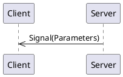
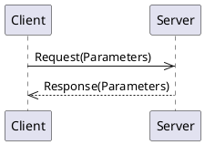
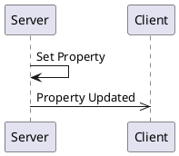

# _Full_ API Overview 

## Signals

Signals are messages from the server to clients.

### todayIs

_No documentation for this signal_

#### Signal Parameters

|Name           |Type      |Description|
|---------------|----------|-----------|
|   dayOfMonth  | integer  ||
|   dayOfWeek   |[Enum DayOfTheWeek](#enum-DayOfTheWeek)||

## Methods

Methods are requests from a client to a server and the server provides a response back to the client:

### addNumbers

_No documentation for this method_

#### Request Parameters
| Name          | Type     |Description|
|---------------|----------|-----------|
|     first     | integer  ||
|     second    | integer  ||
|     third     | integer   (optional)||

#### Return Parameters

The return value type is `integer`.

### doSomething

_No documentation for this method_

#### Request Parameters
| Name          | Type     |Description|
|---------------|----------|-----------|
|    aString    |  string  ||

#### Return Parameters

| Name          | Type     |Description|
|---------------|----------|-----------|
|     label     |  string  ||
|   identifier  | integer  ||
|      day      |[Enum DayOfTheWeek](#enum-DayOfTheWeek)||
## Properties

Properties are values (or a set of values) held by the server.   They are re-published when the value changes. 

### favorite_number

_No documentation for this property_

| Name          | Type     |Description|
|---------------|----------|-----------|
|     number    | integer  ||

### favorite_foods

_No documentation for this property_

| Name          | Type     |Description|
|---------------|----------|-----------|
|     drink     |  string  ||
|slices_of_pizza| integer  ||
|   breakfast   |  string   (optional)||

### lunch_menu

_No documentation for this property_

| Name          | Type     |Description|
|---------------|----------|-----------|
|     monday    |          ||
|    tuesday    |          ||

## Enums

### Enum `DayOfTheWeek`

_No description exists for this enumeration._

* Sunday (1)
* Monday (2)
* Tuesday (3)
* Wednesday (4)
* Thursday (5)
* Friday (6)
* Saturday (7)

## Structures

Structures are a group of values and may be used as an argument in signals, methods, or properties.  Defining a structure allows for easy reuse.

### Struct `Lunch`

_No general description exists for this structure_

| Name          | Type     |Description|
|---------------|----------|-----------|
|     drink     | boolean  ||
|    sandwich   |  string  ||
|    crackers   |  number  ||
|      day      |[Enum DayOfTheWeek](#enum-DayOfTheWeek)||
|  order_number | integer   (optional)||
