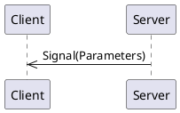
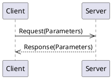
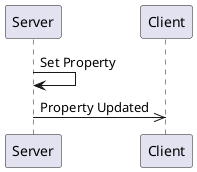

# _Fully Featured Example Interface_ API Overview 
_Example StingerAPI interface which demonstrates most features._


[[_TOC_]]

## Connections

A connection object is a wrapper around an MQTT client and provides specific functionality to support both clients and servers.
Generally, you only need one connection object per daemon/program, as it can support multiple clients and servers.  

### Connection code Examples

<details>
  <summary>Python</summary>

```python
from connection import MqttBrokerConnection, MqttTransportType, MqttTransport

transport = MqttTransport(MqttTransportType.TCP, "localhost", 1883) # Or: MqttTransport(MqttTransportType.UNIX, socket_path="/path/to/socket")
connection_object = MqttBrokerConnection(transport)
```

The `connection_object` will be passed to client and server constructors.

</details>

<details>
  <summary>Rust</summary>

Rust implementations use the [MQTTier](https://crates.io/crates/mqttier) crate for MQTT connectivity.  MQTTier is a wrapper around the [rumqttc](https://crates.io/crates/rumqttc) crate and handles serialization, message queuing, and acknowledgments.

```rust
use mqttier::{MqttierClient, MqttierOptions};

  let conn_opts = MqttierOptionsBuilder::new()
      .connection(Connection::TcpLocalhost(1883)) // Connection::UnixSocket("/path/to/socket") is also supported.
      .build()
      .unwrap()
      .expect("Failed to build MQTT connection options");
  let mut connection = MqttierClient::new(conn_opts).unwrap().expect("Failed to create MQTT client");
```

The `connection_object` will be passed to client and server constructors.

</details>

<details>
  <summary>C++</summary>

The C++ connection object is a wrapper around the [libmosquitto](https://mosquitto.org/api/files/mosquitto-h.html) C library.  This library only supports TCP and WebSocket connections.  Unix Domain Socket support may be added in the future.

```c++
#include "broker.hpp"

auto connection_object = std::make_shared<MqttBrokerConnection>("localhost", 1883, "daemon-name");
```

The `connection_object` will be passed to client and server constructors.

</details>

## Server

A server is a _provider_ of functionality.  It sends signals, handles method calls, and owns property values.

### Server Code Examples

<details>
  <summary>Python Server</summary>

```python
from fullipc.client import FullServer

server = FullServer(connection_object)
```

The `server` object provides methods for emitting signals and updating properties.  It also allows for decorators to indicate method call handlers.

A full example can be viewed by looking at the `if __name__ == "__main__":` section of the generated `fullipc.server.py` module.

</details>


<details>
  <summary>C++ Server</summary>

```c++

```

The `server` object provides methods for emitting signals and updating properties.  It also allows for decorators to indicate method call handlers.

A full example can be viewed by looking at the generated `examples/server_main.cpp` file.`

</details>

## Client

A client is a _utilizer_ of functionality.  It receives signals, makes method calls, reads property values, or requests updates to property values.

<details>
  <summary>Rust</summary>

```rust
let mut api_client = FullClient::new(&mut connection).await;
```

A full example can be viewed by looking at the generated `client/examples/client.rs` file.

</details>

<details>
  <summary>C++ Client</summary>

A full example can be viewed by looking at the generated `examples/client_main.cpp` file.

</details>

## Logging

Each generated language has different ways of handling logging.  

### Python

Python uses the standard Python `logging` module.  

### Rust

Rust uses the `tracing` crate for logging.

### C++

C++ uses a user-provided logging function.  The function should take two parameters: an integer log level and a string message. 

Log levels are re-used from the `syslog.h` header file, although no other syslog mechanisms are used.  Client and server classes use the logging provided by the `MqttBrokerConnection` object.

<details>
  <summary>Example C++ Code</summary>

```c++
#include <syslog.h>

auto connnection = std::make_shared<MqttBrokerConnection>(...);
connnection->SetLogLevel(LOG_DEBUG);
connnection->SetLogFunction([](int level, const char* msg)
{
    std::cout << "[" << level << "] " << msg << std::endl;
});
```

</details>


## Signals

Signals are messages from a server to clients.



### Signal `todayIs`

_No documentation for this signal_

#### Signal Parameters for `todayIs`

| Name          | Type     |Description|
|---------------|----------|-----------|
|   dayOfMonth  | integer  ||
|   dayOfWeek   |[Enum DayOfTheWeek](#enum-DayOfTheWeek) (optional)||
|   timestamp   |          ||
|  process_time |          ||
| memory_segment|          ||

#### Code Examples

<details>
  <summary>Python Client</summary>

The `todayIs` signal can be subscribed to by using the client's `receive_today_is` decorator on a callback function. The name of the function does not matter. The function is called any time the signal is received.

```python
@client.receive_today_is
def on_today_is(dayOfMonth: int, dayOfWeek: Optional[interface_types.DayOfTheWeek], timestamp: datetime, process_time: timedelta, memory_segment: bytes):
    print(f"Got a 'todayIs' signal: dayOfMonth={ dayOfMonth } dayOfWeek={ dayOfWeek } timestamp={ timestamp } process_time={ process_time } memory_segment={ memory_segment } ")
```

</details>

<details>
  <summary>Python Server</summary>

A server can emit a `todayIs` signal simply by calling the server's `emit_today_is` method.

```python
server.emit_today_is(42, interface_types.DayOfTheWeek.SATURDAY, datetime.now(), timedelta(seconds=3536), b"example binary data")
```

</details>

<details>
  <summary>Rust Client</summary>

A Rust client receives signals through a `tokio::broadcast` channel.  Receiving from the channel returns a `Result<T, RecvError>` object.  

Since receiving a message through the channel blocks, it may be best to put this into a separate async task.

```rust
let mut today_is_signal_rx = client.get_today_is_receiver();
print("Got a 'todayIs' signal: {:?}", today_is_signal_rx.recv().await);
```

</details>

<details>
  <summary>Rust Server</summary>

A server can emit a `todayIs` signal simply by calling the server's `emit_today_is` method.

```rust
let publish_result = server.emit_today_is(42, Some(DayOfTheWeek::Saturday), chrono::Utc::now(), chrono::Duration::seconds(3536), vec![101, 120, 97, 109, 112, 108, 101]).await;
```

The return type is a **Pinned Boxed Future** that resolves to a `Result<(), MethodReturnCode>`.  The future is resolved when the signal is sent (with "publish complete" acknowledgment) or when an error occurs.  If you need to block until the signal is received by the MQTT broker, you can `.await` the future.

</details>

<details>
  <summary>C++ Client</summary>

A client can register a callback function to be called when a `todayIs` signal is received.  The callback function should take the same parameters as the signal.  In this example, we are using a lambda as the callback function.

```cpp
client.registerTodayIsCallback([](int dayOfMonth, boost::optional<DayOfTheWeek> dayOfWeek, std::chrono::time_point<std::chrono::system_clock> timestamp, std::chrono::duration<double> process_time, std::vector<uint8_t> memory_segment) {
    std::cout << "dayOfMonth=" <<dayOfMonth << " | " << "dayOfWeek=" << "None" << " | " << "timestamp=" <<timestamp << " | " << "process_time=" <<process_time << " | " << "memory_segment=" <<memory_segment <<  std::endl;
});
```

</details>

<details>
  <summary>C++ Server</summary>

A `todayIs` signal can be emitted by calling the server's `emitTodayIsSignal` method.  This returns a `std::future` that can be waited on if desired.  The future is resolved when the signal is sent.

```cpp
auto todayIsFuture = server.emitTodayIsSignal(42, DayOfTheWeek::SATURDAY, std::chrono::system_clock::now(), std::chrono::duration<double>(3536), std::vector<uint8_t>{101, 120, 97, 109, 112, 108, 101});
todayIsFuture.wait(); // Optional, to block until signal is sent.
```

</details>


## Methods

Methods are requests from a client to a server and the server provides a response back to the client:




### Method `addNumbers`

_No documentation for this method_

#### Request Parameters
| Name          | Type     |Description|
|---------------|----------|-----------|
|     first     | integer  ||
|     second    | integer  ||
|     third     | integer   (optional)||

#### Return Parameters

The return value type is `integer`.
#### Code Examples

<details>
  <summary>Python Client</summary>

The `addNumbers` method can be called by calling the clients's `add_numbers` method.
This returns a `Future` object.  In this example, we wait up to 5 seconds for the result.

```python
from futures import Future

future = client.add_numbers(first=42, second=42, third=42)
try:
    print(f"RESULT:  {future.result(5)}")
except futures.TimeoutError:
    print(f"Timed out waiting for response to 'add_numbers' call")
```

</details>

<details>
  <summary>Python Server</summary>

The server provides an implementation for the `addNumbers` method by using the `@server.handle_add_numbers` decorator on a function.  The name of the function does not matter. 
The decorated method is called everytime the a request for the method is received.  In an error, the method can raise on of the exceptions found in `method_codes.py`.

```python
@server.handle_add_numbers 
def add_numbers(first: int, second: int, third: Optional[int]) -> int:
    """ This is an example handler for the 'addNumbers' method.  """
    print(f"Running add_numbers'({first}, {second}, {third})'")
    return 42
```

</details>

<details>
  <summary>Rust Client</summary>

The `FullClient` provides an implementation for the `addNumbers` method.  It will block and return a Result object of either the return payload value, or an error.

```rust
let result = api_client.add_numbers(42, 42, Some(42)).await.expect("Failed to call addNumbers");
println!("addNumbers response: {:?}", result);
```

</details>


### Method `doSomething`

_No documentation for this method_

#### Request Parameters
| Name          | Type     |Description|
|---------------|----------|-----------|
|    aString    |  string  ||

#### Return Parameters

The return value type is ``.
#### Code Examples

<details>
  <summary>Python Client</summary>

The `doSomething` method can be called by calling the clients's `do_something` method.
This returns a `Future` object.  In this example, we wait up to 5 seconds for the result.

```python
from futures import Future

future = client.do_something(aString="apples")
try:
    print(f"RESULT:  {future.result(5)}")
except futures.TimeoutError:
    print(f"Timed out waiting for response to 'do_something' call")
```

</details>

<details>
  <summary>Python Server</summary>

The server provides an implementation for the `doSomething` method by using the `@server.handle_do_something` decorator on a function.  The name of the function does not matter. 
The decorated method is called everytime the a request for the method is received.  In an error, the method can raise on of the exceptions found in `method_codes.py`.

```python
@server.handle_do_something 
def do_something(aString: str) -> interface_types.DoSomethingMethodResponse:
    """ This is an example handler for the 'doSomething' method.  """
    print(f"Running do_something'({aString})'")
    return interface_types.DoSomethingMethodResponse(label="apples", identifier=42, day=interface_types.DayOfTheWeek.SATURDAY)
```

</details>

<details>
  <summary>Rust Client</summary>

The `FullClient` provides an implementation for the `doSomething` method.  It will block and return a Result object of either the return payload value, or an error.

```rust
let result = api_client.do_something("apples".to_string()).await.expect("Failed to call doSomething");
println!("doSomething response: {:?}", result);
```

</details>


### Method `echo`

Echo back the received message.

#### Request Parameters
| Name          | Type     |Description|
|---------------|----------|-----------|
|    message    |  string  ||

#### Return Parameters

The return value type is `string`.
#### Code Examples

<details>
  <summary>Python Client</summary>

The `echo` method can be called by calling the clients's `echo` method.
This returns a `Future` object.  In this example, we wait up to 5 seconds for the result.

```python
from futures import Future

future = client.echo(message="apples")
try:
    print(f"RESULT:  {future.result(5)}")
except futures.TimeoutError:
    print(f"Timed out waiting for response to 'echo' call")
```

</details>

<details>
  <summary>Python Server</summary>

The server provides an implementation for the `echo` method by using the `@server.handle_echo` decorator on a function.  The name of the function does not matter. 
The decorated method is called everytime the a request for the method is received.  In an error, the method can raise on of the exceptions found in `method_codes.py`.

```python
@server.handle_echo 
def echo(message: str) -> str:
    """ This is an example handler for the 'echo' method.  """
    print(f"Running echo'({message})'")
    return "apples"
```

</details>

<details>
  <summary>Rust Client</summary>

The `FullClient` provides an implementation for the `echo` method.  It will block and return a Result object of either the return payload value, or an error.

```rust
let result = api_client.echo("apples".to_string()).await.expect("Failed to call echo");
println!("echo response: {:?}", result);
```

</details>


### Method `what_time_is_it`

Get the current date and time.

#### Request Parameters
| Name          | Type     |Description|
|---------------|----------|-----------|
| the_first_time|          ||

#### Return Parameters

The return value type is ``.
#### Code Examples

<details>
  <summary>Python Client</summary>

The `what_time_is_it` method can be called by calling the clients's `what_time_is_it` method.
This returns a `Future` object.  In this example, we wait up to 5 seconds for the result.

```python
from futures import Future

future = client.what_time_is_it(the_first_time=datetime.now())
try:
    print(f"RESULT:  {future.result(5)}")
except futures.TimeoutError:
    print(f"Timed out waiting for response to 'what_time_is_it' call")
```

</details>

<details>
  <summary>Python Server</summary>

The server provides an implementation for the `what_time_is_it` method by using the `@server.handle_what_time_is_it` decorator on a function.  The name of the function does not matter. 
The decorated method is called everytime the a request for the method is received.  In an error, the method can raise on of the exceptions found in `method_codes.py`.

```python
@server.handle_what_time_is_it 
def what_time_is_it(the_first_time: datetime) -> datetime:
    """ This is an example handler for the 'what_time_is_it' method.  """
    print(f"Running what_time_is_it'({the_first_time})'")
    return datetime.now()
```

</details>

<details>
  <summary>Rust Client</summary>

The `FullClient` provides an implementation for the `what_time_is_it` method.  It will block and return a Result object of either the return payload value, or an error.

```rust
let result = api_client.what_time_is_it(chrono::Utc::now()).await.expect("Failed to call what_time_is_it");
println!("what_time_is_it response: {:?}", result);
```

</details>


### Method `set_the_time`

_No documentation for this method_

#### Request Parameters
| Name          | Type     |Description|
|---------------|----------|-----------|
| the_first_time|          ||
|the_second_time|          ||

#### Return Parameters

The return value type is ``.
#### Code Examples

<details>
  <summary>Python Client</summary>

The `set_the_time` method can be called by calling the clients's `set_the_time` method.
This returns a `Future` object.  In this example, we wait up to 5 seconds for the result.

```python
from futures import Future

future = client.set_the_time(the_first_time=datetime.now(), the_second_time=datetime.now())
try:
    print(f"RESULT:  {future.result(5)}")
except futures.TimeoutError:
    print(f"Timed out waiting for response to 'set_the_time' call")
```

</details>

<details>
  <summary>Python Server</summary>

The server provides an implementation for the `set_the_time` method by using the `@server.handle_set_the_time` decorator on a function.  The name of the function does not matter. 
The decorated method is called everytime the a request for the method is received.  In an error, the method can raise on of the exceptions found in `method_codes.py`.

```python
@server.handle_set_the_time 
def set_the_time(the_first_time: datetime, the_second_time: datetime) -> interface_types.SetTheTimeMethodResponse:
    """ This is an example handler for the 'set_the_time' method.  """
    print(f"Running set_the_time'({the_first_time}, {the_second_time})'")
    return interface_types.SetTheTimeMethodResponse(timestamp=datetime.now(), confirmation_message="apples")
```

</details>

<details>
  <summary>Rust Client</summary>

The `FullClient` provides an implementation for the `set_the_time` method.  It will block and return a Result object of either the return payload value, or an error.

```rust
let result = api_client.set_the_time(chrono::Utc::now(), chrono::Utc::now()).await.expect("Failed to call set_the_time");
println!("set_the_time response: {:?}", result);
```

</details>


### Method `forward_time`

This method takes a time and a duration, and returns the time plus the duration.

#### Request Parameters
| Name          | Type     |Description|
|---------------|----------|-----------|
|   adjustment  |          ||

#### Return Parameters

The return value type is ``.
#### Code Examples

<details>
  <summary>Python Client</summary>

The `forward_time` method can be called by calling the clients's `forward_time` method.
This returns a `Future` object.  In this example, we wait up to 5 seconds for the result.

```python
from futures import Future

future = client.forward_time(adjustment=timedelta(seconds=3536))
try:
    print(f"RESULT:  {future.result(5)}")
except futures.TimeoutError:
    print(f"Timed out waiting for response to 'forward_time' call")
```

</details>

<details>
  <summary>Python Server</summary>

The server provides an implementation for the `forward_time` method by using the `@server.handle_forward_time` decorator on a function.  The name of the function does not matter. 
The decorated method is called everytime the a request for the method is received.  In an error, the method can raise on of the exceptions found in `method_codes.py`.

```python
@server.handle_forward_time 
def forward_time(adjustment: timedelta) -> datetime:
    """ This is an example handler for the 'forward_time' method.  """
    print(f"Running forward_time'({adjustment})'")
    return datetime.now()
```

</details>

<details>
  <summary>Rust Client</summary>

The `FullClient` provides an implementation for the `forward_time` method.  It will block and return a Result object of either the return payload value, or an error.

```rust
let result = api_client.forward_time(chrono::Duration::seconds(3536)).await.expect("Failed to call forward_time");
println!("forward_time response: {:?}", result);
```

</details>


### Method `how_off_is_the_clock`

Returns how far off the clock is from the actual time.

#### Request Parameters
| Name          | Type     |Description|
|---------------|----------|-----------|
|  actual_time  |          ||

#### Return Parameters

The return value type is ``.
#### Code Examples

<details>
  <summary>Python Client</summary>

The `how_off_is_the_clock` method can be called by calling the clients's `how_off_is_the_clock` method.
This returns a `Future` object.  In this example, we wait up to 5 seconds for the result.

```python
from futures import Future

future = client.how_off_is_the_clock(actual_time=datetime.now())
try:
    print(f"RESULT:  {future.result(5)}")
except futures.TimeoutError:
    print(f"Timed out waiting for response to 'how_off_is_the_clock' call")
```

</details>

<details>
  <summary>Python Server</summary>

The server provides an implementation for the `how_off_is_the_clock` method by using the `@server.handle_how_off_is_the_clock` decorator on a function.  The name of the function does not matter. 
The decorated method is called everytime the a request for the method is received.  In an error, the method can raise on of the exceptions found in `method_codes.py`.

```python
@server.handle_how_off_is_the_clock 
def how_off_is_the_clock(actual_time: datetime) -> timedelta:
    """ This is an example handler for the 'how_off_is_the_clock' method.  """
    print(f"Running how_off_is_the_clock'({actual_time})'")
    return timedelta(seconds=3536)
```

</details>

<details>
  <summary>Rust Client</summary>

The `FullClient` provides an implementation for the `how_off_is_the_clock` method.  It will block and return a Result object of either the return payload value, or an error.

```rust
let result = api_client.how_off_is_the_clock(chrono::Utc::now()).await.expect("Failed to call how_off_is_the_clock");
println!("how_off_is_the_clock response: {:?}", result);
```

</details>


## Properties

Properties are values (or a set of values) held by the server.   They are re-published when the value changes. 



### Property `favorite_number`

My favorite number


| Name          | Type     |Description|
|---------------|----------|-----------|
|     number    | integer  ||

### Code Examples

<details>
  <summary>Rust Server</summary>

A server hold the "source of truth" for the value of `favorite_number`.  The value can be changed by calling the server's `set_favorite_number` method:

```rust
let property_set_future: SentMessageFuture = server.set_favorite_number(42).await;
```

The return type is a **Pinned Boxed Future** that resolves to a `Result<(), MethodReturnCode>`. 
The future is resolved with `Ok(())` if the value didn't change or when the MQTT broker responds with a "publish acknowledgment" on the publishing of the updated value.  Otherwise, the future resolves to an error code.

The application code should call the `set_favorite_number()` method with an initial value when starting up, and then whenever the value changes.

The property can also be changed by a client request via MQTT.  When this happens, the server will send to a `tokio::watch` channel with the updated property value.
Application code can get a `watch::Receiver<Option<i32>>` by calling the server's `get_favorite_number_receiver()` method.  The receiver can be used to get the current value of the property, and to be notified when the value changes.

```rust
let mut on_favorite_number_changed = server.watch_favorite_number();

while let Some(new_value) = on_favorite_number_changed.recv().await {
    println!("Property 'favorite_number' changed to: {:?}", new_value);
}
```

</details>


### Property `favorite_foods`

_No documentation is available for this property_

| Name          | Type     |Description|
|---------------|----------|-----------|
|     drink     |  string  ||
|slices_of_pizza| integer  ||
|   breakfast   |  string   (optional)||

### Code Examples

<details>
  <summary>Rust Server</summary>

A server hold the "source of truth" for the value of `favorite_foods`.  The value can be changed by calling the server's `set_favorite_foods` method:

```rust
let property_set_future: SentMessageFuture = server.set_favorite_foods("apples".to_string()).await;
```

The return type is a **Pinned Boxed Future** that resolves to a `Result<(), MethodReturnCode>`. 
The future is resolved with `Ok(())` if the value didn't change or when the MQTT broker responds with a "publish acknowledgment" on the publishing of the updated value.  Otherwise, the future resolves to an error code.

The application code should call the `set_favorite_foods()` method with an initial value when starting up, and then whenever the value changes.

The property can also be changed by a client request via MQTT.  When this happens, the server will send to a `tokio::watch` channel with the updated property value.
Application code can get a `watch::Receiver<Option<FavoriteFoodsProperty>>` by calling the server's `get_favorite_foods_receiver()` method.  The receiver can be used to get the current value of the property, and to be notified when the value changes.

```rust
let mut on_favorite_foods_changed = server.watch_favorite_foods();

while let Some(new_value) = on_favorite_foods_changed.recv().await {
    println!("Property 'favorite_foods' changed to: {:?}", new_value);
}
```

</details>


### Property `lunch_menu`

_No documentation is available for this property_

| Name          | Type     |Description|
|---------------|----------|-----------|
|     monday    |[Struct Lunch](#enum-Lunch)||
|    tuesday    |[Struct Lunch](#enum-Lunch)|Tuesday's lunch menu.|

### Code Examples

<details>
  <summary>Rust Server</summary>

A server hold the "source of truth" for the value of `lunch_menu`.  The value can be changed by calling the server's `set_lunch_menu` method:

```rust
let property_set_future: SentMessageFuture = server.set_lunch_menu(Lunch {drink: true, sandwich: "apples".to_string(), crackers: 3.14, day: DayOfTheWeek::Saturday, order_number: Some(42), time_of_lunch: chrono::Utc::now(), duration_of_lunch: chrono::Duration::seconds(3536)}).await;
```

The return type is a **Pinned Boxed Future** that resolves to a `Result<(), MethodReturnCode>`. 
The future is resolved with `Ok(())` if the value didn't change or when the MQTT broker responds with a "publish acknowledgment" on the publishing of the updated value.  Otherwise, the future resolves to an error code.

The application code should call the `set_lunch_menu()` method with an initial value when starting up, and then whenever the value changes.

The property can also be changed by a client request via MQTT.  When this happens, the server will send to a `tokio::watch` channel with the updated property value.
Application code can get a `watch::Receiver<Option<LunchMenuProperty>>` by calling the server's `get_lunch_menu_receiver()` method.  The receiver can be used to get the current value of the property, and to be notified when the value changes.

```rust
let mut on_lunch_menu_changed = server.watch_lunch_menu();

while let Some(new_value) = on_lunch_menu_changed.recv().await {
    println!("Property 'lunch_menu' changed to: {:?}", new_value);
}
```

</details>


### Property `family_name`

This is to test a property with a single string value.

| Name          | Type     |Description|
|---------------|----------|-----------|
|  family_name  |  string  ||

### Code Examples

<details>
  <summary>Rust Server</summary>

A server hold the "source of truth" for the value of `family_name`.  The value can be changed by calling the server's `set_family_name` method:

```rust
let property_set_future: SentMessageFuture = server.set_family_name("apples".to_string()).await;
```

The return type is a **Pinned Boxed Future** that resolves to a `Result<(), MethodReturnCode>`. 
The future is resolved with `Ok(())` if the value didn't change or when the MQTT broker responds with a "publish acknowledgment" on the publishing of the updated value.  Otherwise, the future resolves to an error code.

The application code should call the `set_family_name()` method with an initial value when starting up, and then whenever the value changes.

The property can also be changed by a client request via MQTT.  When this happens, the server will send to a `tokio::watch` channel with the updated property value.
Application code can get a `watch::Receiver<Option<String>>` by calling the server's `get_family_name_receiver()` method.  The receiver can be used to get the current value of the property, and to be notified when the value changes.

```rust
let mut on_family_name_changed = server.watch_family_name();

while let Some(new_value) = on_family_name_changed.recv().await {
    println!("Property 'family_name' changed to: {:?}", new_value);
}
```

</details>


### Property `last_breakfast_time`

This is to test a property with a single datetime value.

| Name          | Type     |Description|
|---------------|----------|-----------|
|   timestamp   |          ||

### Code Examples

<details>
  <summary>Rust Server</summary>

A server hold the "source of truth" for the value of `last_breakfast_time`.  The value can be changed by calling the server's `set_last_breakfast_time` method:

```rust
let property_set_future: SentMessageFuture = server.set_last_breakfast_time(chrono::Utc::now()).await;
```

The return type is a **Pinned Boxed Future** that resolves to a `Result<(), MethodReturnCode>`. 
The future is resolved with `Ok(())` if the value didn't change or when the MQTT broker responds with a "publish acknowledgment" on the publishing of the updated value.  Otherwise, the future resolves to an error code.

The application code should call the `set_last_breakfast_time()` method with an initial value when starting up, and then whenever the value changes.

The property can also be changed by a client request via MQTT.  When this happens, the server will send to a `tokio::watch` channel with the updated property value.
Application code can get a `watch::Receiver<Option<chrono::DateTime<chrono::Utc>>>` by calling the server's `get_last_breakfast_time_receiver()` method.  The receiver can be used to get the current value of the property, and to be notified when the value changes.

```rust
let mut on_last_breakfast_time_changed = server.watch_last_breakfast_time();

while let Some(new_value) = on_last_breakfast_time_changed.recv().await {
    println!("Property 'last_breakfast_time' changed to: {:?}", new_value);
}
```

</details>


### Property `breakfast_length`

This is to test a property with a single duration value.

| Name          | Type     |Description|
|---------------|----------|-----------|
|     length    |          ||

### Code Examples

<details>
  <summary>Rust Server</summary>

A server hold the "source of truth" for the value of `breakfast_length`.  The value can be changed by calling the server's `set_breakfast_length` method:

```rust
let property_set_future: SentMessageFuture = server.set_breakfast_length(chrono::Duration::seconds(3536)).await;
```

The return type is a **Pinned Boxed Future** that resolves to a `Result<(), MethodReturnCode>`. 
The future is resolved with `Ok(())` if the value didn't change or when the MQTT broker responds with a "publish acknowledgment" on the publishing of the updated value.  Otherwise, the future resolves to an error code.

The application code should call the `set_breakfast_length()` method with an initial value when starting up, and then whenever the value changes.

The property can also be changed by a client request via MQTT.  When this happens, the server will send to a `tokio::watch` channel with the updated property value.
Application code can get a `watch::Receiver<Option<chrono::Duration>>` by calling the server's `get_breakfast_length_receiver()` method.  The receiver can be used to get the current value of the property, and to be notified when the value changes.

```rust
let mut on_breakfast_length_changed = server.watch_breakfast_length();

while let Some(new_value) = on_breakfast_length_changed.recv().await {
    println!("Property 'breakfast_length' changed to: {:?}", new_value);
}
```

</details>


### Property `last_birthdays`

This is to test a property with multiple datetime values.

| Name          | Type     |Description|
|---------------|----------|-----------|
|      mom      |          ||
|      dad      |          ||
|     sister    |           (optional)||
|  brothers_age | integer   (optional)||

### Code Examples

<details>
  <summary>Rust Server</summary>

A server hold the "source of truth" for the value of `last_birthdays`.  The value can be changed by calling the server's `set_last_birthdays` method:

```rust
let property_set_future: SentMessageFuture = server.set_last_birthdays(chrono::Utc::now()).await;
```

The return type is a **Pinned Boxed Future** that resolves to a `Result<(), MethodReturnCode>`. 
The future is resolved with `Ok(())` if the value didn't change or when the MQTT broker responds with a "publish acknowledgment" on the publishing of the updated value.  Otherwise, the future resolves to an error code.

The application code should call the `set_last_birthdays()` method with an initial value when starting up, and then whenever the value changes.

The property can also be changed by a client request via MQTT.  When this happens, the server will send to a `tokio::watch` channel with the updated property value.
Application code can get a `watch::Receiver<Option<LastBirthdaysProperty>>` by calling the server's `get_last_birthdays_receiver()` method.  The receiver can be used to get the current value of the property, and to be notified when the value changes.

```rust
let mut on_last_birthdays_changed = server.watch_last_birthdays();

while let Some(new_value) = on_last_birthdays_changed.recv().await {
    println!("Property 'last_birthdays' changed to: {:?}", new_value);
}
```

</details>


## Enums


### Enum `DayOfTheWeek`

<a name="Enum-DayOfTheWeek"></a>The days of the week.

* Sunday (1)
* Monday (2)
* Tuesday (3)
* Wednesday (4)
* Thursday (5)
* Friday (6)
* Saturday (7)


## Structures

Structures are a group of values and may be used as an argument in signals, methods, or properties.  Defining a structure allows for easy reuse.

### Struct `Lunch`

<a name="Struct-Lunch"></a>_No general description exists for this structure_

| Name          | Type     |Description|
|---------------|----------|-----------|
|     drink     | boolean  ||
|    sandwich   |  string  ||
|    crackers   |  number  ||
|      day      |[Enum DayOfTheWeek](#enum-DayOfTheWeek)||
|  order_number | integer   (optional)||
| time_of_lunch |          ||
|duration_of_lunch|          ||
