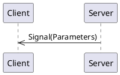
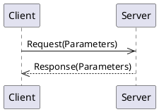

# _Example_ API Overview 

## Signals

Signals are messages from the server to clients.

### todayIs

#### Signal Parameters

|Name|Type|Description|
|----|----|-----------|
|dayOfMonth|integer|None|
|dayOfWeek|[Enum DayOfTheWeek](#enum-DayOfTheWeek)|None|

## Methods

Methods are requests from a client to a server and the server provides a response back to the client:

### addNumbers

#### Request Parameters

|Name|Type|Description|
|----|----|-----------|
|first|integer|None|
|second|integer|None|

#### Return Parameters

The return parameter type is `integer`.

### doSomething

#### Request Parameters

|Name|Type|Description|
|----|----|-----------|
|aString|string|None|

#### Return Parameters

|Name|Type|Description|
|----|----|-----------|
|label|string|None|
|identifier|integer|None|
|day|[Enum DayOfTheWeek](#enum-DayOfTheWeek)|None|

## Enums

### Enum DayOfTheWeek

 * Sunday
 * Monday
 * Tuesday
 * Wednesday
 * Thursday
 * Friday
 * Saturday
