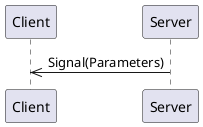

# _SignalOnly_ API Overview

[[_TOC_]]

## Connections

A connection object is a wrapper around an MQTT client and provides specific functionality to support both clients and servers.
Generally, you only need one connection object per daemon/program, as it can support multiple clients and servers.  

### Connection code Examples

<details>
  <summary>Python</summary>

```python
from connection import MqttBrokerConnection, MqttTransportType, MqttTransport

transport = MqttTransport(MqttTransportType.TCP, "localhost", 1883) # Or: MqttTransport(MqttTransportType.UNIX, socket_path="/path/to/socket")
connection_object = MqttBrokerConnection(transport)
```

The `connection_object` will be passed to client and server constructors.

</details>

<details>
  <summary>Rust</summary>

Rust implementations use the [MQTTier](https://crates.io/crates/mqttier) crate for MQTT connectivity.  MQTTier is a wrapper around the [rumqttc](https://crates.io/crates/rumqttc) crate and handles serialization, message queuing, and acknowledgments.

```rust
use mqttier::{MqttierClient, MqttierOptions};

  let conn_opts = MqttierOptionsBuilder::new()
      .connection(Connection::TcpLocalhost(1883)) // Connection::UnixSocket("/path/to/socket") is also supported.
      .build()
      .unwrap()
      .expect("Failed to build MQTT connection options");
  let mut connection = MqttierClient::new(conn_opts).unwrap().expect("Failed to create MQTT client");
```

The `connection_object` will be passed to client and server constructors.

</details>

<details>
  <summary>C++</summary>

The C++ connection object is a wrapper around the [libmosquitto](https://mosquitto.org/api/files/mosquitto-h.html) C library.  This library only supports TCP and WebSocket connections.  Unix Domain Socket support may be added in the future.

```c++
#include "broker.hpp"

auto connection_object = std::make_shared<MqttBrokerConnection>("localhost", 1883, "daemon-name");
```

The `connection_object` will be passed to client and server constructors.

</details>

## Server

A server is a _provider_ of functionality.  It sends signals, handles method calls, and owns property values.

### Server Code Examples

<details>
  <summary>Python Server</summary>

```python
from signalonlyipc.client import SignalOnlyServer

server = SignalOnlyServer(connection_object)
```

The `server` object provides methods for emitting signals and updating properties.  It also allows for decorators to indicate method call handlers.

A full example can be viewed by looking at the `if __name__ == "__main__":` section of the generated `signalonlyipc.server.py` module.

</details>


<details>
  <summary>C++ Server</summary>

```c++

```

The `server` object provides methods for emitting signals and updating properties.  It also allows for decorators to indicate method call handlers.

A full example can be viewed by looking at the generated `examples/server_main.cpp` file.`

</details>

## Client

A client is a _utilizer_ of functionality.  It receives signals, makes method calls, reads property values, or requests updates to property values.

<details>
  <summary>Rust</summary>

```rust
let api_client = SignalOnlyClient::new(&mut connection).await;
```

A full example can be viewed by looking at the generated `client/examples/client.rs` file.

</details>

<details>
  <summary>C++ Client</summary>

A full example can be viewed by looking at the generated `examples/client_main.cpp` file.

</details>


## Signals

Signals are messages from a server to clients.



### Signal `anotherSignal`

_No documentation for this signal_

#### Signal Parameters for `anotherSignal`

| Name          | Type     |Description|
|---------------|----------|-----------|
|      one      |  number  ||
|      two      | boolean  ||
|     three     |  string  ||

#### Code Examples

<details>
  <summary>Python Client</summary>

The `anotherSignal` signal can be subscribed to by using the client's `receive_another_signal` decorator on a callback function. The name of the function does not matter. The function is called any time the signal is received.

```python
@client.receive_another_signal
def on_another_signal(one: float, two: bool, three: str):
    print(f"Got a 'anotherSignal' signal: one={ one } two={ two } three={ three } ")
```

</details>

<details>
  <summary>Python Server</summary>

A server can emit a `anotherSignal` signal simply by calling the server's `emit_another_signal` method.

```python
server.emit_another_signal(3.14, True, "apples")
```

</details>

<details>
  <summary>Rust Client</summary>

A Rust client receives signals through a `tokio::broadcast` channel.  Receiving from the channel returns a `Result<T, RecvError>` object.  

Since receiving a message through the channel blocks, it may be best to put this into a separate async task.

```rust
let mut another_signal_signal_rx = client.get_another_signal_receiver();
print("Got a 'anotherSignal' signal: {:?}", another_signal_signal_rx.recv().await);
```

</details>

<details>
  <summary>Rust Server</summary>

A server can emit a `anotherSignal` signal simply by calling the server's `emit_another_signal` method.

```rust
let publish_result = server.emit_another_signal(3.14, true, "apples".to_string()).await;
```

The return type is a **Pinned Boxed Future** that resolves to a `Result<(), MethodReturnCode>`.  The future is resolved when the signal is sent (with "publish complete" acknowledgment) or when an error occurs.  If you need to block until the signal is received by the MQTT broker, you can `.await` the future.

</details>

<details>
  <summary>C++ Client</summary>

A client can register a callback function to be called when a `anotherSignal` signal is received.  The callback function should take the same parameters as the signal.  In this example, we are using a lambda as the callback function.

```cpp
client.registerAnotherSignalCallback([](double one, bool two, const std::string& three) {
    std::cout << "one=" <<one << " | " << "two=" <<two << " | " << "three=" <<three <<  std::endl;
});
```

</details>

<details>
  <summary>C++ Server</summary>

A `anotherSignal` signal can be emitted by calling the server's `emitAnotherSignalSignal` method.  This returns a `std::future` that can be waited on if desired.  The future is resolved when the signal is sent.

```cpp
auto anotherSignalFuture = server.emitAnotherSignalSignal(3.14, true, "apples");
anotherSignalFuture.wait(); // Optional, to block until signal is sent.
```

</details>


### Signal `bark`

Emitted when a dog barks.

#### Signal Parameters for `bark`

| Name          | Type     |Description|
|---------------|----------|-----------|
|      word     |  string  ||

#### Code Examples

<details>
  <summary>Python Client</summary>

The `bark` signal can be subscribed to by using the client's `receive_bark` decorator on a callback function. The name of the function does not matter. The function is called any time the signal is received.

```python
@client.receive_bark
def on_bark(word: str):
    print(f"Got a 'bark' signal: word={ word } ")
```

</details>

<details>
  <summary>Python Server</summary>

A server can emit a `bark` signal simply by calling the server's `emit_bark` method.

```python
server.emit_bark("apples")
```

</details>

<details>
  <summary>Rust Client</summary>

A Rust client receives signals through a `tokio::broadcast` channel.  Receiving from the channel returns a `Result<T, RecvError>` object.  

Since receiving a message through the channel blocks, it may be best to put this into a separate async task.

```rust
let mut bark_signal_rx = client.get_bark_receiver();
print("Got a 'bark' signal: {:?}", bark_signal_rx.recv().await);
```

</details>

<details>
  <summary>Rust Server</summary>

A server can emit a `bark` signal simply by calling the server's `emit_bark` method.

```rust
let publish_result = server.emit_bark("apples".to_string()).await;
```

The return type is a **Pinned Boxed Future** that resolves to a `Result<(), MethodReturnCode>`.  The future is resolved when the signal is sent (with "publish complete" acknowledgment) or when an error occurs.  If you need to block until the signal is received by the MQTT broker, you can `.await` the future.

</details>

<details>
  <summary>C++ Client</summary>

A client can register a callback function to be called when a `bark` signal is received.  The callback function should take the same parameters as the signal.  In this example, we are using a lambda as the callback function.

```cpp
client.registerBarkCallback([](const std::string& word) {
    std::cout << "word=" <<word <<  std::endl;
});
```

</details>

<details>
  <summary>C++ Server</summary>

A `bark` signal can be emitted by calling the server's `emitBarkSignal` method.  This returns a `std::future` that can be waited on if desired.  The future is resolved when the signal is sent.

```cpp
auto barkFuture = server.emitBarkSignal("apples");
barkFuture.wait(); // Optional, to block until signal is sent.
```

</details>


### Signal `maybe_number`

A signal with optionally no payload.

#### Signal Parameters for `maybe_number`

| Name          | Type     |Description|
|---------------|----------|-----------|
|     number    | integer   (optional)||

#### Code Examples

<details>
  <summary>Python Client</summary>

The `maybe_number` signal can be subscribed to by using the client's `receive_maybe_number` decorator on a callback function. The name of the function does not matter. The function is called any time the signal is received.

```python
@client.receive_maybe_number
def on_maybe_number(number: int | None):
    print(f"Got a 'maybe_number' signal: number={ number } ")
```

</details>

<details>
  <summary>Python Server</summary>

A server can emit a `maybe_number` signal simply by calling the server's `emit_maybe_number` method.

```python
server.emit_maybe_number(42)
```

</details>

<details>
  <summary>Rust Client</summary>

A Rust client receives signals through a `tokio::broadcast` channel.  Receiving from the channel returns a `Result<T, RecvError>` object.  

Since receiving a message through the channel blocks, it may be best to put this into a separate async task.

```rust
let mut maybe_number_signal_rx = client.get_maybe_number_receiver();
print("Got a 'maybe_number' signal: {:?}", maybe_number_signal_rx.recv().await);
```

</details>

<details>
  <summary>Rust Server</summary>

A server can emit a `maybe_number` signal simply by calling the server's `emit_maybe_number` method.

```rust
let publish_result = server.emit_maybe_number(Some(42)).await;
```

The return type is a **Pinned Boxed Future** that resolves to a `Result<(), MethodReturnCode>`.  The future is resolved when the signal is sent (with "publish complete" acknowledgment) or when an error occurs.  If you need to block until the signal is received by the MQTT broker, you can `.await` the future.

</details>

<details>
  <summary>C++ Client</summary>

A client can register a callback function to be called when a `maybe_number` signal is received.  The callback function should take the same parameters as the signal.  In this example, we are using a lambda as the callback function.

```cpp
client.registerMaybeNumberCallback([](boost::optional<int> number) {
    std::cout << "number=" << "None" <<  std::endl;
});
```

</details>

<details>
  <summary>C++ Server</summary>

A `maybe_number` signal can be emitted by calling the server's `emitMaybeNumberSignal` method.  This returns a `std::future` that can be waited on if desired.  The future is resolved when the signal is sent.

```cpp
auto maybeNumberFuture = server.emitMaybeNumberSignal(42);
maybeNumberFuture.wait(); // Optional, to block until signal is sent.
```

</details>


### Signal `maybe_name`

A signal with optionally no payload.

#### Signal Parameters for `maybe_name`

| Name          | Type     |Description|
|---------------|----------|-----------|
|      name     |  string   (optional)||

#### Code Examples

<details>
  <summary>Python Client</summary>

The `maybe_name` signal can be subscribed to by using the client's `receive_maybe_name` decorator on a callback function. The name of the function does not matter. The function is called any time the signal is received.

```python
@client.receive_maybe_name
def on_maybe_name(name: str | None):
    print(f"Got a 'maybe_name' signal: name={ name } ")
```

</details>

<details>
  <summary>Python Server</summary>

A server can emit a `maybe_name` signal simply by calling the server's `emit_maybe_name` method.

```python
server.emit_maybe_name("apples")
```

</details>

<details>
  <summary>Rust Client</summary>

A Rust client receives signals through a `tokio::broadcast` channel.  Receiving from the channel returns a `Result<T, RecvError>` object.  

Since receiving a message through the channel blocks, it may be best to put this into a separate async task.

```rust
let mut maybe_name_signal_rx = client.get_maybe_name_receiver();
print("Got a 'maybe_name' signal: {:?}", maybe_name_signal_rx.recv().await);
```

</details>

<details>
  <summary>Rust Server</summary>

A server can emit a `maybe_name` signal simply by calling the server's `emit_maybe_name` method.

```rust
let publish_result = server.emit_maybe_name(Some("apples".to_string())).await;
```

The return type is a **Pinned Boxed Future** that resolves to a `Result<(), MethodReturnCode>`.  The future is resolved when the signal is sent (with "publish complete" acknowledgment) or when an error occurs.  If you need to block until the signal is received by the MQTT broker, you can `.await` the future.

</details>

<details>
  <summary>C++ Client</summary>

A client can register a callback function to be called when a `maybe_name` signal is received.  The callback function should take the same parameters as the signal.  In this example, we are using a lambda as the callback function.

```cpp
client.registerMaybeNameCallback([](boost::optional<std::string> name) {
    std::cout << "name=" << "None" <<  std::endl;
});
```

</details>

<details>
  <summary>C++ Server</summary>

A `maybe_name` signal can be emitted by calling the server's `emitMaybeNameSignal` method.  This returns a `std::future` that can be waited on if desired.  The future is resolved when the signal is sent.

```cpp
auto maybeNameFuture = server.emitMaybeNameSignal(boost::make_optional(std::string("apples")));
maybeNameFuture.wait(); // Optional, to block until signal is sent.
```

</details>


### Signal `now`

The current date and time.

#### Signal Parameters for `now`

| Name          | Type     |Description|
|---------------|----------|-----------|
|   timestamp   |          ||

#### Code Examples

<details>
  <summary>Python Client</summary>

The `now` signal can be subscribed to by using the client's `receive_now` decorator on a callback function. The name of the function does not matter. The function is called any time the signal is received.

```python
@client.receive_now
def on_now(timestamp: datetime.datetime):
    print(f"Got a 'now' signal: timestamp={ timestamp } ")
```

</details>

<details>
  <summary>Python Server</summary>

A server can emit a `now` signal simply by calling the server's `emit_now` method.

```python
server.emit_now(datetime.datetime.now())
```

</details>

<details>
  <summary>Rust Client</summary>

A Rust client receives signals through a `tokio::broadcast` channel.  Receiving from the channel returns a `Result<T, RecvError>` object.  

Since receiving a message through the channel blocks, it may be best to put this into a separate async task.

```rust
let mut now_signal_rx = client.get_now_receiver();
print("Got a 'now' signal: {:?}", now_signal_rx.recv().await);
```

</details>

<details>
  <summary>Rust Server</summary>

A server can emit a `now` signal simply by calling the server's `emit_now` method.

```rust
let publish_result = server.emit_now(chrono::Utc::now()).await;
```

The return type is a **Pinned Boxed Future** that resolves to a `Result<(), MethodReturnCode>`.  The future is resolved when the signal is sent (with "publish complete" acknowledgment) or when an error occurs.  If you need to block until the signal is received by the MQTT broker, you can `.await` the future.

</details>

<details>
  <summary>C++ Client</summary>

A client can register a callback function to be called when a `now` signal is received.  The callback function should take the same parameters as the signal.  In this example, we are using a lambda as the callback function.

```cpp
client.registerNowCallback([](std::chrono::time_point<std::chrono::system_clock> timestamp) {
    std::cout << "timestamp=" <<timestamp <<  std::endl;
});
```

</details>

<details>
  <summary>C++ Server</summary>

A `now` signal can be emitted by calling the server's `emitNowSignal` method.  This returns a `std::future` that can be waited on if desired.  The future is resolved when the signal is sent.

```cpp
auto nowFuture = server.emitNowSignal(std::chrono::system_clock::now());
nowFuture.wait(); // Optional, to block until signal is sent.
```

</details>


## Structures

Structures are a group of values and may be used as an argument in signals, methods, or properties.  Defining a structure allows for easy reuse.
