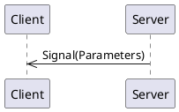

# _SignalOnly_ API Overview 

<!--
This is automatically generated documentation.
LICENSE: This generated content is not subject to any license restrictions.
TODO: Get license text from stinger file
-->

[[_TOC_]]

## Connections

A connection object is a wrapper around an MQTT client and provides specific functionality to support both clients and servers.
Generally, you only need one connection object per daemon/program, as it can support multiple clients and servers.  
For most languages, Stinger-IPC does not require a specific connection object implementation, as long as it implements the required interface.

The application code is responsible for creating and managing the connection object, including connecting to the MQTT broker.

### Connection code Examples

<details>
  <summary>Python</summary>

```python
from connection import MqttBrokerConnection, MqttTransportType, MqttTransport

transport = MqttTransport(MqttTransportType.TCP, "localhost", 1883) # Or: MqttTransport(MqttTransportType.UNIX, socket_path="/path/to/socket")
connection_object = MqttBrokerConnection(transport)
```

The `connection_object` will be passed to client and server constructors.

</details>

<details>
  <summary>Rust</summary>

Stinger-IPC instances only require an MQTT connection object that implements the [`stinger_mqtt_trait::Mqtt5PubSub` trait](https://docs.rs/stinger-mqtt-trait/latest/stinger_mqtt_trait/trait.Mqtt5PubSub.html). 

The [MQTTier](https://crates.io/crates/mqttier) crate provides an implementation of the `Mqtt5PubSub` trait, and is shown in this documentation as an example.  MQTTier is a wrapper around the [rumqttc](https://crates.io/crates/rumqttc) crate and handles serialization, message queuing, and acknowledgments.'

Here is an example showing how to create an MQTTier client connection object:

```rust
use mqttier::{MqttierClient, MqttierOptionsBuilder, Connection};

let mqttier_options = MqttierOptionsBuilder::default()
    .connection(Connection::TcpLocalhost(1883))
    .client_id("rust-client-demo".to_string())
    .build().unwrap();
let mut connection_object = MqttierClient::new(mqttier_options).unwrap();
let _ = connection_object.start().await;
```

The `connection_object` will be passed to client and server constructors.

</details>

<details>
  <summary>C++</summary>

The C++ connection object is a wrapper around the [libmosquitto](https://mosquitto.org/api/files/mosquitto-h.html) C library.  This library only supports TCP and WebSocket connections.  Unix Domain Socket support may be added in the future.

```c++
#include "broker.hpp"

auto connection_object = std::make_shared<MqttBrokerConnection>("localhost", 1883, "daemon-name");
```

The `connection_object` will be passed to client and server constructors.

</details>

## Discovery

Because there may be multiple instances of the same Stinger Interface, a discovery mechanism is provided to find and connect to them.  A discovery class is provided which connects to
the MQTT broker and listens for Stinger Interface announcements.  The discovery class can then provide SignalOnlyClient client instances.  Additionally, the discovery class
find all the current property values for discovered interfaces in order to initialize the client instance.

### Discovery Code Examples

<details>
  <summary>Python</summary>

```python
from signalonlyipc.client import SignalOnlyClientDiscoverer

discovery = SignalOnlyClientDiscoverer(connection_object)

# To get a single client instance (waits until one is found):
client = discovery.get_singleton_client().result()

# To get all currently available client instances (does not wait):
discovered_service_ids = discovery.get_service_instance_ids()
clients = [discovery.get_client_for_instance(service_id) for service_id in discovered_service_ids]
```
</details>

<details>
  <summary>Rust</summary>

```rust
use signal_only_ipc::discovery::SignalOnlyDiscovery;

let discovered_singleton_info = {
    let service_discovery = SignalOnlyDiscovery::new(&mut connection_object).await.unwrap();
    service_discovery.get_singleton_instance_info().await // Blocks until a service is discovered.
}
let signal_only_client = SignalOnlyClient::new(&mut connection_object, &discovered_singleton_info).await;
```

</details>

## Server

A server is a _provider_ of functionality.  It sends signals .

When constructing a server instance, a connection object.

### Server Code Examples

<details>
  <summary>Python Server</summary>

```python
from signalonlyipc.server import SignalOnlyServer, SignalOnlyInitialPropertyValues

# Ideally, you would load these initial property values from a configuration file or database.


service_id = "py-server-demo:1" # Can be anything. When there is a single instance of the interface, 'singleton' is often used.
server = SignalOnlyServer(connection_object, service_id, )
```

The `server` object provides methods for emitting signals and updating properties.  It also allows for decorators to indicate method call handlers.

A full example can be viewed by looking at the `example/server_demo.py` file of the generated code.

When decorating class methods, especially when there might be multiple instances of the class with methods being decorated, the Python implementation provides a `SignalOnlyClientBuilder`
class to help capture decorated methods and bind them to a specific instance at runtime. Here is an example of how to use it in a class:

```python
from signalonlyipc.client import SignalOnlyClientBuilder

signal_only_builder = SignalOnlyClientBuilder()

class MyClass:
    def __init__(self, label: str, connection: MqttBrokerConnection):
        instance_info = ... # Create manually or use discovery to get this
        self.client = signal_only_builder.build(connection_object, instance_info, binding=self) # The binding param binds all decorated methods to the `self` instance.

    @signal_only_builder.receive_a_signal
    def on_a_signal(self, param1: int, param2: str):
        ...
```

A more complete example, including use with the discovery mechanism, can be viewed by looking at the generated `examples/server_demo_classes.py` file.

</details>

<details>
  <summary>Rust Server</summary>

Service code for Rust is only available when using the `server` feature:

```sh
cargo add signal_only_ipc --features=server
```

Here is an example of how to create a server instance:

```rust
use signal_only_ipc::server::SignalOnlyServer;

let service_id = String::from("rust-server-demo:1");


// Create the server object.
let mut server = SignalOnlyServer::new(connection_object, serivce_id).await;


```

Providing method handlers is better described in the [Methods](#methods) section.  

A full example can be viewed by looking at the generated `examples/server_demo.rs` example and can be compiled with `cargo run --example signal_only_server_demo --features=server` in the generated Rust project.

</details>

<details>
  <summary>C++ Server</summary>

```c++
// To be written
```

The `server` object provides methods for emitting signals and updating properties.  It also allows for decorators to indicate method call handlers.

A full example can be viewed by looking at the generated `examples/server_main.cpp` file.`

</details>

## Client

A client is a _utilizer_ of functionality.  It receives signals, makes method calls, reads property values, or requests updates to property values.

<details>
  <summary>Rust Client</summary>

The best way to create a client instance is to use the discovery class to find an instance of the service, and then create the client from the discovered instance information.
An example of that is shown in the [Discovery](#discovery) section.  However, if you already know the service instance ID, you can create a client directly:

```rust
use signal_only_ipc::client::SignalOnlyClient;

let instance_info = DiscoveredInstance {
    service_instance_id: String::from("singleton"),
    
};

let signal_only_client = SignalOnlyClient::new(connection_object.clone(), instance_info).await;
```

A full example can be viewed by looking at the generated `client/examples/client_demo.rs` file.

</details>

<details>
  <summary>Python Client</summary>

```python
from signalonlyipc.server import SignalOnlyServer


service_instance_id="singleton"
server = SignalOnlyServer(connection_object, service_instance_id)
```

A full example can be viewed by looking at the generated `examples/client_main.py` file.

Like the Python client, there is a `SignalOnlyServerBuilder` class to help capture decorated methods and bind them to a specific instance at runtime.

```python

</details>

<details>
  <summary>C++ Client</summary>

A full example can be viewed by looking at the generated `examples/client_main.cpp` file.

</details>

## Logging

Each generated language has different ways of handling logging.  

### Python

Python uses the standard Python `logging` module.  

### Rust

Rust uses the `tracing` crate for logging.

### C++

C++ uses a user-provided logging function.  The function should take two parameters: an integer log level and a string message. 

Log levels are re-used from the `syslog.h` header file, although no other syslog mechanisms are used.  Client and server classes use the logging provided by the `MqttBrokerConnection` object.

<details>
  <summary>Example C++ Code</summary>

```c++
#include <syslog.h>

auto connnection = std::make_shared<MqttBrokerConnection>(...);
connnection->SetLogLevel(LOG_DEBUG);
connnection->SetLogFunction([](int level, const char* msg)
{
    std::cout << "[" << level << "] " << msg << std::endl;
});
```

</details>


## Signals

Signals are messages from a server to clients.



### Signal `anotherSignal`

_No documentation for this signal_

#### Signal Parameters for `anotherSignal`

| Name          | Type     |Description|
|---------------|----------|-----------|
|      one      |  number  ||
|      two      | boolean  ||
|     three     |  string  ||

#### Code Examples

<details>
  <summary>Python Client</summary>

The `anotherSignal` signal can be subscribed to by using the client's `receive_another_signal` decorator on a callback function. The name of the function does not matter. The function is called any time the signal is received.

```python
@client.receive_another_signal
def on_another_signal(one: float, two: bool, three: str):
    print(f"Got a 'anotherSignal' signal: one={ one } two={ two } three={ three } ")
```

</details>

<details>
  <summary>Python Server</summary>

A server can emit a `anotherSignal` signal simply by calling the server's `emit_another_signal` method.

```python
server.emit_another_signal(3.14, True, "apples")
```

</details>

<details>
  <summary>Rust Client</summary>

A Rust client receives signals through a `tokio::broadcast` channel.  Receiving from the channel returns a `Result<T, RecvError>` object.  

Since receiving a message through the channel blocks, it may be best to put this into a separate async task.

```rust
let mut another_signal_signal_rx = client.get_another_signal_receiver();
print("Got a 'anotherSignal' signal: {:?}", another_signal_signal_rx.recv().await);
```

</details>

<details>
  <summary>Rust Server</summary>

A server can emit a `anotherSignal` signal simply by calling the server's `emit_another_signal` method.

```rust
let publish_result = server.emit_another_signal(3.14, true, "apples".to_string()).await;
```

The return type is a **Pinned Boxed Future** that resolves to a `Result<(), MethodReturnCode>`.  The future is resolved when the signal is sent (with "publish complete" acknowledgment) or when an error occurs.  If you need to block until the signal is received by the MQTT broker, you can `.await` the future.

</details>

<details>
  <summary>C++ Client</summary>

A client can register a callback function to be called when a `anotherSignal` signal is received.  The callback function should take the same parameters as the signal.  In this example, we are using a lambda as the callback function.

```cpp
client.registerAnotherSignalCallback([](double one, bool two, const std::string& three) {
    std::cout << "one=" <<one << " | " << "two=" <<two << " | " << "three=" <<three <<  std::endl;
});
```

</details>

<details>
  <summary>C++ Server</summary>

A `anotherSignal` signal can be emitted by calling the server's `emitAnotherSignalSignal` method.  This returns a `std::future` that can be waited on if desired.  The future is resolved when the signal is sent.

```cpp
auto anotherSignalFuture = server.emitAnotherSignalSignal(3.14, true, "apples");
anotherSignalFuture.wait(); // Optional, to block until signal is sent.
```

</details>


### Signal `bark`

Emitted when a dog barks.

#### Signal Parameters for `bark`

| Name          | Type     |Description|
|---------------|----------|-----------|
|      word     |  string  ||

#### Code Examples

<details>
  <summary>Python Client</summary>

The `bark` signal can be subscribed to by using the client's `receive_bark` decorator on a callback function. The name of the function does not matter. The function is called any time the signal is received.

```python
@client.receive_bark
def on_bark(word: str):
    print(f"Got a 'bark' signal: word={ word } ")
```

</details>

<details>
  <summary>Python Server</summary>

A server can emit a `bark` signal simply by calling the server's `emit_bark` method.

```python
server.emit_bark("apples")
```

</details>

<details>
  <summary>Rust Client</summary>

A Rust client receives signals through a `tokio::broadcast` channel.  Receiving from the channel returns a `Result<T, RecvError>` object.  

Since receiving a message through the channel blocks, it may be best to put this into a separate async task.

```rust
let mut bark_signal_rx = client.get_bark_receiver();
print("Got a 'bark' signal: {:?}", bark_signal_rx.recv().await);
```

</details>

<details>
  <summary>Rust Server</summary>

A server can emit a `bark` signal simply by calling the server's `emit_bark` method.

```rust
let publish_result = server.emit_bark("apples".to_string()).await;
```

The return type is a **Pinned Boxed Future** that resolves to a `Result<(), MethodReturnCode>`.  The future is resolved when the signal is sent (with "publish complete" acknowledgment) or when an error occurs.  If you need to block until the signal is received by the MQTT broker, you can `.await` the future.

</details>

<details>
  <summary>C++ Client</summary>

A client can register a callback function to be called when a `bark` signal is received.  The callback function should take the same parameters as the signal.  In this example, we are using a lambda as the callback function.

```cpp
client.registerBarkCallback([](const std::string& word) {
    std::cout << "word=" <<word <<  std::endl;
});
```

</details>

<details>
  <summary>C++ Server</summary>

A `bark` signal can be emitted by calling the server's `emitBarkSignal` method.  This returns a `std::future` that can be waited on if desired.  The future is resolved when the signal is sent.

```cpp
auto barkFuture = server.emitBarkSignal("apples");
barkFuture.wait(); // Optional, to block until signal is sent.
```

</details>


### Signal `maybe_number`

A signal with optionally no payload.

#### Signal Parameters for `maybe_number`

| Name          | Type     |Description|
|---------------|----------|-----------|
|     number    | integer   (optional)||

#### Code Examples

<details>
  <summary>Python Client</summary>

The `maybe_number` signal can be subscribed to by using the client's `receive_maybe_number` decorator on a callback function. The name of the function does not matter. The function is called any time the signal is received.

```python
@client.receive_maybe_number
def on_maybe_number(number: Optional[int]):
    print(f"Got a 'maybe_number' signal: number={ number } ")
```

</details>

<details>
  <summary>Python Server</summary>

A server can emit a `maybe_number` signal simply by calling the server's `emit_maybe_number` method.

```python
server.emit_maybe_number(42)
```

</details>

<details>
  <summary>Rust Client</summary>

A Rust client receives signals through a `tokio::broadcast` channel.  Receiving from the channel returns a `Result<T, RecvError>` object.  

Since receiving a message through the channel blocks, it may be best to put this into a separate async task.

```rust
let mut maybe_number_signal_rx = client.get_maybe_number_receiver();
print("Got a 'maybe_number' signal: {:?}", maybe_number_signal_rx.recv().await);
```

</details>

<details>
  <summary>Rust Server</summary>

A server can emit a `maybe_number` signal simply by calling the server's `emit_maybe_number` method.

```rust
let publish_result = server.emit_maybe_number(Some(42)).await;
```

The return type is a **Pinned Boxed Future** that resolves to a `Result<(), MethodReturnCode>`.  The future is resolved when the signal is sent (with "publish complete" acknowledgment) or when an error occurs.  If you need to block until the signal is received by the MQTT broker, you can `.await` the future.

</details>

<details>
  <summary>C++ Client</summary>

A client can register a callback function to be called when a `maybe_number` signal is received.  The callback function should take the same parameters as the signal.  In this example, we are using a lambda as the callback function.

```cpp
client.registerMaybeNumberCallback([](boost::optional<int> number) {
    std::cout << "number=" << "None" <<  std::endl;
});
```

</details>

<details>
  <summary>C++ Server</summary>

A `maybe_number` signal can be emitted by calling the server's `emitMaybeNumberSignal` method.  This returns a `std::future` that can be waited on if desired.  The future is resolved when the signal is sent.

```cpp
auto maybeNumberFuture = server.emitMaybeNumberSignal(42);
maybeNumberFuture.wait(); // Optional, to block until signal is sent.
```

</details>


### Signal `maybe_name`

A signal with optionally no payload.

#### Signal Parameters for `maybe_name`

| Name          | Type     |Description|
|---------------|----------|-----------|
|      name     |  string   (optional)||

#### Code Examples

<details>
  <summary>Python Client</summary>

The `maybe_name` signal can be subscribed to by using the client's `receive_maybe_name` decorator on a callback function. The name of the function does not matter. The function is called any time the signal is received.

```python
@client.receive_maybe_name
def on_maybe_name(name: Optional[str]):
    print(f"Got a 'maybe_name' signal: name={ name } ")
```

</details>

<details>
  <summary>Python Server</summary>

A server can emit a `maybe_name` signal simply by calling the server's `emit_maybe_name` method.

```python
server.emit_maybe_name("apples")
```

</details>

<details>
  <summary>Rust Client</summary>

A Rust client receives signals through a `tokio::broadcast` channel.  Receiving from the channel returns a `Result<T, RecvError>` object.  

Since receiving a message through the channel blocks, it may be best to put this into a separate async task.

```rust
let mut maybe_name_signal_rx = client.get_maybe_name_receiver();
print("Got a 'maybe_name' signal: {:?}", maybe_name_signal_rx.recv().await);
```

</details>

<details>
  <summary>Rust Server</summary>

A server can emit a `maybe_name` signal simply by calling the server's `emit_maybe_name` method.

```rust
let publish_result = server.emit_maybe_name(Some("apples".to_string())).await;
```

The return type is a **Pinned Boxed Future** that resolves to a `Result<(), MethodReturnCode>`.  The future is resolved when the signal is sent (with "publish complete" acknowledgment) or when an error occurs.  If you need to block until the signal is received by the MQTT broker, you can `.await` the future.

</details>

<details>
  <summary>C++ Client</summary>

A client can register a callback function to be called when a `maybe_name` signal is received.  The callback function should take the same parameters as the signal.  In this example, we are using a lambda as the callback function.

```cpp
client.registerMaybeNameCallback([](boost::optional<std::string> name) {
    std::cout << "name=" << "None" <<  std::endl;
});
```

</details>

<details>
  <summary>C++ Server</summary>

A `maybe_name` signal can be emitted by calling the server's `emitMaybeNameSignal` method.  This returns a `std::future` that can be waited on if desired.  The future is resolved when the signal is sent.

```cpp
auto maybeNameFuture = server.emitMaybeNameSignal(boost::make_optional(std::string("apples")));
maybeNameFuture.wait(); // Optional, to block until signal is sent.
```

</details>


### Signal `now`

The current date and time.

#### Signal Parameters for `now`

| Name          | Type     |Description|
|---------------|----------|-----------|
|   timestamp   |          ||

#### Code Examples

<details>
  <summary>Python Client</summary>

The `now` signal can be subscribed to by using the client's `receive_now` decorator on a callback function. The name of the function does not matter. The function is called any time the signal is received.

```python
@client.receive_now
def on_now(timestamp: datetime):
    print(f"Got a 'now' signal: timestamp={ timestamp } ")
```

</details>

<details>
  <summary>Python Server</summary>

A server can emit a `now` signal simply by calling the server's `emit_now` method.

```python
server.emit_now(datetime.now(UTC))
```

</details>

<details>
  <summary>Rust Client</summary>

A Rust client receives signals through a `tokio::broadcast` channel.  Receiving from the channel returns a `Result<T, RecvError>` object.  

Since receiving a message through the channel blocks, it may be best to put this into a separate async task.

```rust
let mut now_signal_rx = client.get_now_receiver();
print("Got a 'now' signal: {:?}", now_signal_rx.recv().await);
```

</details>

<details>
  <summary>Rust Server</summary>

A server can emit a `now` signal simply by calling the server's `emit_now` method.

```rust
let publish_result = server.emit_now(chrono::Utc::now()).await;
```

The return type is a **Pinned Boxed Future** that resolves to a `Result<(), MethodReturnCode>`.  The future is resolved when the signal is sent (with "publish complete" acknowledgment) or when an error occurs.  If you need to block until the signal is received by the MQTT broker, you can `.await` the future.

</details>

<details>
  <summary>C++ Client</summary>

A client can register a callback function to be called when a `now` signal is received.  The callback function should take the same parameters as the signal.  In this example, we are using a lambda as the callback function.

```cpp
client.registerNowCallback([](std::chrono::time_point<std::chrono::system_clock> timestamp) {
    std::cout << "timestamp=" <<timestamp <<  std::endl;
});
```

</details>

<details>
  <summary>C++ Server</summary>

A `now` signal can be emitted by calling the server's `emitNowSignal` method.  This returns a `std::future` that can be waited on if desired.  The future is resolved when the signal is sent.

```cpp
auto nowFuture = server.emitNowSignal(std::chrono::system_clock::now());
nowFuture.wait(); // Optional, to block until signal is sent.
```

</details>


## Structures

Structures are a group of values and may be used as an argument in signals, methods, or properties.  Defining a structure allows for easy reuse.
