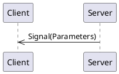
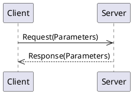
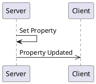

# _Simple Example Interface_ API Overview 

<!--
This is automatically generated documentation.
LICENSE: This generated content is not subject to any license restrictions.
TODO: Get license text from stinger file
--> 
_Example StingerAPI interface which demonstrates just a bit._


[[_TOC_]]

## Connections

A connection object is a wrapper around an MQTT client and provides specific functionality to support both clients and servers.
Generally, you only need one connection object per daemon/program, as it can support multiple clients and servers.  
For most languages, Stinger-IPC does not require a specific connection object implementation, as long as it implements the required interface.

The application code is responsible for creating and managing the connection object, including connecting to the MQTT broker.

### Connection code Examples

<details>
  <summary>Python MQTT Connection Example</summary>

Rather than including connection code in each generated client and server, Stinger-IPC for Python uses the [PYQTtier](https://pypi.org/project/pyqttier/) library to provide MQTT connection objects.  PYQTtier is a wrapper around the [paho-mqtt](https://pypi.org/project/paho-mqtt/) library and handles serialization, message queuing, and acknowledgments.

```python
from pyqttier import Mqtt5Connection, MqttTransportType, MqttTransport

transport = MqttTransport(MqttTransportType.TCP, "localhost", 1883) # Or: MqttTransport(MqttTransportType.UNIX, socket_path="/path/to/socket")
connection_object = Mqtt5Connection(transport)
```

The `connection_object` will be passed to client and server constructors.

</details>

<details>
  <summary>Rust MQTT Connection Example</summary>

Stinger-IPC instances only require an MQTT connection object that implements the [`stinger_mqtt_trait::Mqtt5PubSub` trait](https://docs.rs/stinger-mqtt-trait/latest/stinger_mqtt_trait/trait.Mqtt5PubSub.html). 

The [MQTTier](https://crates.io/crates/mqttier) crate provides an implementation of the `Mqtt5PubSub` trait, and is shown in this documentation as an example.  MQTTier is a wrapper around the [rumqttc](https://crates.io/crates/rumqttc) crate and handles serialization, message queuing, and acknowledgments.'

Here is an example showing how to create an MQTTier client connection object:

```rust
use mqttier::{MqttierClient, MqttierOptionsBuilder, Connection};

let mqttier_options = MqttierOptionsBuilder::default()
    .connection(Connection::TcpLocalhost(1883))
    .client_id("rust-client-demo".to_string())
    .build().unwrap();
let mut connection_object = MqttierClient::new(mqttier_options).unwrap();
let _ = connection_object.start().await;
```

The `connection_object` will be passed to client and server constructors.

</details>

<details>
  <summary>C++ MQTT Connection Example</summary>

The C++ connection object is a wrapper around the [libmosquitto](https://mosquitto.org/api/files/mosquitto-h.html) C library.  This library only supports TCP and WebSocket connections.  Unix Domain Socket support may be added in the future.

```c++
#include "broker.hpp"

auto connection_object = std::make_shared<MqttBrokerConnection>("localhost", 1883, "daemon-name");
```

The `connection_object` will be passed to client and server constructors.

</details>

## Discovery

Because there may be multiple instances of the same Stinger Interface, a discovery mechanism is provided to find and connect to them.  A discovery class is provided which connects to
the MQTT broker and listens for Stinger Interface announcements.  The discovery class can then provide SimpleClient client instances.  Additionally, the discovery class
find all the current property values for discovered interfaces in order to initialize the client instance.

### Discovery Code Examples

<details>
  <summary>Python Discovery Example</summary>

```python
from simpleipc.client import SimpleClientDiscoverer

discovery = SimpleClientDiscoverer(connection_object)

# To get a single client instance (waits until one is found):
client = discovery.get_singleton_client().result()

# To get all currently available client instances (does not wait):
discovered_service_ids = discovery.get_service_instance_ids()
clients = [discovery.get_client_for_instance(service_id) for service_id in discovered_service_ids]
```
</details>

<details>
  <summary>Rust Discovery Example</summary>

```rust
use simple_ipc::discovery::SimpleDiscovery;

let discovered_singleton_info = {
    let service_discovery = SimpleDiscovery::new(&mut connection_object).await.unwrap();
    service_discovery.get_singleton_instance_info().await // Blocks until a service is discovered.
}
let simple_client = SimpleClient::new(&mut connection_object, &discovered_singleton_info).await;
```

</details>

## Server

A server is a _provider_ of functionality.  It sends signals and handles method calls and owns property values.

When constructing a server instance, a connection object and initial property values must be provided.

### Server Code Examples

<details>
  <summary>Python Server Object Construction</summary>

```python
from simpleipc.server import SimpleServer, SimpleInitialPropertyValues

# Ideally, you would load these initial property values from a configuration file or database.

initial_property_values = SimpleInitialPropertyValues(

    school="apples",
        
    school_version=1,

)


service_id = "py-server-demo:1" # Can be anything. When there is a single instance of the interface, 'singleton' is often used.
server = SimpleServer(connection_object, service_id, initial_property_values)
```

The `server` object provides methods for emitting signals and updating properties.  It also allows for decorators to indicate method call handlers.

A full example can be viewed by looking at the `example/server_demo.py` file of the generated code.

When decorating class methods, especially when there might be multiple instances of the class with methods being decorated, the Python implementation provides a `SimpleClientBuilder`
class to help capture decorated methods and bind them to a specific instance at runtime. Here is an example of how to use it in a class:

```python
from simpleipc.client import SimpleClientBuilder

simple_builder = SimpleClientBuilder()

class MyClass:
    def __init__(self, label: str, connection: MqttBrokerConnection):
        instance_info = ... # Create manually or use discovery to get this
        self.client = simple_builder.build(connection_object, instance_info, binding=self) # The binding param binds all decorated methods to the `self` instance.

    @simple_builder.receive_a_signal
    def on_a_signal(self, param1: int, param2: str):
        ...
```

A more complete example, including use with the discovery mechanism, can be viewed by looking at the generated `examples/server_demo_classes.py` file.

</details>

<details>
  <summary>Rust Server Struct Creation</summary>

Service code for Rust is only available when using the `server` feature:

```sh
cargo add simple_ipc --features=server
```

Here is an example of how to create a server instance:

```rust
use simple_ipc::server::SimpleServer;
use simple_ipc::property::SimpleInitialPropertyValues;

let service_id = String::from("rust-server-demo:1");

let initial_property_values = SimpleInitialPropertyValues {
    
    school:"apples".to_string(),
    school_version: 1,
    
};


// Create the server object.
let mut server = SimpleServer::new(connection_object, method_handlers.clone(), service_id, initial_property_values, ).await;


```

Providing method handlers is better described in the [Methods](#methods) section.  

A full example can be viewed by looking at the generated `examples/server_demo.rs` example and can be compiled with `cargo run --example simple_server_demo --features=server` in the generated Rust project.

</details>

<details>
  <summary>C++ Server Object Construction</summary>

```c++
// To be written
```

The `server` object provides methods for emitting signals and updating properties.  It also allows for decorators to indicate method call handlers.

A full example can be viewed by looking at the generated `examples/server_main.cpp` file.`

</details>

## Client

A client is a _utilizer_ of functionality.  It receives signals, makes method calls, reads property values, or requests updates to property values.

<details>
  <summary>Rust Client Struct Creation</summary>

The best way to create a client instance is to use the discovery class to find an instance of the service, and then create the client from the discovered instance information.
An example of that is shown in the [Discovery](#discovery) section.  However, if you already know the service instance IDand initial property values, you can create a client directly:

```rust
use simple_ipc::client::SimpleClient;

let instance_info = DiscoveredInstance {
    service_instance_id: String::from("singleton"),
    
    initial_property_values: SimpleInitialPropertyValues {
        
        school:"apples".to_string(),
        school_version: 1,
        
    },
    
};

let mut simple_client = SimpleClient::new(connection_object.clone(), instance_info).await;
```

A full example can be viewed by looking at the generated `client/examples/client_demo.rs` file.

</details>

<details>
  <summary>Python Client Object Construction</summary>

```python
from simpleipc.server import SimpleServer, SimpleInitialPropertyValues


initial_property_values = SimpleInitialPropertyValues(

    school="apples",
        
    school_version=1,

)


service_instance_id="singleton"
server = SimpleServer(connection_object, service_instance_id, initial_property_values)
```

A full example can be viewed by looking at the generated `examples/client_main.py` file.

Like the Python client, there is a `SimpleServerBuilder` class to help capture decorated methods and bind them to a specific instance at runtime.

```python

</details>

<details>
  <summary>C++ Client Object Construction</summary>

A full example can be viewed by looking at the generated `examples/client_main.cpp` file.

</details>

## Logging

Each generated language has different ways of handling logging.  

### Python

Python uses the standard Python `logging` module.  

### Rust

Rust uses the `tracing` crate for logging.

### C++

C++ uses a user-provided logging function.  The function should take two parameters: an integer log level and a string message. 

Log levels are re-used from the `syslog.h` header file, although no other syslog mechanisms are used.  Client and server classes use the logging provided by the `MqttBrokerConnection` object.

<details>
  <summary>Example C++ Log Setup</summary>

```c++
#include <syslog.h>

auto connection = std::make_shared<MqttBrokerConnection>(...);
connection->SetLogLevel(LOG_DEBUG);
connection->SetLogFunction([](int level, const char* msg)
{
    std::cout << "[" << level << "] " << msg << std::endl;
});
```

</details>


## Signals

Signals are messages from a server to clients.



### Signal `person_entered`

_No documentation for this signal_

#### Signal Parameters for `person_entered`

| Name          | Type     |Description|
|---------------|----------|-----------|
|     person    |[Struct Person](#enum-Person)||

#### Code Examples

<details>
  <summary>Python Client code for receiving 'person_entered' signal</summary>

The `person_entered` signal can be subscribed to by using the client's `receive_person_entered` decorator on a callback function. The name of the function does not matter. The function is called any time the signal is received.

```python
@client.receive_person_entered
def on_person_entered(person: Person):
    print(f"Got a 'person_entered' signal: person={ person } ")
```

</details>

<details>
  <summary>Python Server code for emitting 'person_entered' signal</summary>

A server can emit a `person_entered` signal simply by calling the server's `emit_person_entered` method.

```python
server.emit_person_entered(Person(name="apples", gender=Gender.MALE))
```

</details>

<details>
  <summary>Rust Client code for receiving 'person_entered' signal</summary>

A Rust client receives signals through a `tokio::broadcast` channel.  Receiving from the channel returns a `Result<T, RecvError>` object.  

Since receiving a message through the channel blocks, it may be best to put this into a separate async task.

```rust
let mut person_entered_signal_rx = client.get_person_entered_receiver();
print("Got a 'person_entered' signal: {:?}", person_entered_signal_rx.recv().await);
```

</details>

<details>
  <summary>Rust Server code for emitting 'person_entered' signal</summary>

A server can emit a `person_entered` signal simply by calling the server's `emit_person_entered` method.

```rust
let publish_result = server.emit_person_entered(Person {name: "apples".to_string(), gender: Gender::Male}).await;
```

The return type is a **Pinned Boxed Future** that resolves to a `Result<(), MethodReturnCode>`.  The future is resolved when the signal is sent (with "publish complete" acknowledgment) or when an error occurs.  If you need to block until the signal is received by the MQTT broker, you can `.await` the future.

</details>

<details>
  <summary>C++ Client code for registering a 'person_entered' signal callback</summary>

A client can register a callback function to be called when a `person_entered` signal is received.  The callback function should take the same parameters as the signal.  In this example, we are using a lambda as the callback function.

```cpp
client.registerPersonEnteredCallback([](Person person) {
    std::cout << "person=" <<person <<  std::endl;
});
```

</details>

<details>
  <summary>C++ Server code for emitting a 'person_entered' signal</summary>

A `person_entered` signal can be emitted by calling the server's `emitPersonEnteredSignal` method.  This returns a `std::future` that can be waited on if desired.  The future is resolved when the signal is sent.

```cpp
auto personEnteredFuture = server.emitPersonEnteredSignal(Person{"apples", Gender::MALE});
personEnteredFuture.wait(); // Optional, to block until signal is sent.
```

</details>


## Methods

Methods are requests from a client to a server and the server provides a response back to the client:




### Method `trade_numbers`

_No documentation for this method_

#### Request Parameters
| Name          | Type     |Description|
|---------------|----------|-----------|
|  your_number  | integer  ||

#### Return Parameters

The return value type is `integer`.
#### Code Examples

<details>
  <summary>Python Client code for calling the 'trade_numbers' method</summary>

The `trade_numbers` method can be called by calling the clients's `trade_numbers` method.
This returns a `Future` object.  In this example, we wait up to 5 seconds for the result.

```python
from futures import Future

future = client.trade_numbers(your_number=42)
try:
    print(f"RESULT:  {future.result(5)}")
except futures.TimeoutError:
    print(f"Timed out waiting for response to 'trade_numbers' call")
```

</details>

<details>
  <summary>Python Server code for handling the 'trade_numbers' method</summary>

The server provides an implementation for the `trade_numbers` method by using the `@server.handle_trade_numbers` decorator on a function.  The name of the function does not matter. 
The decorated method is called everytime the a request for the method is received.  In an error, the method can raise on of the exceptions found in `method_codes.py`.

```python
@server.handle_trade_numbers 
def trade_numbers(your_number: int) -> int:
    """ This is an example handler for the 'trade_numbers' method.  """
    print(f"Running trade_numbers'({your_number})'")
    return 42
```

</details>

<details>
  <summary>Rust Client code for calling the 'trade_numbers' method</summary>

The `SimpleClient` provides an implementation for the `trade_numbers` method.  It will block and return a Result object of either the return payload value, or an error.

```rust
let result = api_client.trade_numbers(42).await.expect("Failed to call trade_numbers");
println!("trade_numbers response: {:?}", result);
```

</details>


## Properties

Properties are values (or a set of values) held by the server.   They are re-published when the value changes. 



### Property `school`

_No documentation is available for this property_

| Name          | Type     |Description|
|---------------|----------|-----------|
|      name     |  string  ||

### Code Examples

<details>
  <summary>Rust Server code for reading and writing the 'school' property</summary>

A server hold the "source of truth" for the value of `school`.  An `Arc` pointer can be copied and moved that points to the server's property value.   Here is how to write a new value:

```rust
let school_handle = server.get_school_handle();
{
    let mut school_guard = school_handle.write().await;
    *school_guard = "foo".to_string();
    // Optional, block until the property is published to the MQTT broker:
    school_guard.commit(std::time::Duration::from_secs(2)).await;

    // If not committed, the property will be published when the guard is dropped in "fire-and-forget" mode.
}

```

If only reading the value, a read guard can be used:

```rust
let school_guard = school_handle.read().await;
```

Application code can subscribe to property updates by subscribing to a `tokio::sync::watch` channel which can be obtained by:

```rust
let school_watch_rx = client.watch_school();

if school_watch_rx.changed().await.is_ok() {
    let latest = school_watch_rx.borrow().clone();
    println!("Property updated: {:?}", latest);
}
```
</details>

<details>
  <summary>Rust Client code for reading and writing  the 'school' property</summary>

  A Rust client works with properties the same was as the server.  
  When using the `commit()` method on the write guard, the client will send a request to the server to update the property value and block until the server acknowledges the update.
  

</details>


## Enums


### Enum `Gender`

<a name="Enum-Gender"></a>_No description exists for this enumeration._

* male (1)
* female (2)
* other (3)


## Structures

Structures are a group of values and may be used as an argument in signals, methods, or properties.  Defining a structure allows for easy reuse.

### Struct `Person`

<a name="Struct-Person"></a>_No general description exists for this structure_

| Name          | Type     |Description|
|---------------|----------|-----------|
|      name     |  string  ||
|     gender    |[Enum Gender](#enum-Gender)||
