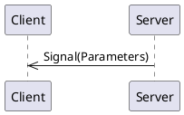
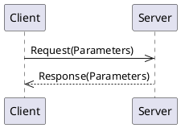
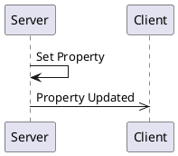

# _Interface for testing_ API Overview 
_This tries to capture most variants of features._


[[_TOC_]]

## Connections

A connection object is a wrapper around an MQTT client and provides specific functionality to support both clients and servers.
Generally, you only need one connection object per daemon/program, as it can support multiple clients and servers.  

### Connection code Examples

<details>
  <summary>Python</summary>

```python
from connection import MqttBrokerConnection, MqttTransportType, MqttTransport

transport = MqttTransport(MqttTransportType.TCP, "localhost", 1883) # Or: MqttTransport(MqttTransportType.UNIX, socket_path="/path/to/socket")
connection_object = MqttBrokerConnection(transport)
```

The `connection_object` will be passed to client and server constructors.

</details>

<details>
  <summary>Rust</summary>

Rust implementations use the [MQTTier](https://crates.io/crates/mqttier) crate for MQTT connectivity.  MQTTier is a wrapper around the [rumqttc](https://crates.io/crates/rumqttc) crate and handles serialization, message queuing, and acknowledgments.

```rust
use mqttier::{MqttierClient, MqttierOptions};

  let conn_opts = MqttierOptionsBuilder::new()
      .connection(Connection::TcpLocalhost(1883)) // Connection::UnixSocket("/path/to/socket") is also supported.
      .build()
      .unwrap()
      .expect("Failed to build MQTT connection options");
  let mut connection = MqttierClient::new(conn_opts).unwrap().expect("Failed to create MQTT client");
```

The `connection_object` will be passed to client and server constructors.

</details>

<details>
  <summary>C++</summary>

The C++ connection object is a wrapper around the [libmosquitto](https://mosquitto.org/api/files/mosquitto-h.html) C library.  This library only supports TCP and WebSocket connections.  Unix Domain Socket support may be added in the future.

```c++
#include "broker.hpp"

auto connection_object = std::make_shared<MqttBrokerConnection>("localhost", 1883, "daemon-name");
```

The `connection_object` will be passed to client and server constructors.

</details>

## Server

A server is a _provider_ of functionality.  It sends signals, handles method calls, and owns property values.

### Server Code Examples

<details>
  <summary>Python Server</summary>

```python
from testableipc.client import TestAbleServer

server = TestAbleServer(connection_object)
```

The `server` object provides methods for emitting signals and updating properties.  It also allows for decorators to indicate method call handlers.

A full example can be viewed by looking at the `if __name__ == "__main__":` section of the generated `testableipc.server.py` module.

</details>


<details>
  <summary>C++ Server</summary>

```c++

```

The `server` object provides methods for emitting signals and updating properties.  It also allows for decorators to indicate method call handlers.

A full example can be viewed by looking at the generated `examples/server_main.cpp` file.`

</details>

## Client

A client is a _utilizer_ of functionality.  It receives signals, makes method calls, reads property values, or requests updates to property values.

<details>
  <summary>Rust</summary>

```rust
let mut api_client = TestAbleClient::new(&mut connection).await;
```

A full example can be viewed by looking at the generated `client/examples/client.rs` file.

</details>

<details>
  <summary>C++ Client</summary>

A full example can be viewed by looking at the generated `examples/client_main.cpp` file.

</details>

## Logging

Each generated language has different ways of handling logging.  

### Python

Python uses the standard Python `logging` module.  

### Rust

Rust uses the `tracing` crate for logging.

### C++

C++ uses a user-provided logging function.  The function should take two parameters: an integer log level and a string message. 

Log levels are re-used from the `syslog.h` header file, although no other syslog mechanisms are used.  Client and server classes use the logging provided by the `MqttBrokerConnection` object.

<details>
  <summary>Example C++ Code</summary>

```c++
#include <syslog.h>

auto connnection = std::make_shared<MqttBrokerConnection>(...);
connnection->SetLogLevel(LOG_DEBUG);
connnection->SetLogFunction([](int level, const char* msg)
{
    std::cout << "[" << level << "] " << msg << std::endl;
});
```

</details>


## Signals

Signals are messages from a server to clients.



### Signal `empty`

A signal with no parameters.

#### Signal Parameters for `empty`

| Name          | Type     |Description|
|---------------|----------|-----------|

#### Code Examples

<details>
  <summary>Python Client</summary>

The `empty` signal can be subscribed to by using the client's `receive_empty` decorator on a callback function. The name of the function does not matter. The function is called any time the signal is received.

```python
@client.receive_empty
def on_empty():
    print(f"Got a 'empty' signal: ")
```

</details>

<details>
  <summary>Python Server</summary>

A server can emit a `empty` signal simply by calling the server's `emit_empty` method.

```python
server.emit_empty()
```

</details>

<details>
  <summary>Rust Client</summary>

A Rust client receives signals through a `tokio::broadcast` channel.  Receiving from the channel returns a `Result<T, RecvError>` object.  

Since receiving a message through the channel blocks, it may be best to put this into a separate async task.

```rust
let mut empty_signal_rx = client.get_empty_receiver();
print("Got a 'empty' signal: {:?}", empty_signal_rx.recv().await);
```

</details>

<details>
  <summary>Rust Server</summary>

A server can emit a `empty` signal simply by calling the server's `emit_empty` method.

```rust
let publish_result = server.emit_empty().await;
```

The return type is a **Pinned Boxed Future** that resolves to a `Result<(), MethodReturnCode>`.  The future is resolved when the signal is sent (with "publish complete" acknowledgment) or when an error occurs.  If you need to block until the signal is received by the MQTT broker, you can `.await` the future.

</details>

<details>
  <summary>C++ Client</summary>

A client can register a callback function to be called when a `empty` signal is received.  The callback function should take the same parameters as the signal.  In this example, we are using a lambda as the callback function.

```cpp
client.registerEmptyCallback([]() {
    std::cout <<  std::endl;
});
```

</details>

<details>
  <summary>C++ Server</summary>

A `empty` signal can be emitted by calling the server's `emitEmptySignal` method.  This returns a `std::future` that can be waited on if desired.  The future is resolved when the signal is sent.

```cpp
auto emptyFuture = server.emitEmptySignal();
emptyFuture.wait(); // Optional, to block until signal is sent.
```

</details>


### Signal `singleInt`

A signal with a single integer parameter.

#### Signal Parameters for `singleInt`

| Name          | Type     |Description|
|---------------|----------|-----------|
|     value     | integer  |The integer value.|

#### Code Examples

<details>
  <summary>Python Client</summary>

The `singleInt` signal can be subscribed to by using the client's `receive_single_int` decorator on a callback function. The name of the function does not matter. The function is called any time the signal is received.

```python
@client.receive_single_int
def on_single_int(value: int):
    print(f"Got a 'singleInt' signal: value={ value } ")
```

</details>

<details>
  <summary>Python Server</summary>

A server can emit a `singleInt` signal simply by calling the server's `emit_single_int` method.

```python
server.emit_single_int(42)
```

</details>

<details>
  <summary>Rust Client</summary>

A Rust client receives signals through a `tokio::broadcast` channel.  Receiving from the channel returns a `Result<T, RecvError>` object.  

Since receiving a message through the channel blocks, it may be best to put this into a separate async task.

```rust
let mut single_int_signal_rx = client.get_single_int_receiver();
print("Got a 'singleInt' signal: {:?}", single_int_signal_rx.recv().await);
```

</details>

<details>
  <summary>Rust Server</summary>

A server can emit a `singleInt` signal simply by calling the server's `emit_single_int` method.

```rust
let publish_result = server.emit_single_int(42).await;
```

The return type is a **Pinned Boxed Future** that resolves to a `Result<(), MethodReturnCode>`.  The future is resolved when the signal is sent (with "publish complete" acknowledgment) or when an error occurs.  If you need to block until the signal is received by the MQTT broker, you can `.await` the future.

</details>

<details>
  <summary>C++ Client</summary>

A client can register a callback function to be called when a `singleInt` signal is received.  The callback function should take the same parameters as the signal.  In this example, we are using a lambda as the callback function.

```cpp
client.registerSingleIntCallback([](int value) {
    std::cout << "value=" <<value <<  std::endl;
});
```

</details>

<details>
  <summary>C++ Server</summary>

A `singleInt` signal can be emitted by calling the server's `emitSingleIntSignal` method.  This returns a `std::future` that can be waited on if desired.  The future is resolved when the signal is sent.

```cpp
auto singleIntFuture = server.emitSingleIntSignal(42);
singleIntFuture.wait(); // Optional, to block until signal is sent.
```

</details>


### Signal `singleOptionalInt`

A signal with a single optional integer parameter.

#### Signal Parameters for `singleOptionalInt`

| Name          | Type     |Description|
|---------------|----------|-----------|
|     value     | integer   (optional)|The integer value.|

#### Code Examples

<details>
  <summary>Python Client</summary>

The `singleOptionalInt` signal can be subscribed to by using the client's `receive_single_optional_int` decorator on a callback function. The name of the function does not matter. The function is called any time the signal is received.

```python
@client.receive_single_optional_int
def on_single_optional_int(value: Optional[int]):
    print(f"Got a 'singleOptionalInt' signal: value={ value } ")
```

</details>

<details>
  <summary>Python Server</summary>

A server can emit a `singleOptionalInt` signal simply by calling the server's `emit_single_optional_int` method.

```python
server.emit_single_optional_int(42)
```

</details>

<details>
  <summary>Rust Client</summary>

A Rust client receives signals through a `tokio::broadcast` channel.  Receiving from the channel returns a `Result<T, RecvError>` object.  

Since receiving a message through the channel blocks, it may be best to put this into a separate async task.

```rust
let mut single_optional_int_signal_rx = client.get_single_optional_int_receiver();
print("Got a 'singleOptionalInt' signal: {:?}", single_optional_int_signal_rx.recv().await);
```

</details>

<details>
  <summary>Rust Server</summary>

A server can emit a `singleOptionalInt` signal simply by calling the server's `emit_single_optional_int` method.

```rust
let publish_result = server.emit_single_optional_int(Some(42)).await;
```

The return type is a **Pinned Boxed Future** that resolves to a `Result<(), MethodReturnCode>`.  The future is resolved when the signal is sent (with "publish complete" acknowledgment) or when an error occurs.  If you need to block until the signal is received by the MQTT broker, you can `.await` the future.

</details>

<details>
  <summary>C++ Client</summary>

A client can register a callback function to be called when a `singleOptionalInt` signal is received.  The callback function should take the same parameters as the signal.  In this example, we are using a lambda as the callback function.

```cpp
client.registerSingleOptionalIntCallback([](boost::optional<int> value) {
    std::cout << "value=" << "None" <<  std::endl;
});
```

</details>

<details>
  <summary>C++ Server</summary>

A `singleOptionalInt` signal can be emitted by calling the server's `emitSingleOptionalIntSignal` method.  This returns a `std::future` that can be waited on if desired.  The future is resolved when the signal is sent.

```cpp
auto singleOptionalIntFuture = server.emitSingleOptionalIntSignal(42);
singleOptionalIntFuture.wait(); // Optional, to block until signal is sent.
```

</details>


### Signal `threeIntegers`

A signal with three integer parameters, the third is optional.

#### Signal Parameters for `threeIntegers`

| Name          | Type     |Description|
|---------------|----------|-----------|
|     first     | integer  |The first integer value.|
|     second    | integer  |The second integer value.|
|     third     | integer   (optional)|The third integer value.|

#### Code Examples

<details>
  <summary>Python Client</summary>

The `threeIntegers` signal can be subscribed to by using the client's `receive_three_integers` decorator on a callback function. The name of the function does not matter. The function is called any time the signal is received.

```python
@client.receive_three_integers
def on_three_integers(first: int, second: int, third: Optional[int]):
    print(f"Got a 'threeIntegers' signal: first={ first } second={ second } third={ third } ")
```

</details>

<details>
  <summary>Python Server</summary>

A server can emit a `threeIntegers` signal simply by calling the server's `emit_three_integers` method.

```python
server.emit_three_integers(42, 42, 42)
```

</details>

<details>
  <summary>Rust Client</summary>

A Rust client receives signals through a `tokio::broadcast` channel.  Receiving from the channel returns a `Result<T, RecvError>` object.  

Since receiving a message through the channel blocks, it may be best to put this into a separate async task.

```rust
let mut three_integers_signal_rx = client.get_three_integers_receiver();
print("Got a 'threeIntegers' signal: {:?}", three_integers_signal_rx.recv().await);
```

</details>

<details>
  <summary>Rust Server</summary>

A server can emit a `threeIntegers` signal simply by calling the server's `emit_three_integers` method.

```rust
let publish_result = server.emit_three_integers(42, 42, Some(42)).await;
```

The return type is a **Pinned Boxed Future** that resolves to a `Result<(), MethodReturnCode>`.  The future is resolved when the signal is sent (with "publish complete" acknowledgment) or when an error occurs.  If you need to block until the signal is received by the MQTT broker, you can `.await` the future.

</details>

<details>
  <summary>C++ Client</summary>

A client can register a callback function to be called when a `threeIntegers` signal is received.  The callback function should take the same parameters as the signal.  In this example, we are using a lambda as the callback function.

```cpp
client.registerThreeIntegersCallback([](int first, int second, boost::optional<int> third) {
    std::cout << "first=" <<first << " | " << "second=" <<second << " | " << "third=" << "None" <<  std::endl;
});
```

</details>

<details>
  <summary>C++ Server</summary>

A `threeIntegers` signal can be emitted by calling the server's `emitThreeIntegersSignal` method.  This returns a `std::future` that can be waited on if desired.  The future is resolved when the signal is sent.

```cpp
auto threeIntegersFuture = server.emitThreeIntegersSignal(42, 42, 42);
threeIntegersFuture.wait(); // Optional, to block until signal is sent.
```

</details>


### Signal `singleString`

A signal with a single string parameter.

#### Signal Parameters for `singleString`

| Name          | Type     |Description|
|---------------|----------|-----------|
|     value     |  string  |The string value.|

#### Code Examples

<details>
  <summary>Python Client</summary>

The `singleString` signal can be subscribed to by using the client's `receive_single_string` decorator on a callback function. The name of the function does not matter. The function is called any time the signal is received.

```python
@client.receive_single_string
def on_single_string(value: str):
    print(f"Got a 'singleString' signal: value={ value } ")
```

</details>

<details>
  <summary>Python Server</summary>

A server can emit a `singleString` signal simply by calling the server's `emit_single_string` method.

```python
server.emit_single_string("apples")
```

</details>

<details>
  <summary>Rust Client</summary>

A Rust client receives signals through a `tokio::broadcast` channel.  Receiving from the channel returns a `Result<T, RecvError>` object.  

Since receiving a message through the channel blocks, it may be best to put this into a separate async task.

```rust
let mut single_string_signal_rx = client.get_single_string_receiver();
print("Got a 'singleString' signal: {:?}", single_string_signal_rx.recv().await);
```

</details>

<details>
  <summary>Rust Server</summary>

A server can emit a `singleString` signal simply by calling the server's `emit_single_string` method.

```rust
let publish_result = server.emit_single_string("apples".to_string()).await;
```

The return type is a **Pinned Boxed Future** that resolves to a `Result<(), MethodReturnCode>`.  The future is resolved when the signal is sent (with "publish complete" acknowledgment) or when an error occurs.  If you need to block until the signal is received by the MQTT broker, you can `.await` the future.

</details>

<details>
  <summary>C++ Client</summary>

A client can register a callback function to be called when a `singleString` signal is received.  The callback function should take the same parameters as the signal.  In this example, we are using a lambda as the callback function.

```cpp
client.registerSingleStringCallback([](const std::string& value) {
    std::cout << "value=" <<value <<  std::endl;
});
```

</details>

<details>
  <summary>C++ Server</summary>

A `singleString` signal can be emitted by calling the server's `emitSingleStringSignal` method.  This returns a `std::future` that can be waited on if desired.  The future is resolved when the signal is sent.

```cpp
auto singleStringFuture = server.emitSingleStringSignal("apples");
singleStringFuture.wait(); // Optional, to block until signal is sent.
```

</details>


### Signal `singleOptionalString`

A signal with a single optional string parameter.

#### Signal Parameters for `singleOptionalString`

| Name          | Type     |Description|
|---------------|----------|-----------|
|     value     |  string   (optional)|The string value.|

#### Code Examples

<details>
  <summary>Python Client</summary>

The `singleOptionalString` signal can be subscribed to by using the client's `receive_single_optional_string` decorator on a callback function. The name of the function does not matter. The function is called any time the signal is received.

```python
@client.receive_single_optional_string
def on_single_optional_string(value: Optional[str]):
    print(f"Got a 'singleOptionalString' signal: value={ value } ")
```

</details>

<details>
  <summary>Python Server</summary>

A server can emit a `singleOptionalString` signal simply by calling the server's `emit_single_optional_string` method.

```python
server.emit_single_optional_string("apples")
```

</details>

<details>
  <summary>Rust Client</summary>

A Rust client receives signals through a `tokio::broadcast` channel.  Receiving from the channel returns a `Result<T, RecvError>` object.  

Since receiving a message through the channel blocks, it may be best to put this into a separate async task.

```rust
let mut single_optional_string_signal_rx = client.get_single_optional_string_receiver();
print("Got a 'singleOptionalString' signal: {:?}", single_optional_string_signal_rx.recv().await);
```

</details>

<details>
  <summary>Rust Server</summary>

A server can emit a `singleOptionalString` signal simply by calling the server's `emit_single_optional_string` method.

```rust
let publish_result = server.emit_single_optional_string(Some("apples".to_string())).await;
```

The return type is a **Pinned Boxed Future** that resolves to a `Result<(), MethodReturnCode>`.  The future is resolved when the signal is sent (with "publish complete" acknowledgment) or when an error occurs.  If you need to block until the signal is received by the MQTT broker, you can `.await` the future.

</details>

<details>
  <summary>C++ Client</summary>

A client can register a callback function to be called when a `singleOptionalString` signal is received.  The callback function should take the same parameters as the signal.  In this example, we are using a lambda as the callback function.

```cpp
client.registerSingleOptionalStringCallback([](boost::optional<std::string> value) {
    std::cout << "value=" << "None" <<  std::endl;
});
```

</details>

<details>
  <summary>C++ Server</summary>

A `singleOptionalString` signal can be emitted by calling the server's `emitSingleOptionalStringSignal` method.  This returns a `std::future` that can be waited on if desired.  The future is resolved when the signal is sent.

```cpp
auto singleOptionalStringFuture = server.emitSingleOptionalStringSignal(boost::make_optional(std::string("apples")));
singleOptionalStringFuture.wait(); // Optional, to block until signal is sent.
```

</details>


### Signal `threeStrings`

A signal with three string parameters, the third is optional.

#### Signal Parameters for `threeStrings`

| Name          | Type     |Description|
|---------------|----------|-----------|
|     first     |  string  |The first string value.|
|     second    |  string  |The second string value.|
|     third     |  string   (optional)|The third string value.|

#### Code Examples

<details>
  <summary>Python Client</summary>

The `threeStrings` signal can be subscribed to by using the client's `receive_three_strings` decorator on a callback function. The name of the function does not matter. The function is called any time the signal is received.

```python
@client.receive_three_strings
def on_three_strings(first: str, second: str, third: Optional[str]):
    print(f"Got a 'threeStrings' signal: first={ first } second={ second } third={ third } ")
```

</details>

<details>
  <summary>Python Server</summary>

A server can emit a `threeStrings` signal simply by calling the server's `emit_three_strings` method.

```python
server.emit_three_strings("apples", "apples", "apples")
```

</details>

<details>
  <summary>Rust Client</summary>

A Rust client receives signals through a `tokio::broadcast` channel.  Receiving from the channel returns a `Result<T, RecvError>` object.  

Since receiving a message through the channel blocks, it may be best to put this into a separate async task.

```rust
let mut three_strings_signal_rx = client.get_three_strings_receiver();
print("Got a 'threeStrings' signal: {:?}", three_strings_signal_rx.recv().await);
```

</details>

<details>
  <summary>Rust Server</summary>

A server can emit a `threeStrings` signal simply by calling the server's `emit_three_strings` method.

```rust
let publish_result = server.emit_three_strings("apples".to_string(), "apples".to_string(), Some("apples".to_string())).await;
```

The return type is a **Pinned Boxed Future** that resolves to a `Result<(), MethodReturnCode>`.  The future is resolved when the signal is sent (with "publish complete" acknowledgment) or when an error occurs.  If you need to block until the signal is received by the MQTT broker, you can `.await` the future.

</details>

<details>
  <summary>C++ Client</summary>

A client can register a callback function to be called when a `threeStrings` signal is received.  The callback function should take the same parameters as the signal.  In this example, we are using a lambda as the callback function.

```cpp
client.registerThreeStringsCallback([](const std::string& first, const std::string& second, boost::optional<std::string> third) {
    std::cout << "first=" <<first << " | " << "second=" <<second << " | " << "third=" << "None" <<  std::endl;
});
```

</details>

<details>
  <summary>C++ Server</summary>

A `threeStrings` signal can be emitted by calling the server's `emitThreeStringsSignal` method.  This returns a `std::future` that can be waited on if desired.  The future is resolved when the signal is sent.

```cpp
auto threeStringsFuture = server.emitThreeStringsSignal("apples", "apples", boost::make_optional(std::string("apples")));
threeStringsFuture.wait(); // Optional, to block until signal is sent.
```

</details>


### Signal `singleEnum`

A signal with a single enum parameter.

#### Signal Parameters for `singleEnum`

| Name          | Type     |Description|
|---------------|----------|-----------|
|     value     |[Enum Numbers](#enum-Numbers)|The enum value.|

#### Code Examples

<details>
  <summary>Python Client</summary>

The `singleEnum` signal can be subscribed to by using the client's `receive_single_enum` decorator on a callback function. The name of the function does not matter. The function is called any time the signal is received.

```python
@client.receive_single_enum
def on_single_enum(value: Numbers):
    print(f"Got a 'singleEnum' signal: value={ value } ")
```

</details>

<details>
  <summary>Python Server</summary>

A server can emit a `singleEnum` signal simply by calling the server's `emit_single_enum` method.

```python
server.emit_single_enum(Numbers.ONE)
```

</details>

<details>
  <summary>Rust Client</summary>

A Rust client receives signals through a `tokio::broadcast` channel.  Receiving from the channel returns a `Result<T, RecvError>` object.  

Since receiving a message through the channel blocks, it may be best to put this into a separate async task.

```rust
let mut single_enum_signal_rx = client.get_single_enum_receiver();
print("Got a 'singleEnum' signal: {:?}", single_enum_signal_rx.recv().await);
```

</details>

<details>
  <summary>Rust Server</summary>

A server can emit a `singleEnum` signal simply by calling the server's `emit_single_enum` method.

```rust
let publish_result = server.emit_single_enum(Numbers::One).await;
```

The return type is a **Pinned Boxed Future** that resolves to a `Result<(), MethodReturnCode>`.  The future is resolved when the signal is sent (with "publish complete" acknowledgment) or when an error occurs.  If you need to block until the signal is received by the MQTT broker, you can `.await` the future.

</details>

<details>
  <summary>C++ Client</summary>

A client can register a callback function to be called when a `singleEnum` signal is received.  The callback function should take the same parameters as the signal.  In this example, we are using a lambda as the callback function.

```cpp
client.registerSingleEnumCallback([](Numbers value) {
    std::cout << "value=" <<numbersStrings[static_cast<int>(value)] <<  std::endl;
});
```

</details>

<details>
  <summary>C++ Server</summary>

A `singleEnum` signal can be emitted by calling the server's `emitSingleEnumSignal` method.  This returns a `std::future` that can be waited on if desired.  The future is resolved when the signal is sent.

```cpp
auto singleEnumFuture = server.emitSingleEnumSignal(Numbers::ONE);
singleEnumFuture.wait(); // Optional, to block until signal is sent.
```

</details>


### Signal `singleOptionalEnum`

A signal with a single optional enum parameter.

#### Signal Parameters for `singleOptionalEnum`

| Name          | Type     |Description|
|---------------|----------|-----------|
|     value     |[Enum Numbers](#enum-Numbers) (optional)|The enum value.|

#### Code Examples

<details>
  <summary>Python Client</summary>

The `singleOptionalEnum` signal can be subscribed to by using the client's `receive_single_optional_enum` decorator on a callback function. The name of the function does not matter. The function is called any time the signal is received.

```python
@client.receive_single_optional_enum
def on_single_optional_enum(value: Optional[Numbers]):
    print(f"Got a 'singleOptionalEnum' signal: value={ value } ")
```

</details>

<details>
  <summary>Python Server</summary>

A server can emit a `singleOptionalEnum` signal simply by calling the server's `emit_single_optional_enum` method.

```python
server.emit_single_optional_enum(Numbers.ONE)
```

</details>

<details>
  <summary>Rust Client</summary>

A Rust client receives signals through a `tokio::broadcast` channel.  Receiving from the channel returns a `Result<T, RecvError>` object.  

Since receiving a message through the channel blocks, it may be best to put this into a separate async task.

```rust
let mut single_optional_enum_signal_rx = client.get_single_optional_enum_receiver();
print("Got a 'singleOptionalEnum' signal: {:?}", single_optional_enum_signal_rx.recv().await);
```

</details>

<details>
  <summary>Rust Server</summary>

A server can emit a `singleOptionalEnum` signal simply by calling the server's `emit_single_optional_enum` method.

```rust
let publish_result = server.emit_single_optional_enum(Some(Numbers::One)).await;
```

The return type is a **Pinned Boxed Future** that resolves to a `Result<(), MethodReturnCode>`.  The future is resolved when the signal is sent (with "publish complete" acknowledgment) or when an error occurs.  If you need to block until the signal is received by the MQTT broker, you can `.await` the future.

</details>

<details>
  <summary>C++ Client</summary>

A client can register a callback function to be called when a `singleOptionalEnum` signal is received.  The callback function should take the same parameters as the signal.  In this example, we are using a lambda as the callback function.

```cpp
client.registerSingleOptionalEnumCallback([](boost::optional<Numbers> value) {
    std::cout << "value=" << "None" <<  std::endl;
});
```

</details>

<details>
  <summary>C++ Server</summary>

A `singleOptionalEnum` signal can be emitted by calling the server's `emitSingleOptionalEnumSignal` method.  This returns a `std::future` that can be waited on if desired.  The future is resolved when the signal is sent.

```cpp
auto singleOptionalEnumFuture = server.emitSingleOptionalEnumSignal(Numbers::ONE);
singleOptionalEnumFuture.wait(); // Optional, to block until signal is sent.
```

</details>


### Signal `threeEnums`

A signal with three enum parameters, the third is optional.

#### Signal Parameters for `threeEnums`

| Name          | Type     |Description|
|---------------|----------|-----------|
|     first     |[Enum Numbers](#enum-Numbers)|The first enum value.|
|     second    |[Enum Numbers](#enum-Numbers)|The second enum value.|
|     third     |[Enum Numbers](#enum-Numbers) (optional)|The third enum value.|

#### Code Examples

<details>
  <summary>Python Client</summary>

The `threeEnums` signal can be subscribed to by using the client's `receive_three_enums` decorator on a callback function. The name of the function does not matter. The function is called any time the signal is received.

```python
@client.receive_three_enums
def on_three_enums(first: Numbers, second: Numbers, third: Optional[Numbers]):
    print(f"Got a 'threeEnums' signal: first={ first } second={ second } third={ third } ")
```

</details>

<details>
  <summary>Python Server</summary>

A server can emit a `threeEnums` signal simply by calling the server's `emit_three_enums` method.

```python
server.emit_three_enums(Numbers.ONE, Numbers.ONE, Numbers.ONE)
```

</details>

<details>
  <summary>Rust Client</summary>

A Rust client receives signals through a `tokio::broadcast` channel.  Receiving from the channel returns a `Result<T, RecvError>` object.  

Since receiving a message through the channel blocks, it may be best to put this into a separate async task.

```rust
let mut three_enums_signal_rx = client.get_three_enums_receiver();
print("Got a 'threeEnums' signal: {:?}", three_enums_signal_rx.recv().await);
```

</details>

<details>
  <summary>Rust Server</summary>

A server can emit a `threeEnums` signal simply by calling the server's `emit_three_enums` method.

```rust
let publish_result = server.emit_three_enums(Numbers::One, Numbers::One, Some(Numbers::One)).await;
```

The return type is a **Pinned Boxed Future** that resolves to a `Result<(), MethodReturnCode>`.  The future is resolved when the signal is sent (with "publish complete" acknowledgment) or when an error occurs.  If you need to block until the signal is received by the MQTT broker, you can `.await` the future.

</details>

<details>
  <summary>C++ Client</summary>

A client can register a callback function to be called when a `threeEnums` signal is received.  The callback function should take the same parameters as the signal.  In this example, we are using a lambda as the callback function.

```cpp
client.registerThreeEnumsCallback([](Numbers first, Numbers second, boost::optional<Numbers> third) {
    std::cout << "first=" <<numbersStrings[static_cast<int>(first)] << " | " << "second=" <<numbersStrings[static_cast<int>(second)] << " | " << "third=" << "None" <<  std::endl;
});
```

</details>

<details>
  <summary>C++ Server</summary>

A `threeEnums` signal can be emitted by calling the server's `emitThreeEnumsSignal` method.  This returns a `std::future` that can be waited on if desired.  The future is resolved when the signal is sent.

```cpp
auto threeEnumsFuture = server.emitThreeEnumsSignal(Numbers::ONE, Numbers::ONE, Numbers::ONE);
threeEnumsFuture.wait(); // Optional, to block until signal is sent.
```

</details>


### Signal `singleStruct`

A signal with a single struct parameter.

#### Signal Parameters for `singleStruct`

| Name          | Type     |Description|
|---------------|----------|-----------|
|     value     |[Struct AllTypes](#enum-AllTypes)|The struct value.|

#### Code Examples

<details>
  <summary>Python Client</summary>

The `singleStruct` signal can be subscribed to by using the client's `receive_single_struct` decorator on a callback function. The name of the function does not matter. The function is called any time the signal is received.

```python
@client.receive_single_struct
def on_single_struct(value: AllTypes):
    print(f"Got a 'singleStruct' signal: value={ value } ")
```

</details>

<details>
  <summary>Python Server</summary>

A server can emit a `singleStruct` signal simply by calling the server's `emit_single_struct` method.

```python
server.emit_single_struct(AllTypes(the_bool=True, the_int=42, the_number=3.14, the_str="apples", the_enum=Numbers.ONE, an_entry_object=Entry(key=42, value="apples"), date_and_time=datetime.now(UTC), time_duration=timedelta(seconds=3536), data=b"example binary data", optional_integer=42, optional_string="apples", optional_enum=Numbers.ONE, optional_entry_object=Entry(key=42, value="apples"), optional_date_time=None, optional_duration=None, optional_binary=b"example binary data", array_of_integers=[42, 2022], optional_array_of_integers=[42, 2022], array_of_strings=["apples", "foo"], optional_array_of_strings=["apples", "foo"], array_of_enums=[Numbers.ONE, Numbers.ONE], optional_array_of_enums=[Numbers.ONE, Numbers.ONE], array_of_datetimes=[datetime.now(UTC), datetime.now(UTC)], optional_array_of_datetimes=[datetime.now(UTC), datetime.now(UTC)], array_of_durations=[timedelta(seconds=3536), timedelta(seconds=975)], optional_array_of_durations=[timedelta(seconds=3536), timedelta(seconds=975)], array_of_binaries=[b"example binary data", b"example binary data"], optional_array_of_binaries=[b"example binary data", b"example binary data"], array_of_entry_objects=[Entry(key=42, value="apples"), Entry(key=2022, value="foo")], optional_array_of_entry_objects=[Entry(key=42, value="apples"), Entry(key=2022, value="foo")]))
```

</details>

<details>
  <summary>Rust Client</summary>

A Rust client receives signals through a `tokio::broadcast` channel.  Receiving from the channel returns a `Result<T, RecvError>` object.  

Since receiving a message through the channel blocks, it may be best to put this into a separate async task.

```rust
let mut single_struct_signal_rx = client.get_single_struct_receiver();
print("Got a 'singleStruct' signal: {:?}", single_struct_signal_rx.recv().await);
```

</details>

<details>
  <summary>Rust Server</summary>

A server can emit a `singleStruct` signal simply by calling the server's `emit_single_struct` method.

```rust
let publish_result = server.emit_single_struct(AllTypes {the_bool: true, the_int: 42, the_number: 3.14, the_str: "apples".to_string(), the_enum: Numbers::One, an_entry_object: Entry {key: 42, value: "apples".to_string()}, date_and_time: chrono::Utc::now(), time_duration: chrono::Duration::seconds(3536), data: vec![101, 120, 97, 109, 112, 108, 101], optional_integer: Some(42), optional_string: Some("apples".to_string()), optional_enum: Some(Numbers::One), optional_entry_object: Some(Entry {key: 42, value: "apples".to_string()}), optional_date_time: Some(chrono::Utc::now()), optional_duration: Some(chrono::Duration::seconds(3536)), optional_binary: Some(vec![101, 120, 97, 109, 112, 108, 101]), array_of_integers: vec![42, 2022], optional_array_of_integers: Some(vec![42, 2022, 2022]), array_of_strings: vec!["apples".to_string(), "foo".to_string()], optional_array_of_strings: Some(vec!["apples".to_string(), "foo".to_string(), "foo".to_string()]), array_of_enums: vec![Numbers::One, Numbers::One], optional_array_of_enums: Some(vec![Numbers::One, Numbers::One, Numbers::One]), array_of_datetimes: vec![chrono::Utc::now(), chrono::Utc::now()], optional_array_of_datetimes: Some(vec![chrono::Utc::now(), chrono::Utc::now(), chrono::Utc::now()]), array_of_durations: vec![chrono::Duration::seconds(3536), chrono::Duration::seconds(975)], optional_array_of_durations: Some(vec![chrono::Duration::seconds(3536), chrono::Duration::seconds(975), chrono::Duration::seconds(967)]), array_of_binaries: vec![vec![101, 120, 97, 109, 112, 108, 101], vec![101, 120, 97, 109, 112, 108, 101]], optional_array_of_binaries: Some(vec![vec![101, 120, 97, 109, 112, 108, 101], vec![101, 120, 97, 109, 112, 108, 101], vec![101, 120, 97, 109, 112, 108, 101]]), array_of_entry_objects: vec![Entry {key: 42, value: "apples".to_string()}, Entry {key: 2022, value: "foo".to_string()}], optional_array_of_entry_objects: Some(vec![Entry {key: 42, value: "apples".to_string()}, Entry {key: 2022, value: "foo".to_string()}, Entry {key: 2022, value: "foo".to_string()}])}).await;
```

The return type is a **Pinned Boxed Future** that resolves to a `Result<(), MethodReturnCode>`.  The future is resolved when the signal is sent (with "publish complete" acknowledgment) or when an error occurs.  If you need to block until the signal is received by the MQTT broker, you can `.await` the future.

</details>

<details>
  <summary>C++ Client</summary>

A client can register a callback function to be called when a `singleStruct` signal is received.  The callback function should take the same parameters as the signal.  In this example, we are using a lambda as the callback function.

```cpp
client.registerSingleStructCallback([](AllTypes value) {
    std::cout << "value=" <<value <<  std::endl;
});
```

</details>

<details>
  <summary>C++ Server</summary>

A `singleStruct` signal can be emitted by calling the server's `emitSingleStructSignal` method.  This returns a `std::future` that can be waited on if desired.  The future is resolved when the signal is sent.

```cpp
auto singleStructFuture = server.emitSingleStructSignal(AllTypes{true, 42, 3.14, "apples", Numbers::ONE, Entry{42, "apples"}, std::chrono::system_clock::now(), std::chrono::duration<double>(3536), std::vector<uint8_t>{101, 120, 97, 109, 112, 108, 101}, 42, boost::make_optional(std::string("apples")), Numbers::ONE, Entry{42, "apples"}, std::chrono::system_clock::now(), std::chrono::duration<double>(3536), std::vector<uint8_t>{101, 120, 97, 109, 112, 108, 101}, std::vector<int>{42, 2022}, std::vector<int>{42, 2022}, std::vector<std::string>{"apples", "foo"}, std::vector<std::string>{"apples", "foo"}, std::vector<Numbers>{Numbers::ONE, Numbers::ONE}, std::vector<Numbers>{Numbers::ONE, Numbers::ONE}, std::vector<std::chrono::time_point<std::chrono::system_clock>>{std::chrono::system_clock::now(), std::chrono::system_clock::now()}, std::vector<std::chrono::time_point<std::chrono::system_clock>>{std::chrono::system_clock::now(), std::chrono::system_clock::now()}, std::vector<std::chrono::duration<double>>{std::chrono::duration<double>(3536), std::chrono::duration<double>(975)}, std::vector<std::chrono::duration<double>>{std::chrono::duration<double>(3536), std::chrono::duration<double>(975)}, std::vector<std::vector<uint8_t>>{std::vector<uint8_t>{101, 120, 97, 109, 112, 108, 101}, std::vector<uint8_t>{101, 120, 97, 109, 112, 108, 101}}, std::vector<std::vector<uint8_t>>{std::vector<uint8_t>{101, 120, 97, 109, 112, 108, 101}, std::vector<uint8_t>{101, 120, 97, 109, 112, 108, 101}}, std::vector<Entry>{Entry{42, "apples"}, Entry{2022, "foo"}}, std::vector<Entry>{Entry{42, "apples"}, Entry{2022, "foo"}}});
singleStructFuture.wait(); // Optional, to block until signal is sent.
```

</details>


### Signal `singleOptionalStruct`

A signal with a single optional struct parameter.

#### Signal Parameters for `singleOptionalStruct`

| Name          | Type     |Description|
|---------------|----------|-----------|
|     value     |[Struct AllTypes](#enum-AllTypes) (optional)|The struct value.|

#### Code Examples

<details>
  <summary>Python Client</summary>

The `singleOptionalStruct` signal can be subscribed to by using the client's `receive_single_optional_struct` decorator on a callback function. The name of the function does not matter. The function is called any time the signal is received.

```python
@client.receive_single_optional_struct
def on_single_optional_struct(value: AllTypes):
    print(f"Got a 'singleOptionalStruct' signal: value={ value } ")
```

</details>

<details>
  <summary>Python Server</summary>

A server can emit a `singleOptionalStruct` signal simply by calling the server's `emit_single_optional_struct` method.

```python
server.emit_single_optional_struct(AllTypes(the_bool=True, the_int=42, the_number=3.14, the_str="apples", the_enum=Numbers.ONE, an_entry_object=Entry(key=42, value="apples"), date_and_time=datetime.now(UTC), time_duration=timedelta(seconds=3536), data=b"example binary data", optional_integer=42, optional_string="apples", optional_enum=Numbers.ONE, optional_entry_object=Entry(key=42, value="apples"), optional_date_time=None, optional_duration=None, optional_binary=b"example binary data", array_of_integers=[42, 2022], optional_array_of_integers=[42, 2022], array_of_strings=["apples", "foo"], optional_array_of_strings=["apples", "foo"], array_of_enums=[Numbers.ONE, Numbers.ONE], optional_array_of_enums=[Numbers.ONE, Numbers.ONE], array_of_datetimes=[datetime.now(UTC), datetime.now(UTC)], optional_array_of_datetimes=[datetime.now(UTC), datetime.now(UTC)], array_of_durations=[timedelta(seconds=3536), timedelta(seconds=975)], optional_array_of_durations=[timedelta(seconds=3536), timedelta(seconds=975)], array_of_binaries=[b"example binary data", b"example binary data"], optional_array_of_binaries=[b"example binary data", b"example binary data"], array_of_entry_objects=[Entry(key=42, value="apples"), Entry(key=2022, value="foo")], optional_array_of_entry_objects=[Entry(key=42, value="apples"), Entry(key=2022, value="foo")]))
```

</details>

<details>
  <summary>Rust Client</summary>

A Rust client receives signals through a `tokio::broadcast` channel.  Receiving from the channel returns a `Result<T, RecvError>` object.  

Since receiving a message through the channel blocks, it may be best to put this into a separate async task.

```rust
let mut single_optional_struct_signal_rx = client.get_single_optional_struct_receiver();
print("Got a 'singleOptionalStruct' signal: {:?}", single_optional_struct_signal_rx.recv().await);
```

</details>

<details>
  <summary>Rust Server</summary>

A server can emit a `singleOptionalStruct` signal simply by calling the server's `emit_single_optional_struct` method.

```rust
let publish_result = server.emit_single_optional_struct(Some(AllTypes {the_bool: true, the_int: 42, the_number: 3.14, the_str: "apples".to_string(), the_enum: Numbers::One, an_entry_object: Entry {key: 42, value: "apples".to_string()}, date_and_time: chrono::Utc::now(), time_duration: chrono::Duration::seconds(3536), data: vec![101, 120, 97, 109, 112, 108, 101], optional_integer: Some(42), optional_string: Some("apples".to_string()), optional_enum: Some(Numbers::One), optional_entry_object: Some(Entry {key: 42, value: "apples".to_string()}), optional_date_time: Some(chrono::Utc::now()), optional_duration: Some(chrono::Duration::seconds(3536)), optional_binary: Some(vec![101, 120, 97, 109, 112, 108, 101]), array_of_integers: vec![42, 2022], optional_array_of_integers: Some(vec![42, 2022, 2022]), array_of_strings: vec!["apples".to_string(), "foo".to_string()], optional_array_of_strings: Some(vec!["apples".to_string(), "foo".to_string(), "foo".to_string()]), array_of_enums: vec![Numbers::One, Numbers::One], optional_array_of_enums: Some(vec![Numbers::One, Numbers::One, Numbers::One]), array_of_datetimes: vec![chrono::Utc::now(), chrono::Utc::now()], optional_array_of_datetimes: Some(vec![chrono::Utc::now(), chrono::Utc::now(), chrono::Utc::now()]), array_of_durations: vec![chrono::Duration::seconds(3536), chrono::Duration::seconds(975)], optional_array_of_durations: Some(vec![chrono::Duration::seconds(3536), chrono::Duration::seconds(975), chrono::Duration::seconds(967)]), array_of_binaries: vec![vec![101, 120, 97, 109, 112, 108, 101], vec![101, 120, 97, 109, 112, 108, 101]], optional_array_of_binaries: Some(vec![vec![101, 120, 97, 109, 112, 108, 101], vec![101, 120, 97, 109, 112, 108, 101], vec![101, 120, 97, 109, 112, 108, 101]]), array_of_entry_objects: vec![Entry {key: 42, value: "apples".to_string()}, Entry {key: 2022, value: "foo".to_string()}], optional_array_of_entry_objects: Some(vec![Entry {key: 42, value: "apples".to_string()}, Entry {key: 2022, value: "foo".to_string()}, Entry {key: 2022, value: "foo".to_string()}])})).await;
```

The return type is a **Pinned Boxed Future** that resolves to a `Result<(), MethodReturnCode>`.  The future is resolved when the signal is sent (with "publish complete" acknowledgment) or when an error occurs.  If you need to block until the signal is received by the MQTT broker, you can `.await` the future.

</details>

<details>
  <summary>C++ Client</summary>

A client can register a callback function to be called when a `singleOptionalStruct` signal is received.  The callback function should take the same parameters as the signal.  In this example, we are using a lambda as the callback function.

```cpp
client.registerSingleOptionalStructCallback([](AllTypes value) {
    std::cout << "value=" << "None" <<  std::endl;
});
```

</details>

<details>
  <summary>C++ Server</summary>

A `singleOptionalStruct` signal can be emitted by calling the server's `emitSingleOptionalStructSignal` method.  This returns a `std::future` that can be waited on if desired.  The future is resolved when the signal is sent.

```cpp
auto singleOptionalStructFuture = server.emitSingleOptionalStructSignal(AllTypes{true, 42, 3.14, "apples", Numbers::ONE, Entry{42, "apples"}, std::chrono::system_clock::now(), std::chrono::duration<double>(3536), std::vector<uint8_t>{101, 120, 97, 109, 112, 108, 101}, 42, boost::make_optional(std::string("apples")), Numbers::ONE, Entry{42, "apples"}, std::chrono::system_clock::now(), std::chrono::duration<double>(3536), std::vector<uint8_t>{101, 120, 97, 109, 112, 108, 101}, std::vector<int>{42, 2022}, std::vector<int>{42, 2022}, std::vector<std::string>{"apples", "foo"}, std::vector<std::string>{"apples", "foo"}, std::vector<Numbers>{Numbers::ONE, Numbers::ONE}, std::vector<Numbers>{Numbers::ONE, Numbers::ONE}, std::vector<std::chrono::time_point<std::chrono::system_clock>>{std::chrono::system_clock::now(), std::chrono::system_clock::now()}, std::vector<std::chrono::time_point<std::chrono::system_clock>>{std::chrono::system_clock::now(), std::chrono::system_clock::now()}, std::vector<std::chrono::duration<double>>{std::chrono::duration<double>(3536), std::chrono::duration<double>(975)}, std::vector<std::chrono::duration<double>>{std::chrono::duration<double>(3536), std::chrono::duration<double>(975)}, std::vector<std::vector<uint8_t>>{std::vector<uint8_t>{101, 120, 97, 109, 112, 108, 101}, std::vector<uint8_t>{101, 120, 97, 109, 112, 108, 101}}, std::vector<std::vector<uint8_t>>{std::vector<uint8_t>{101, 120, 97, 109, 112, 108, 101}, std::vector<uint8_t>{101, 120, 97, 109, 112, 108, 101}}, std::vector<Entry>{Entry{42, "apples"}, Entry{2022, "foo"}}, std::vector<Entry>{Entry{42, "apples"}, Entry{2022, "foo"}}});
singleOptionalStructFuture.wait(); // Optional, to block until signal is sent.
```

</details>


### Signal `threeStructs`

A signal with three struct parameters, the third is optional.

#### Signal Parameters for `threeStructs`

| Name          | Type     |Description|
|---------------|----------|-----------|
|     first     |[Struct AllTypes](#enum-AllTypes)|The first struct value.|
|     second    |[Struct AllTypes](#enum-AllTypes)|The second struct value.|
|     third     |[Struct AllTypes](#enum-AllTypes) (optional)|The third struct value.|

#### Code Examples

<details>
  <summary>Python Client</summary>

The `threeStructs` signal can be subscribed to by using the client's `receive_three_structs` decorator on a callback function. The name of the function does not matter. The function is called any time the signal is received.

```python
@client.receive_three_structs
def on_three_structs(first: AllTypes, second: AllTypes, third: AllTypes):
    print(f"Got a 'threeStructs' signal: first={ first } second={ second } third={ third } ")
```

</details>

<details>
  <summary>Python Server</summary>

A server can emit a `threeStructs` signal simply by calling the server's `emit_three_structs` method.

```python
server.emit_three_structs(AllTypes(the_bool=True, the_int=42, the_number=3.14, the_str="apples", the_enum=Numbers.ONE, an_entry_object=Entry(key=42, value="apples"), date_and_time=datetime.now(UTC), time_duration=timedelta(seconds=3536), data=b"example binary data", optional_integer=42, optional_string="apples", optional_enum=Numbers.ONE, optional_entry_object=Entry(key=42, value="apples"), optional_date_time=datetime.now(UTC), optional_duration=None, optional_binary=b"example binary data", array_of_integers=[42, 2022], optional_array_of_integers=[42, 2022], array_of_strings=["apples", "foo"], optional_array_of_strings=["apples", "foo"], array_of_enums=[Numbers.ONE, Numbers.ONE], optional_array_of_enums=[Numbers.ONE, Numbers.ONE], array_of_datetimes=[datetime.now(UTC), datetime.now(UTC)], optional_array_of_datetimes=[datetime.now(UTC), datetime.now(UTC)], array_of_durations=[timedelta(seconds=3536), timedelta(seconds=975)], optional_array_of_durations=[timedelta(seconds=3536), timedelta(seconds=975)], array_of_binaries=[b"example binary data", b"example binary data"], optional_array_of_binaries=[b"example binary data", b"example binary data"], array_of_entry_objects=[Entry(key=42, value="apples"), Entry(key=2022, value="foo")], optional_array_of_entry_objects=[Entry(key=42, value="apples"), Entry(key=2022, value="foo")]), AllTypes(the_bool=True, the_int=42, the_number=3.14, the_str="apples", the_enum=Numbers.ONE, an_entry_object=Entry(key=42, value="apples"), date_and_time=datetime.now(UTC), time_duration=timedelta(seconds=3536), data=b"example binary data", optional_integer=42, optional_string="apples", optional_enum=Numbers.ONE, optional_entry_object=Entry(key=42, value="apples"), optional_date_time=datetime.now(UTC), optional_duration=None, optional_binary=b"example binary data", array_of_integers=[42, 2022], optional_array_of_integers=[42, 2022], array_of_strings=["apples", "foo"], optional_array_of_strings=["apples", "foo"], array_of_enums=[Numbers.ONE, Numbers.ONE], optional_array_of_enums=[Numbers.ONE, Numbers.ONE], array_of_datetimes=[datetime.now(UTC), datetime.now(UTC)], optional_array_of_datetimes=[datetime.now(UTC), datetime.now(UTC)], array_of_durations=[timedelta(seconds=3536), timedelta(seconds=975)], optional_array_of_durations=[timedelta(seconds=3536), timedelta(seconds=975)], array_of_binaries=[b"example binary data", b"example binary data"], optional_array_of_binaries=[b"example binary data", b"example binary data"], array_of_entry_objects=[Entry(key=42, value="apples"), Entry(key=2022, value="foo")], optional_array_of_entry_objects=[Entry(key=42, value="apples"), Entry(key=2022, value="foo")]), AllTypes(the_bool=True, the_int=42, the_number=3.14, the_str="apples", the_enum=Numbers.ONE, an_entry_object=Entry(key=42, value="apples"), date_and_time=datetime.now(UTC), time_duration=timedelta(seconds=3536), data=b"example binary data", optional_integer=42, optional_string="apples", optional_enum=Numbers.ONE, optional_entry_object=Entry(key=42, value="apples"), optional_date_time=datetime.now(UTC), optional_duration=None, optional_binary=b"example binary data", array_of_integers=[42, 2022], optional_array_of_integers=[42, 2022], array_of_strings=["apples", "foo"], optional_array_of_strings=["apples", "foo"], array_of_enums=[Numbers.ONE, Numbers.ONE], optional_array_of_enums=[Numbers.ONE, Numbers.ONE], array_of_datetimes=[datetime.now(UTC), datetime.now(UTC)], optional_array_of_datetimes=[datetime.now(UTC), datetime.now(UTC)], array_of_durations=[timedelta(seconds=3536), timedelta(seconds=975)], optional_array_of_durations=[timedelta(seconds=3536), timedelta(seconds=975)], array_of_binaries=[b"example binary data", b"example binary data"], optional_array_of_binaries=[b"example binary data", b"example binary data"], array_of_entry_objects=[Entry(key=42, value="apples"), Entry(key=2022, value="foo")], optional_array_of_entry_objects=[Entry(key=42, value="apples"), Entry(key=2022, value="foo")]))
```

</details>

<details>
  <summary>Rust Client</summary>

A Rust client receives signals through a `tokio::broadcast` channel.  Receiving from the channel returns a `Result<T, RecvError>` object.  

Since receiving a message through the channel blocks, it may be best to put this into a separate async task.

```rust
let mut three_structs_signal_rx = client.get_three_structs_receiver();
print("Got a 'threeStructs' signal: {:?}", three_structs_signal_rx.recv().await);
```

</details>

<details>
  <summary>Rust Server</summary>

A server can emit a `threeStructs` signal simply by calling the server's `emit_three_structs` method.

```rust
let publish_result = server.emit_three_structs(AllTypes {the_bool: true, the_int: 42, the_number: 3.14, the_str: "apples".to_string(), the_enum: Numbers::One, an_entry_object: Entry {key: 42, value: "apples".to_string()}, date_and_time: chrono::Utc::now(), time_duration: chrono::Duration::seconds(3536), data: vec![101, 120, 97, 109, 112, 108, 101], optional_integer: Some(42), optional_string: Some("apples".to_string()), optional_enum: Some(Numbers::One), optional_entry_object: Some(Entry {key: 42, value: "apples".to_string()}), optional_date_time: Some(chrono::Utc::now()), optional_duration: Some(chrono::Duration::seconds(3536)), optional_binary: Some(vec![101, 120, 97, 109, 112, 108, 101]), array_of_integers: vec![42, 2022], optional_array_of_integers: Some(vec![42, 2022, 2022]), array_of_strings: vec!["apples".to_string(), "foo".to_string()], optional_array_of_strings: Some(vec!["apples".to_string(), "foo".to_string(), "foo".to_string()]), array_of_enums: vec![Numbers::One, Numbers::One], optional_array_of_enums: Some(vec![Numbers::One, Numbers::One, Numbers::One]), array_of_datetimes: vec![chrono::Utc::now(), chrono::Utc::now()], optional_array_of_datetimes: Some(vec![chrono::Utc::now(), chrono::Utc::now(), chrono::Utc::now()]), array_of_durations: vec![chrono::Duration::seconds(3536), chrono::Duration::seconds(975)], optional_array_of_durations: Some(vec![chrono::Duration::seconds(3536), chrono::Duration::seconds(975), chrono::Duration::seconds(967)]), array_of_binaries: vec![vec![101, 120, 97, 109, 112, 108, 101], vec![101, 120, 97, 109, 112, 108, 101]], optional_array_of_binaries: Some(vec![vec![101, 120, 97, 109, 112, 108, 101], vec![101, 120, 97, 109, 112, 108, 101], vec![101, 120, 97, 109, 112, 108, 101]]), array_of_entry_objects: vec![Entry {key: 42, value: "apples".to_string()}, Entry {key: 2022, value: "foo".to_string()}], optional_array_of_entry_objects: Some(vec![Entry {key: 42, value: "apples".to_string()}, Entry {key: 2022, value: "foo".to_string()}, Entry {key: 2022, value: "foo".to_string()}])}, AllTypes {the_bool: true, the_int: 42, the_number: 3.14, the_str: "apples".to_string(), the_enum: Numbers::One, an_entry_object: Entry {key: 42, value: "apples".to_string()}, date_and_time: chrono::Utc::now(), time_duration: chrono::Duration::seconds(3536), data: vec![101, 120, 97, 109, 112, 108, 101], optional_integer: Some(42), optional_string: Some("apples".to_string()), optional_enum: Some(Numbers::One), optional_entry_object: Some(Entry {key: 42, value: "apples".to_string()}), optional_date_time: Some(chrono::Utc::now()), optional_duration: Some(chrono::Duration::seconds(3536)), optional_binary: Some(vec![101, 120, 97, 109, 112, 108, 101]), array_of_integers: vec![42, 2022], optional_array_of_integers: Some(vec![42, 2022, 2022]), array_of_strings: vec!["apples".to_string(), "foo".to_string()], optional_array_of_strings: Some(vec!["apples".to_string(), "foo".to_string(), "foo".to_string()]), array_of_enums: vec![Numbers::One, Numbers::One], optional_array_of_enums: Some(vec![Numbers::One, Numbers::One, Numbers::One]), array_of_datetimes: vec![chrono::Utc::now(), chrono::Utc::now()], optional_array_of_datetimes: Some(vec![chrono::Utc::now(), chrono::Utc::now(), chrono::Utc::now()]), array_of_durations: vec![chrono::Duration::seconds(3536), chrono::Duration::seconds(975)], optional_array_of_durations: Some(vec![chrono::Duration::seconds(3536), chrono::Duration::seconds(975), chrono::Duration::seconds(967)]), array_of_binaries: vec![vec![101, 120, 97, 109, 112, 108, 101], vec![101, 120, 97, 109, 112, 108, 101]], optional_array_of_binaries: Some(vec![vec![101, 120, 97, 109, 112, 108, 101], vec![101, 120, 97, 109, 112, 108, 101], vec![101, 120, 97, 109, 112, 108, 101]]), array_of_entry_objects: vec![Entry {key: 42, value: "apples".to_string()}, Entry {key: 2022, value: "foo".to_string()}], optional_array_of_entry_objects: Some(vec![Entry {key: 42, value: "apples".to_string()}, Entry {key: 2022, value: "foo".to_string()}, Entry {key: 2022, value: "foo".to_string()}])}, Some(AllTypes {the_bool: true, the_int: 42, the_number: 3.14, the_str: "apples".to_string(), the_enum: Numbers::One, an_entry_object: Entry {key: 42, value: "apples".to_string()}, date_and_time: chrono::Utc::now(), time_duration: chrono::Duration::seconds(3536), data: vec![101, 120, 97, 109, 112, 108, 101], optional_integer: Some(42), optional_string: Some("apples".to_string()), optional_enum: Some(Numbers::One), optional_entry_object: Some(Entry {key: 42, value: "apples".to_string()}), optional_date_time: Some(chrono::Utc::now()), optional_duration: Some(chrono::Duration::seconds(3536)), optional_binary: Some(vec![101, 120, 97, 109, 112, 108, 101]), array_of_integers: vec![42, 2022], optional_array_of_integers: Some(vec![42, 2022, 2022]), array_of_strings: vec!["apples".to_string(), "foo".to_string()], optional_array_of_strings: Some(vec!["apples".to_string(), "foo".to_string(), "foo".to_string()]), array_of_enums: vec![Numbers::One, Numbers::One], optional_array_of_enums: Some(vec![Numbers::One, Numbers::One, Numbers::One]), array_of_datetimes: vec![chrono::Utc::now(), chrono::Utc::now()], optional_array_of_datetimes: Some(vec![chrono::Utc::now(), chrono::Utc::now(), chrono::Utc::now()]), array_of_durations: vec![chrono::Duration::seconds(3536), chrono::Duration::seconds(975)], optional_array_of_durations: Some(vec![chrono::Duration::seconds(3536), chrono::Duration::seconds(975), chrono::Duration::seconds(967)]), array_of_binaries: vec![vec![101, 120, 97, 109, 112, 108, 101], vec![101, 120, 97, 109, 112, 108, 101]], optional_array_of_binaries: Some(vec![vec![101, 120, 97, 109, 112, 108, 101], vec![101, 120, 97, 109, 112, 108, 101], vec![101, 120, 97, 109, 112, 108, 101]]), array_of_entry_objects: vec![Entry {key: 42, value: "apples".to_string()}, Entry {key: 2022, value: "foo".to_string()}], optional_array_of_entry_objects: Some(vec![Entry {key: 42, value: "apples".to_string()}, Entry {key: 2022, value: "foo".to_string()}, Entry {key: 2022, value: "foo".to_string()}])})).await;
```

The return type is a **Pinned Boxed Future** that resolves to a `Result<(), MethodReturnCode>`.  The future is resolved when the signal is sent (with "publish complete" acknowledgment) or when an error occurs.  If you need to block until the signal is received by the MQTT broker, you can `.await` the future.

</details>

<details>
  <summary>C++ Client</summary>

A client can register a callback function to be called when a `threeStructs` signal is received.  The callback function should take the same parameters as the signal.  In this example, we are using a lambda as the callback function.

```cpp
client.registerThreeStructsCallback([](AllTypes first, AllTypes second, AllTypes third) {
    std::cout << "first=" <<first << " | " << "second=" <<second << " | " << "third=" << "None" <<  std::endl;
});
```

</details>

<details>
  <summary>C++ Server</summary>

A `threeStructs` signal can be emitted by calling the server's `emitThreeStructsSignal` method.  This returns a `std::future` that can be waited on if desired.  The future is resolved when the signal is sent.

```cpp
auto threeStructsFuture = server.emitThreeStructsSignal(AllTypes{true, 42, 3.14, "apples", Numbers::ONE, Entry{42, "apples"}, std::chrono::system_clock::now(), std::chrono::duration<double>(3536), std::vector<uint8_t>{101, 120, 97, 109, 112, 108, 101}, 42, boost::make_optional(std::string("apples")), Numbers::ONE, Entry{42, "apples"}, std::chrono::system_clock::now(), std::chrono::duration<double>(3536), std::vector<uint8_t>{101, 120, 97, 109, 112, 108, 101}, std::vector<int>{42, 2022}, std::vector<int>{42, 2022}, std::vector<std::string>{"apples", "foo"}, std::vector<std::string>{"apples", "foo"}, std::vector<Numbers>{Numbers::ONE, Numbers::ONE}, std::vector<Numbers>{Numbers::ONE, Numbers::ONE}, std::vector<std::chrono::time_point<std::chrono::system_clock>>{std::chrono::system_clock::now(), std::chrono::system_clock::now()}, std::vector<std::chrono::time_point<std::chrono::system_clock>>{std::chrono::system_clock::now(), std::chrono::system_clock::now()}, std::vector<std::chrono::duration<double>>{std::chrono::duration<double>(3536), std::chrono::duration<double>(975)}, std::vector<std::chrono::duration<double>>{std::chrono::duration<double>(3536), std::chrono::duration<double>(975)}, std::vector<std::vector<uint8_t>>{std::vector<uint8_t>{101, 120, 97, 109, 112, 108, 101}, std::vector<uint8_t>{101, 120, 97, 109, 112, 108, 101}}, std::vector<std::vector<uint8_t>>{std::vector<uint8_t>{101, 120, 97, 109, 112, 108, 101}, std::vector<uint8_t>{101, 120, 97, 109, 112, 108, 101}}, std::vector<Entry>{Entry{42, "apples"}, Entry{2022, "foo"}}, std::vector<Entry>{Entry{42, "apples"}, Entry{2022, "foo"}}}, AllTypes{true, 42, 3.14, "apples", Numbers::ONE, Entry{42, "apples"}, std::chrono::system_clock::now(), std::chrono::duration<double>(3536), std::vector<uint8_t>{101, 120, 97, 109, 112, 108, 101}, 42, boost::make_optional(std::string("apples")), Numbers::ONE, Entry{42, "apples"}, std::chrono::system_clock::now(), std::chrono::duration<double>(3536), std::vector<uint8_t>{101, 120, 97, 109, 112, 108, 101}, std::vector<int>{42, 2022}, std::vector<int>{42, 2022}, std::vector<std::string>{"apples", "foo"}, std::vector<std::string>{"apples", "foo"}, std::vector<Numbers>{Numbers::ONE, Numbers::ONE}, std::vector<Numbers>{Numbers::ONE, Numbers::ONE}, std::vector<std::chrono::time_point<std::chrono::system_clock>>{std::chrono::system_clock::now(), std::chrono::system_clock::now()}, std::vector<std::chrono::time_point<std::chrono::system_clock>>{std::chrono::system_clock::now(), std::chrono::system_clock::now()}, std::vector<std::chrono::duration<double>>{std::chrono::duration<double>(3536), std::chrono::duration<double>(975)}, std::vector<std::chrono::duration<double>>{std::chrono::duration<double>(3536), std::chrono::duration<double>(975)}, std::vector<std::vector<uint8_t>>{std::vector<uint8_t>{101, 120, 97, 109, 112, 108, 101}, std::vector<uint8_t>{101, 120, 97, 109, 112, 108, 101}}, std::vector<std::vector<uint8_t>>{std::vector<uint8_t>{101, 120, 97, 109, 112, 108, 101}, std::vector<uint8_t>{101, 120, 97, 109, 112, 108, 101}}, std::vector<Entry>{Entry{42, "apples"}, Entry{2022, "foo"}}, std::vector<Entry>{Entry{42, "apples"}, Entry{2022, "foo"}}}, AllTypes{true, 42, 3.14, "apples", Numbers::ONE, Entry{42, "apples"}, std::chrono::system_clock::now(), std::chrono::duration<double>(3536), std::vector<uint8_t>{101, 120, 97, 109, 112, 108, 101}, 42, boost::make_optional(std::string("apples")), Numbers::ONE, Entry{42, "apples"}, std::chrono::system_clock::now(), std::chrono::duration<double>(3536), std::vector<uint8_t>{101, 120, 97, 109, 112, 108, 101}, std::vector<int>{42, 2022}, std::vector<int>{42, 2022}, std::vector<std::string>{"apples", "foo"}, std::vector<std::string>{"apples", "foo"}, std::vector<Numbers>{Numbers::ONE, Numbers::ONE}, std::vector<Numbers>{Numbers::ONE, Numbers::ONE}, std::vector<std::chrono::time_point<std::chrono::system_clock>>{std::chrono::system_clock::now(), std::chrono::system_clock::now()}, std::vector<std::chrono::time_point<std::chrono::system_clock>>{std::chrono::system_clock::now(), std::chrono::system_clock::now()}, std::vector<std::chrono::duration<double>>{std::chrono::duration<double>(3536), std::chrono::duration<double>(975)}, std::vector<std::chrono::duration<double>>{std::chrono::duration<double>(3536), std::chrono::duration<double>(975)}, std::vector<std::vector<uint8_t>>{std::vector<uint8_t>{101, 120, 97, 109, 112, 108, 101}, std::vector<uint8_t>{101, 120, 97, 109, 112, 108, 101}}, std::vector<std::vector<uint8_t>>{std::vector<uint8_t>{101, 120, 97, 109, 112, 108, 101}, std::vector<uint8_t>{101, 120, 97, 109, 112, 108, 101}}, std::vector<Entry>{Entry{42, "apples"}, Entry{2022, "foo"}}, std::vector<Entry>{Entry{42, "apples"}, Entry{2022, "foo"}}});
threeStructsFuture.wait(); // Optional, to block until signal is sent.
```

</details>


### Signal `singleDateTime`

A signal with a single date and time parameter.

#### Signal Parameters for `singleDateTime`

| Name          | Type     |Description|
|---------------|----------|-----------|
|     value     |          |The date and time value.|

#### Code Examples

<details>
  <summary>Python Client</summary>

The `singleDateTime` signal can be subscribed to by using the client's `receive_single_date_time` decorator on a callback function. The name of the function does not matter. The function is called any time the signal is received.

```python
@client.receive_single_date_time
def on_single_date_time(value: datetime):
    print(f"Got a 'singleDateTime' signal: value={ value } ")
```

</details>

<details>
  <summary>Python Server</summary>

A server can emit a `singleDateTime` signal simply by calling the server's `emit_single_date_time` method.

```python
server.emit_single_date_time(datetime.now(UTC))
```

</details>

<details>
  <summary>Rust Client</summary>

A Rust client receives signals through a `tokio::broadcast` channel.  Receiving from the channel returns a `Result<T, RecvError>` object.  

Since receiving a message through the channel blocks, it may be best to put this into a separate async task.

```rust
let mut single_date_time_signal_rx = client.get_single_date_time_receiver();
print("Got a 'singleDateTime' signal: {:?}", single_date_time_signal_rx.recv().await);
```

</details>

<details>
  <summary>Rust Server</summary>

A server can emit a `singleDateTime` signal simply by calling the server's `emit_single_date_time` method.

```rust
let publish_result = server.emit_single_date_time(chrono::Utc::now()).await;
```

The return type is a **Pinned Boxed Future** that resolves to a `Result<(), MethodReturnCode>`.  The future is resolved when the signal is sent (with "publish complete" acknowledgment) or when an error occurs.  If you need to block until the signal is received by the MQTT broker, you can `.await` the future.

</details>

<details>
  <summary>C++ Client</summary>

A client can register a callback function to be called when a `singleDateTime` signal is received.  The callback function should take the same parameters as the signal.  In this example, we are using a lambda as the callback function.

```cpp
client.registerSingleDateTimeCallback([](std::chrono::time_point<std::chrono::system_clock> value) {
    std::cout << "value=" <<value <<  std::endl;
});
```

</details>

<details>
  <summary>C++ Server</summary>

A `singleDateTime` signal can be emitted by calling the server's `emitSingleDateTimeSignal` method.  This returns a `std::future` that can be waited on if desired.  The future is resolved when the signal is sent.

```cpp
auto singleDateTimeFuture = server.emitSingleDateTimeSignal(std::chrono::system_clock::now());
singleDateTimeFuture.wait(); // Optional, to block until signal is sent.
```

</details>


### Signal `singleOptionalDatetime`

A signal with a single optional date and time parameter.

#### Signal Parameters for `singleOptionalDatetime`

| Name          | Type     |Description|
|---------------|----------|-----------|
|     value     |           (optional)|The date and time value.|

#### Code Examples

<details>
  <summary>Python Client</summary>

The `singleOptionalDatetime` signal can be subscribed to by using the client's `receive_single_optional_datetime` decorator on a callback function. The name of the function does not matter. The function is called any time the signal is received.

```python
@client.receive_single_optional_datetime
def on_single_optional_datetime(value: Optional[datetime]):
    print(f"Got a 'singleOptionalDatetime' signal: value={ value } ")
```

</details>

<details>
  <summary>Python Server</summary>

A server can emit a `singleOptionalDatetime` signal simply by calling the server's `emit_single_optional_datetime` method.

```python
server.emit_single_optional_datetime(datetime.now(UTC))
```

</details>

<details>
  <summary>Rust Client</summary>

A Rust client receives signals through a `tokio::broadcast` channel.  Receiving from the channel returns a `Result<T, RecvError>` object.  

Since receiving a message through the channel blocks, it may be best to put this into a separate async task.

```rust
let mut single_optional_datetime_signal_rx = client.get_single_optional_datetime_receiver();
print("Got a 'singleOptionalDatetime' signal: {:?}", single_optional_datetime_signal_rx.recv().await);
```

</details>

<details>
  <summary>Rust Server</summary>

A server can emit a `singleOptionalDatetime` signal simply by calling the server's `emit_single_optional_datetime` method.

```rust
let publish_result = server.emit_single_optional_datetime(Some(chrono::Utc::now())).await;
```

The return type is a **Pinned Boxed Future** that resolves to a `Result<(), MethodReturnCode>`.  The future is resolved when the signal is sent (with "publish complete" acknowledgment) or when an error occurs.  If you need to block until the signal is received by the MQTT broker, you can `.await` the future.

</details>

<details>
  <summary>C++ Client</summary>

A client can register a callback function to be called when a `singleOptionalDatetime` signal is received.  The callback function should take the same parameters as the signal.  In this example, we are using a lambda as the callback function.

```cpp
client.registerSingleOptionalDatetimeCallback([](boost::optional<std::chrono::time_point<std::chrono::system_clock>> value) {
    std::cout << "value=" << "None" <<  std::endl;
});
```

</details>

<details>
  <summary>C++ Server</summary>

A `singleOptionalDatetime` signal can be emitted by calling the server's `emitSingleOptionalDatetimeSignal` method.  This returns a `std::future` that can be waited on if desired.  The future is resolved when the signal is sent.

```cpp
auto singleOptionalDatetimeFuture = server.emitSingleOptionalDatetimeSignal(std::chrono::system_clock::now());
singleOptionalDatetimeFuture.wait(); // Optional, to block until signal is sent.
```

</details>


### Signal `threeDateTimes`

A signal with three date and time parameters, the third is optional.

#### Signal Parameters for `threeDateTimes`

| Name          | Type     |Description|
|---------------|----------|-----------|
|     first     |          |The first date and time value.|
|     second    |          |The second date and time value.|
|     third     |           (optional)|The third date and time value.|

#### Code Examples

<details>
  <summary>Python Client</summary>

The `threeDateTimes` signal can be subscribed to by using the client's `receive_three_date_times` decorator on a callback function. The name of the function does not matter. The function is called any time the signal is received.

```python
@client.receive_three_date_times
def on_three_date_times(first: datetime, second: datetime, third: Optional[datetime]):
    print(f"Got a 'threeDateTimes' signal: first={ first } second={ second } third={ third } ")
```

</details>

<details>
  <summary>Python Server</summary>

A server can emit a `threeDateTimes` signal simply by calling the server's `emit_three_date_times` method.

```python
server.emit_three_date_times(datetime.now(UTC), datetime.now(UTC), None)
```

</details>

<details>
  <summary>Rust Client</summary>

A Rust client receives signals through a `tokio::broadcast` channel.  Receiving from the channel returns a `Result<T, RecvError>` object.  

Since receiving a message through the channel blocks, it may be best to put this into a separate async task.

```rust
let mut three_date_times_signal_rx = client.get_three_date_times_receiver();
print("Got a 'threeDateTimes' signal: {:?}", three_date_times_signal_rx.recv().await);
```

</details>

<details>
  <summary>Rust Server</summary>

A server can emit a `threeDateTimes` signal simply by calling the server's `emit_three_date_times` method.

```rust
let publish_result = server.emit_three_date_times(chrono::Utc::now(), chrono::Utc::now(), Some(chrono::Utc::now())).await;
```

The return type is a **Pinned Boxed Future** that resolves to a `Result<(), MethodReturnCode>`.  The future is resolved when the signal is sent (with "publish complete" acknowledgment) or when an error occurs.  If you need to block until the signal is received by the MQTT broker, you can `.await` the future.

</details>

<details>
  <summary>C++ Client</summary>

A client can register a callback function to be called when a `threeDateTimes` signal is received.  The callback function should take the same parameters as the signal.  In this example, we are using a lambda as the callback function.

```cpp
client.registerThreeDateTimesCallback([](std::chrono::time_point<std::chrono::system_clock> first, std::chrono::time_point<std::chrono::system_clock> second, boost::optional<std::chrono::time_point<std::chrono::system_clock>> third) {
    std::cout << "first=" <<first << " | " << "second=" <<second << " | " << "third=" << "None" <<  std::endl;
});
```

</details>

<details>
  <summary>C++ Server</summary>

A `threeDateTimes` signal can be emitted by calling the server's `emitThreeDateTimesSignal` method.  This returns a `std::future` that can be waited on if desired.  The future is resolved when the signal is sent.

```cpp
auto threeDateTimesFuture = server.emitThreeDateTimesSignal(std::chrono::system_clock::now(), std::chrono::system_clock::now(), std::chrono::system_clock::now());
threeDateTimesFuture.wait(); // Optional, to block until signal is sent.
```

</details>


### Signal `singleDuration`

A signal with a single duration parameter.

#### Signal Parameters for `singleDuration`

| Name          | Type     |Description|
|---------------|----------|-----------|
|     value     |          |The duration value.|

#### Code Examples

<details>
  <summary>Python Client</summary>

The `singleDuration` signal can be subscribed to by using the client's `receive_single_duration` decorator on a callback function. The name of the function does not matter. The function is called any time the signal is received.

```python
@client.receive_single_duration
def on_single_duration(value: timedelta):
    print(f"Got a 'singleDuration' signal: value={ value } ")
```

</details>

<details>
  <summary>Python Server</summary>

A server can emit a `singleDuration` signal simply by calling the server's `emit_single_duration` method.

```python
server.emit_single_duration(timedelta(seconds=3536))
```

</details>

<details>
  <summary>Rust Client</summary>

A Rust client receives signals through a `tokio::broadcast` channel.  Receiving from the channel returns a `Result<T, RecvError>` object.  

Since receiving a message through the channel blocks, it may be best to put this into a separate async task.

```rust
let mut single_duration_signal_rx = client.get_single_duration_receiver();
print("Got a 'singleDuration' signal: {:?}", single_duration_signal_rx.recv().await);
```

</details>

<details>
  <summary>Rust Server</summary>

A server can emit a `singleDuration` signal simply by calling the server's `emit_single_duration` method.

```rust
let publish_result = server.emit_single_duration(chrono::Duration::seconds(3536)).await;
```

The return type is a **Pinned Boxed Future** that resolves to a `Result<(), MethodReturnCode>`.  The future is resolved when the signal is sent (with "publish complete" acknowledgment) or when an error occurs.  If you need to block until the signal is received by the MQTT broker, you can `.await` the future.

</details>

<details>
  <summary>C++ Client</summary>

A client can register a callback function to be called when a `singleDuration` signal is received.  The callback function should take the same parameters as the signal.  In this example, we are using a lambda as the callback function.

```cpp
client.registerSingleDurationCallback([](std::chrono::duration<double> value) {
    std::cout << "value=" <<value <<  std::endl;
});
```

</details>

<details>
  <summary>C++ Server</summary>

A `singleDuration` signal can be emitted by calling the server's `emitSingleDurationSignal` method.  This returns a `std::future` that can be waited on if desired.  The future is resolved when the signal is sent.

```cpp
auto singleDurationFuture = server.emitSingleDurationSignal(std::chrono::duration<double>(3536));
singleDurationFuture.wait(); // Optional, to block until signal is sent.
```

</details>


### Signal `singleOptionalDuration`

A signal with a single optional duration parameter.

#### Signal Parameters for `singleOptionalDuration`

| Name          | Type     |Description|
|---------------|----------|-----------|
|     value     |           (optional)|The duration value.|

#### Code Examples

<details>
  <summary>Python Client</summary>

The `singleOptionalDuration` signal can be subscribed to by using the client's `receive_single_optional_duration` decorator on a callback function. The name of the function does not matter. The function is called any time the signal is received.

```python
@client.receive_single_optional_duration
def on_single_optional_duration(value: Optional[timedelta]):
    print(f"Got a 'singleOptionalDuration' signal: value={ value } ")
```

</details>

<details>
  <summary>Python Server</summary>

A server can emit a `singleOptionalDuration` signal simply by calling the server's `emit_single_optional_duration` method.

```python
server.emit_single_optional_duration(None)
```

</details>

<details>
  <summary>Rust Client</summary>

A Rust client receives signals through a `tokio::broadcast` channel.  Receiving from the channel returns a `Result<T, RecvError>` object.  

Since receiving a message through the channel blocks, it may be best to put this into a separate async task.

```rust
let mut single_optional_duration_signal_rx = client.get_single_optional_duration_receiver();
print("Got a 'singleOptionalDuration' signal: {:?}", single_optional_duration_signal_rx.recv().await);
```

</details>

<details>
  <summary>Rust Server</summary>

A server can emit a `singleOptionalDuration` signal simply by calling the server's `emit_single_optional_duration` method.

```rust
let publish_result = server.emit_single_optional_duration(Some(chrono::Duration::seconds(3536))).await;
```

The return type is a **Pinned Boxed Future** that resolves to a `Result<(), MethodReturnCode>`.  The future is resolved when the signal is sent (with "publish complete" acknowledgment) or when an error occurs.  If you need to block until the signal is received by the MQTT broker, you can `.await` the future.

</details>

<details>
  <summary>C++ Client</summary>

A client can register a callback function to be called when a `singleOptionalDuration` signal is received.  The callback function should take the same parameters as the signal.  In this example, we are using a lambda as the callback function.

```cpp
client.registerSingleOptionalDurationCallback([](boost::optional<std::chrono::duration<double>> value) {
    std::cout << "value=" << "None" <<  std::endl;
});
```

</details>

<details>
  <summary>C++ Server</summary>

A `singleOptionalDuration` signal can be emitted by calling the server's `emitSingleOptionalDurationSignal` method.  This returns a `std::future` that can be waited on if desired.  The future is resolved when the signal is sent.

```cpp
auto singleOptionalDurationFuture = server.emitSingleOptionalDurationSignal(std::chrono::duration<double>(3536));
singleOptionalDurationFuture.wait(); // Optional, to block until signal is sent.
```

</details>


### Signal `threeDurations`

A signal with three duration parameters, the third is optional.

#### Signal Parameters for `threeDurations`

| Name          | Type     |Description|
|---------------|----------|-----------|
|     first     |          |The first duration value.|
|     second    |          |The second duration value.|
|     third     |           (optional)|The third duration value.|

#### Code Examples

<details>
  <summary>Python Client</summary>

The `threeDurations` signal can be subscribed to by using the client's `receive_three_durations` decorator on a callback function. The name of the function does not matter. The function is called any time the signal is received.

```python
@client.receive_three_durations
def on_three_durations(first: timedelta, second: timedelta, third: Optional[timedelta]):
    print(f"Got a 'threeDurations' signal: first={ first } second={ second } third={ third } ")
```

</details>

<details>
  <summary>Python Server</summary>

A server can emit a `threeDurations` signal simply by calling the server's `emit_three_durations` method.

```python
server.emit_three_durations(timedelta(seconds=3536), timedelta(seconds=3536), None)
```

</details>

<details>
  <summary>Rust Client</summary>

A Rust client receives signals through a `tokio::broadcast` channel.  Receiving from the channel returns a `Result<T, RecvError>` object.  

Since receiving a message through the channel blocks, it may be best to put this into a separate async task.

```rust
let mut three_durations_signal_rx = client.get_three_durations_receiver();
print("Got a 'threeDurations' signal: {:?}", three_durations_signal_rx.recv().await);
```

</details>

<details>
  <summary>Rust Server</summary>

A server can emit a `threeDurations` signal simply by calling the server's `emit_three_durations` method.

```rust
let publish_result = server.emit_three_durations(chrono::Duration::seconds(3536), chrono::Duration::seconds(3536), Some(chrono::Duration::seconds(3536))).await;
```

The return type is a **Pinned Boxed Future** that resolves to a `Result<(), MethodReturnCode>`.  The future is resolved when the signal is sent (with "publish complete" acknowledgment) or when an error occurs.  If you need to block until the signal is received by the MQTT broker, you can `.await` the future.

</details>

<details>
  <summary>C++ Client</summary>

A client can register a callback function to be called when a `threeDurations` signal is received.  The callback function should take the same parameters as the signal.  In this example, we are using a lambda as the callback function.

```cpp
client.registerThreeDurationsCallback([](std::chrono::duration<double> first, std::chrono::duration<double> second, boost::optional<std::chrono::duration<double>> third) {
    std::cout << "first=" <<first << " | " << "second=" <<second << " | " << "third=" << "None" <<  std::endl;
});
```

</details>

<details>
  <summary>C++ Server</summary>

A `threeDurations` signal can be emitted by calling the server's `emitThreeDurationsSignal` method.  This returns a `std::future` that can be waited on if desired.  The future is resolved when the signal is sent.

```cpp
auto threeDurationsFuture = server.emitThreeDurationsSignal(std::chrono::duration<double>(3536), std::chrono::duration<double>(3536), std::chrono::duration<double>(3536));
threeDurationsFuture.wait(); // Optional, to block until signal is sent.
```

</details>


### Signal `singleBinary`

A signal with a single binary parameter.

#### Signal Parameters for `singleBinary`

| Name          | Type     |Description|
|---------------|----------|-----------|
|     value     |          |The binary value.|

#### Code Examples

<details>
  <summary>Python Client</summary>

The `singleBinary` signal can be subscribed to by using the client's `receive_single_binary` decorator on a callback function. The name of the function does not matter. The function is called any time the signal is received.

```python
@client.receive_single_binary
def on_single_binary(value: bytes):
    print(f"Got a 'singleBinary' signal: value={ value } ")
```

</details>

<details>
  <summary>Python Server</summary>

A server can emit a `singleBinary` signal simply by calling the server's `emit_single_binary` method.

```python
server.emit_single_binary(b"example binary data")
```

</details>

<details>
  <summary>Rust Client</summary>

A Rust client receives signals through a `tokio::broadcast` channel.  Receiving from the channel returns a `Result<T, RecvError>` object.  

Since receiving a message through the channel blocks, it may be best to put this into a separate async task.

```rust
let mut single_binary_signal_rx = client.get_single_binary_receiver();
print("Got a 'singleBinary' signal: {:?}", single_binary_signal_rx.recv().await);
```

</details>

<details>
  <summary>Rust Server</summary>

A server can emit a `singleBinary` signal simply by calling the server's `emit_single_binary` method.

```rust
let publish_result = server.emit_single_binary(vec![101, 120, 97, 109, 112, 108, 101]).await;
```

The return type is a **Pinned Boxed Future** that resolves to a `Result<(), MethodReturnCode>`.  The future is resolved when the signal is sent (with "publish complete" acknowledgment) or when an error occurs.  If you need to block until the signal is received by the MQTT broker, you can `.await` the future.

</details>

<details>
  <summary>C++ Client</summary>

A client can register a callback function to be called when a `singleBinary` signal is received.  The callback function should take the same parameters as the signal.  In this example, we are using a lambda as the callback function.

```cpp
client.registerSingleBinaryCallback([](std::vector<uint8_t> value) {
    std::cout << "value=" <<value <<  std::endl;
});
```

</details>

<details>
  <summary>C++ Server</summary>

A `singleBinary` signal can be emitted by calling the server's `emitSingleBinarySignal` method.  This returns a `std::future` that can be waited on if desired.  The future is resolved when the signal is sent.

```cpp
auto singleBinaryFuture = server.emitSingleBinarySignal(std::vector<uint8_t>{101, 120, 97, 109, 112, 108, 101});
singleBinaryFuture.wait(); // Optional, to block until signal is sent.
```

</details>


### Signal `singleOptionalBinary`

A signal with a single optional binary parameter.

#### Signal Parameters for `singleOptionalBinary`

| Name          | Type     |Description|
|---------------|----------|-----------|
|     value     |           (optional)|The binary value.|

#### Code Examples

<details>
  <summary>Python Client</summary>

The `singleOptionalBinary` signal can be subscribed to by using the client's `receive_single_optional_binary` decorator on a callback function. The name of the function does not matter. The function is called any time the signal is received.

```python
@client.receive_single_optional_binary
def on_single_optional_binary(value: bytes):
    print(f"Got a 'singleOptionalBinary' signal: value={ value } ")
```

</details>

<details>
  <summary>Python Server</summary>

A server can emit a `singleOptionalBinary` signal simply by calling the server's `emit_single_optional_binary` method.

```python
server.emit_single_optional_binary(b"example binary data")
```

</details>

<details>
  <summary>Rust Client</summary>

A Rust client receives signals through a `tokio::broadcast` channel.  Receiving from the channel returns a `Result<T, RecvError>` object.  

Since receiving a message through the channel blocks, it may be best to put this into a separate async task.

```rust
let mut single_optional_binary_signal_rx = client.get_single_optional_binary_receiver();
print("Got a 'singleOptionalBinary' signal: {:?}", single_optional_binary_signal_rx.recv().await);
```

</details>

<details>
  <summary>Rust Server</summary>

A server can emit a `singleOptionalBinary` signal simply by calling the server's `emit_single_optional_binary` method.

```rust
let publish_result = server.emit_single_optional_binary(Some(vec![101, 120, 97, 109, 112, 108, 101])).await;
```

The return type is a **Pinned Boxed Future** that resolves to a `Result<(), MethodReturnCode>`.  The future is resolved when the signal is sent (with "publish complete" acknowledgment) or when an error occurs.  If you need to block until the signal is received by the MQTT broker, you can `.await` the future.

</details>

<details>
  <summary>C++ Client</summary>

A client can register a callback function to be called when a `singleOptionalBinary` signal is received.  The callback function should take the same parameters as the signal.  In this example, we are using a lambda as the callback function.

```cpp
client.registerSingleOptionalBinaryCallback([](boost::optional<std::vector<uint8_t>> value) {
    std::cout << "value=" << "None" <<  std::endl;
});
```

</details>

<details>
  <summary>C++ Server</summary>

A `singleOptionalBinary` signal can be emitted by calling the server's `emitSingleOptionalBinarySignal` method.  This returns a `std::future` that can be waited on if desired.  The future is resolved when the signal is sent.

```cpp
auto singleOptionalBinaryFuture = server.emitSingleOptionalBinarySignal(std::vector<uint8_t>{101, 120, 97, 109, 112, 108, 101});
singleOptionalBinaryFuture.wait(); // Optional, to block until signal is sent.
```

</details>


### Signal `threeBinaries`

A signal with three binary parameters, the third is optional.

#### Signal Parameters for `threeBinaries`

| Name          | Type     |Description|
|---------------|----------|-----------|
|     first     |          |The first binary value.|
|     second    |          |The second binary value.|
|     third     |           (optional)|The third binary value.|

#### Code Examples

<details>
  <summary>Python Client</summary>

The `threeBinaries` signal can be subscribed to by using the client's `receive_three_binaries` decorator on a callback function. The name of the function does not matter. The function is called any time the signal is received.

```python
@client.receive_three_binaries
def on_three_binaries(first: bytes, second: bytes, third: bytes):
    print(f"Got a 'threeBinaries' signal: first={ first } second={ second } third={ third } ")
```

</details>

<details>
  <summary>Python Server</summary>

A server can emit a `threeBinaries` signal simply by calling the server's `emit_three_binaries` method.

```python
server.emit_three_binaries(b"example binary data", b"example binary data", b"example binary data")
```

</details>

<details>
  <summary>Rust Client</summary>

A Rust client receives signals through a `tokio::broadcast` channel.  Receiving from the channel returns a `Result<T, RecvError>` object.  

Since receiving a message through the channel blocks, it may be best to put this into a separate async task.

```rust
let mut three_binaries_signal_rx = client.get_three_binaries_receiver();
print("Got a 'threeBinaries' signal: {:?}", three_binaries_signal_rx.recv().await);
```

</details>

<details>
  <summary>Rust Server</summary>

A server can emit a `threeBinaries` signal simply by calling the server's `emit_three_binaries` method.

```rust
let publish_result = server.emit_three_binaries(vec![101, 120, 97, 109, 112, 108, 101], vec![101, 120, 97, 109, 112, 108, 101], Some(vec![101, 120, 97, 109, 112, 108, 101])).await;
```

The return type is a **Pinned Boxed Future** that resolves to a `Result<(), MethodReturnCode>`.  The future is resolved when the signal is sent (with "publish complete" acknowledgment) or when an error occurs.  If you need to block until the signal is received by the MQTT broker, you can `.await` the future.

</details>

<details>
  <summary>C++ Client</summary>

A client can register a callback function to be called when a `threeBinaries` signal is received.  The callback function should take the same parameters as the signal.  In this example, we are using a lambda as the callback function.

```cpp
client.registerThreeBinariesCallback([](std::vector<uint8_t> first, std::vector<uint8_t> second, boost::optional<std::vector<uint8_t>> third) {
    std::cout << "first=" <<first << " | " << "second=" <<second << " | " << "third=" << "None" <<  std::endl;
});
```

</details>

<details>
  <summary>C++ Server</summary>

A `threeBinaries` signal can be emitted by calling the server's `emitThreeBinariesSignal` method.  This returns a `std::future` that can be waited on if desired.  The future is resolved when the signal is sent.

```cpp
auto threeBinariesFuture = server.emitThreeBinariesSignal(std::vector<uint8_t>{101, 120, 97, 109, 112, 108, 101}, std::vector<uint8_t>{101, 120, 97, 109, 112, 108, 101}, std::vector<uint8_t>{101, 120, 97, 109, 112, 108, 101});
threeBinariesFuture.wait(); // Optional, to block until signal is sent.
```

</details>


### Signal `singleArrayOfIntegers`

A signal with an array of integers.

#### Signal Parameters for `singleArrayOfIntegers`

| Name          | Type     |Description|
|---------------|----------|-----------|
|     values    |          |The array of integers.|

#### Code Examples

<details>
  <summary>Python Client</summary>

The `singleArrayOfIntegers` signal can be subscribed to by using the client's `receive_single_array_of_integers` decorator on a callback function. The name of the function does not matter. The function is called any time the signal is received.

```python
@client.receive_single_array_of_integers
def on_single_array_of_integers(values: List[int]):
    print(f"Got a 'singleArrayOfIntegers' signal: values={ values } ")
```

</details>

<details>
  <summary>Python Server</summary>

A server can emit a `singleArrayOfIntegers` signal simply by calling the server's `emit_single_array_of_integers` method.

```python
server.emit_single_array_of_integers([42, 2022])
```

</details>

<details>
  <summary>Rust Client</summary>

A Rust client receives signals through a `tokio::broadcast` channel.  Receiving from the channel returns a `Result<T, RecvError>` object.  

Since receiving a message through the channel blocks, it may be best to put this into a separate async task.

```rust
let mut single_array_of_integers_signal_rx = client.get_single_array_of_integers_receiver();
print("Got a 'singleArrayOfIntegers' signal: {:?}", single_array_of_integers_signal_rx.recv().await);
```

</details>

<details>
  <summary>Rust Server</summary>

A server can emit a `singleArrayOfIntegers` signal simply by calling the server's `emit_single_array_of_integers` method.

```rust
let publish_result = server.emit_single_array_of_integers(vec![42, 2022]).await;
```

The return type is a **Pinned Boxed Future** that resolves to a `Result<(), MethodReturnCode>`.  The future is resolved when the signal is sent (with "publish complete" acknowledgment) or when an error occurs.  If you need to block until the signal is received by the MQTT broker, you can `.await` the future.

</details>

<details>
  <summary>C++ Client</summary>

A client can register a callback function to be called when a `singleArrayOfIntegers` signal is received.  The callback function should take the same parameters as the signal.  In this example, we are using a lambda as the callback function.

```cpp
client.registerSingleArrayOfIntegersCallback([](std::vector<int> values) {
    std::cout << "values=" <<values <<  std::endl;
});
```

</details>

<details>
  <summary>C++ Server</summary>

A `singleArrayOfIntegers` signal can be emitted by calling the server's `emitSingleArrayOfIntegersSignal` method.  This returns a `std::future` that can be waited on if desired.  The future is resolved when the signal is sent.

```cpp
auto singleArrayOfIntegersFuture = server.emitSingleArrayOfIntegersSignal(std::vector<int>{42, 2022});
singleArrayOfIntegersFuture.wait(); // Optional, to block until signal is sent.
```

</details>


### Signal `singleOptionalArrayOfStrings`

A signal with an optional array of strings.

#### Signal Parameters for `singleOptionalArrayOfStrings`

| Name          | Type     |Description|
|---------------|----------|-----------|
|     values    |           (optional)|The array of strings.|

#### Code Examples

<details>
  <summary>Python Client</summary>

The `singleOptionalArrayOfStrings` signal can be subscribed to by using the client's `receive_single_optional_array_of_strings` decorator on a callback function. The name of the function does not matter. The function is called any time the signal is received.

```python
@client.receive_single_optional_array_of_strings
def on_single_optional_array_of_strings(values: List[str]):
    print(f"Got a 'singleOptionalArrayOfStrings' signal: values={ values } ")
```

</details>

<details>
  <summary>Python Server</summary>

A server can emit a `singleOptionalArrayOfStrings` signal simply by calling the server's `emit_single_optional_array_of_strings` method.

```python
server.emit_single_optional_array_of_strings(["apples", "foo"])
```

</details>

<details>
  <summary>Rust Client</summary>

A Rust client receives signals through a `tokio::broadcast` channel.  Receiving from the channel returns a `Result<T, RecvError>` object.  

Since receiving a message through the channel blocks, it may be best to put this into a separate async task.

```rust
let mut single_optional_array_of_strings_signal_rx = client.get_single_optional_array_of_strings_receiver();
print("Got a 'singleOptionalArrayOfStrings' signal: {:?}", single_optional_array_of_strings_signal_rx.recv().await);
```

</details>

<details>
  <summary>Rust Server</summary>

A server can emit a `singleOptionalArrayOfStrings` signal simply by calling the server's `emit_single_optional_array_of_strings` method.

```rust
let publish_result = server.emit_single_optional_array_of_strings(Some(vec!["apples".to_string(), "foo".to_string(), "foo".to_string()])).await;
```

The return type is a **Pinned Boxed Future** that resolves to a `Result<(), MethodReturnCode>`.  The future is resolved when the signal is sent (with "publish complete" acknowledgment) or when an error occurs.  If you need to block until the signal is received by the MQTT broker, you can `.await` the future.

</details>

<details>
  <summary>C++ Client</summary>

A client can register a callback function to be called when a `singleOptionalArrayOfStrings` signal is received.  The callback function should take the same parameters as the signal.  In this example, we are using a lambda as the callback function.

```cpp
client.registerSingleOptionalArrayOfStringsCallback([](boost::optional<std::vector<std::string>> values) {
    std::cout << "values=" << "None" <<  std::endl;
});
```

</details>

<details>
  <summary>C++ Server</summary>

A `singleOptionalArrayOfStrings` signal can be emitted by calling the server's `emitSingleOptionalArrayOfStringsSignal` method.  This returns a `std::future` that can be waited on if desired.  The future is resolved when the signal is sent.

```cpp
auto singleOptionalArrayOfStringsFuture = server.emitSingleOptionalArrayOfStringsSignal(std::vector<std::string>{"apples", "foo"});
singleOptionalArrayOfStringsFuture.wait(); // Optional, to block until signal is sent.
```

</details>


### Signal `arrayOfEveryType`

_No documentation for this signal_

#### Signal Parameters for `arrayOfEveryType`

| Name          | Type     |Description|
|---------------|----------|-----------|
|first_of_integers|          |The first array of integers.|
|second_of_floats|          |The second array of floats.|
|third_of_strings|          |The third array of strings.|
|fourth_of_enums|          |The fourth array of enums.|
|fifth_of_structs|          |The fifth array of structs.|
|sixth_of_datetimes|          |The sixth array of date and time values.|
|seventh_of_durations|          |The seventh array of duration values.|
|eighth_of_binaries|          |The eighth array of binary values.|

#### Code Examples

<details>
  <summary>Python Client</summary>

The `arrayOfEveryType` signal can be subscribed to by using the client's `receive_array_of_every_type` decorator on a callback function. The name of the function does not matter. The function is called any time the signal is received.

```python
@client.receive_array_of_every_type
def on_array_of_every_type(first_of_integers: List[int], second_of_floats: List[float], third_of_strings: List[str], fourth_of_enums: List[Numbers], fifth_of_structs: List[Entry], sixth_of_datetimes: List[datetime], seventh_of_durations: List[timedelta], eighth_of_binaries: List[bytes]):
    print(f"Got a 'arrayOfEveryType' signal: first_of_integers={ first_of_integers } second_of_floats={ second_of_floats } third_of_strings={ third_of_strings } fourth_of_enums={ fourth_of_enums } fifth_of_structs={ fifth_of_structs } sixth_of_datetimes={ sixth_of_datetimes } seventh_of_durations={ seventh_of_durations } eighth_of_binaries={ eighth_of_binaries } ")
```

</details>

<details>
  <summary>Python Server</summary>

A server can emit a `arrayOfEveryType` signal simply by calling the server's `emit_array_of_every_type` method.

```python
server.emit_array_of_every_type([42, 2022], [3.14, 1.0], ["apples", "foo"], [Numbers.ONE, Numbers.ONE], [Entry(key=42, value="apples"), Entry(key=2022, value="foo")], [datetime.now(UTC), datetime.now(UTC)], [timedelta(seconds=3536), timedelta(seconds=975)], [b"example binary data", b"example binary data"])
```

</details>

<details>
  <summary>Rust Client</summary>

A Rust client receives signals through a `tokio::broadcast` channel.  Receiving from the channel returns a `Result<T, RecvError>` object.  

Since receiving a message through the channel blocks, it may be best to put this into a separate async task.

```rust
let mut array_of_every_type_signal_rx = client.get_array_of_every_type_receiver();
print("Got a 'arrayOfEveryType' signal: {:?}", array_of_every_type_signal_rx.recv().await);
```

</details>

<details>
  <summary>Rust Server</summary>

A server can emit a `arrayOfEveryType` signal simply by calling the server's `emit_array_of_every_type` method.

```rust
let publish_result = server.emit_array_of_every_type(vec![42, 2022], vec![3.14, 1.0], vec!["apples".to_string(), "foo".to_string()], vec![Numbers::One, Numbers::One], vec![Entry {key: 42, value: "apples".to_string()}, Entry {key: 2022, value: "foo".to_string()}], vec![chrono::Utc::now(), chrono::Utc::now()], vec![chrono::Duration::seconds(3536), chrono::Duration::seconds(975)], vec![vec![101, 120, 97, 109, 112, 108, 101], vec![101, 120, 97, 109, 112, 108, 101]]).await;
```

The return type is a **Pinned Boxed Future** that resolves to a `Result<(), MethodReturnCode>`.  The future is resolved when the signal is sent (with "publish complete" acknowledgment) or when an error occurs.  If you need to block until the signal is received by the MQTT broker, you can `.await` the future.

</details>

<details>
  <summary>C++ Client</summary>

A client can register a callback function to be called when a `arrayOfEveryType` signal is received.  The callback function should take the same parameters as the signal.  In this example, we are using a lambda as the callback function.

```cpp
client.registerArrayOfEveryTypeCallback([](std::vector<int> first_of_integers, std::vector<double> second_of_floats, std::vector<std::string> third_of_strings, std::vector<Numbers> fourth_of_enums, std::vector<Entry> fifth_of_structs, std::vector<std::chrono::time_point<std::chrono::system_clock>> sixth_of_datetimes, std::vector<std::chrono::duration<double>> seventh_of_durations, std::vector<std::vector<uint8_t>> eighth_of_binaries) {
    std::cout << "first_of_integers=" <<first_of_integers << " | " << "second_of_floats=" <<second_of_floats << " | " << "third_of_strings=" <<third_of_strings << " | " << "fourth_of_enums=" <<fourth_of_enums << " | " << "fifth_of_structs=" <<fifth_of_structs << " | " << "sixth_of_datetimes=" <<sixth_of_datetimes << " | " << "seventh_of_durations=" <<seventh_of_durations << " | " << "eighth_of_binaries=" <<eighth_of_binaries <<  std::endl;
});
```

</details>

<details>
  <summary>C++ Server</summary>

A `arrayOfEveryType` signal can be emitted by calling the server's `emitArrayOfEveryTypeSignal` method.  This returns a `std::future` that can be waited on if desired.  The future is resolved when the signal is sent.

```cpp
auto arrayOfEveryTypeFuture = server.emitArrayOfEveryTypeSignal(std::vector<int>{42, 2022}, std::vector<double>{3.14, 1.0}, std::vector<std::string>{"apples", "foo"}, std::vector<Numbers>{Numbers::ONE, Numbers::ONE}, std::vector<Entry>{Entry{42, "apples"}, Entry{2022, "foo"}}, std::vector<std::chrono::time_point<std::chrono::system_clock>>{std::chrono::system_clock::now(), std::chrono::system_clock::now()}, std::vector<std::chrono::duration<double>>{std::chrono::duration<double>(3536), std::chrono::duration<double>(975)}, std::vector<std::vector<uint8_t>>{std::vector<uint8_t>{101, 120, 97, 109, 112, 108, 101}, std::vector<uint8_t>{101, 120, 97, 109, 112, 108, 101}});
arrayOfEveryTypeFuture.wait(); // Optional, to block until signal is sent.
```

</details>


## Methods

Methods are requests from a client to a server and the server provides a response back to the client:




### Method `callWithNothing`

Method that takes no arguments and returns nothing.

#### Request Parameters

There are no arguments for this request.

#### Return Parameters

There is no return value for this method call.
#### Code Examples

<details>
  <summary>Python Client</summary>

The `callWithNothing` method can be called by calling the clients's `call_with_nothing` method.
This returns a `Future` object.  In this example, we wait up to 5 seconds for the result.

```python
from futures import Future

future = client.call_with_nothing()
try:
    print(f"RESULT:  {future.result(5)}")
except futures.TimeoutError:
    print(f"Timed out waiting for response to 'call_with_nothing' call")
```

</details>

<details>
  <summary>Python Server</summary>

The server provides an implementation for the `callWithNothing` method by using the `@server.handle_call_with_nothing` decorator on a function.  The name of the function does not matter. 
The decorated method is called everytime the a request for the method is received.  In an error, the method can raise on of the exceptions found in `method_codes.py`.

```python
@server.handle_call_with_nothing 
def call_with_nothing() -> None:
    """ This is an example handler for the 'callWithNothing' method.  """
    print(f"Running call_with_nothing'()'")
    return None
```

</details>

<details>
  <summary>Rust Client</summary>

The `TestAbleClient` provides an implementation for the `callWithNothing` method.  It will block and return a Result object of either the return payload value, or an error.

```rust
let result = api_client.call_with_nothing().await.expect("Failed to call callWithNothing");
println!("callWithNothing response: {:?}", result);
```

</details>


### Method `callOneInteger`

Method that takes one integer argument and returns one integer value.

#### Request Parameters
| Name          | Type     |Description|
|---------------|----------|-----------|
|     input1    | integer  ||

#### Return Parameters

The return value type is `integer`.
#### Code Examples

<details>
  <summary>Python Client</summary>

The `callOneInteger` method can be called by calling the clients's `call_one_integer` method.
This returns a `Future` object.  In this example, we wait up to 5 seconds for the result.

```python
from futures import Future

future = client.call_one_integer(input1=42)
try:
    print(f"RESULT:  {future.result(5)}")
except futures.TimeoutError:
    print(f"Timed out waiting for response to 'call_one_integer' call")
```

</details>

<details>
  <summary>Python Server</summary>

The server provides an implementation for the `callOneInteger` method by using the `@server.handle_call_one_integer` decorator on a function.  The name of the function does not matter. 
The decorated method is called everytime the a request for the method is received.  In an error, the method can raise on of the exceptions found in `method_codes.py`.

```python
@server.handle_call_one_integer 
def call_one_integer(input1: int) -> int:
    """ This is an example handler for the 'callOneInteger' method.  """
    print(f"Running call_one_integer'({input1})'")
    return 42
```

</details>

<details>
  <summary>Rust Client</summary>

The `TestAbleClient` provides an implementation for the `callOneInteger` method.  It will block and return a Result object of either the return payload value, or an error.

```rust
let result = api_client.call_one_integer(42).await.expect("Failed to call callOneInteger");
println!("callOneInteger response: {:?}", result);
```

</details>


### Method `callOptionalInteger`

Method that takes one optional integer argument and returns one optional integer value.

#### Request Parameters
| Name          | Type     |Description|
|---------------|----------|-----------|
|     input1    | integer   (optional)||

#### Return Parameters

The return value type is `integer`.
#### Code Examples

<details>
  <summary>Python Client</summary>

The `callOptionalInteger` method can be called by calling the clients's `call_optional_integer` method.
This returns a `Future` object.  In this example, we wait up to 5 seconds for the result.

```python
from futures import Future

future = client.call_optional_integer(input1=42)
try:
    print(f"RESULT:  {future.result(5)}")
except futures.TimeoutError:
    print(f"Timed out waiting for response to 'call_optional_integer' call")
```

</details>

<details>
  <summary>Python Server</summary>

The server provides an implementation for the `callOptionalInteger` method by using the `@server.handle_call_optional_integer` decorator on a function.  The name of the function does not matter. 
The decorated method is called everytime the a request for the method is received.  In an error, the method can raise on of the exceptions found in `method_codes.py`.

```python
@server.handle_call_optional_integer 
def call_optional_integer(input1: Optional[int]) -> Optional[int]:
    """ This is an example handler for the 'callOptionalInteger' method.  """
    print(f"Running call_optional_integer'({input1})'")
    return 42
```

</details>

<details>
  <summary>Rust Client</summary>

The `TestAbleClient` provides an implementation for the `callOptionalInteger` method.  It will block and return a Result object of either the return payload value, or an error.

```rust
let result = api_client.call_optional_integer(Some(42)).await.expect("Failed to call callOptionalInteger");
println!("callOptionalInteger response: {:?}", result);
```

</details>


### Method `callThreeIntegers`

Method that takes three integer arguments, the third is optional, and returns three integer values, the third is optional.

#### Request Parameters
| Name          | Type     |Description|
|---------------|----------|-----------|
|     input1    | integer  |The first integer input.  The other two don't have descriptions.|
|     input2    | integer  ||
|     input3    | integer   (optional)||

#### Return Parameters

The return value type is ``.
#### Code Examples

<details>
  <summary>Python Client</summary>

The `callThreeIntegers` method can be called by calling the clients's `call_three_integers` method.
This returns a `Future` object.  In this example, we wait up to 5 seconds for the result.

```python
from futures import Future

future = client.call_three_integers(input1=42, input2=42, input3=42)
try:
    print(f"RESULT:  {future.result(5)}")
except futures.TimeoutError:
    print(f"Timed out waiting for response to 'call_three_integers' call")
```

</details>

<details>
  <summary>Python Server</summary>

The server provides an implementation for the `callThreeIntegers` method by using the `@server.handle_call_three_integers` decorator on a function.  The name of the function does not matter. 
The decorated method is called everytime the a request for the method is received.  In an error, the method can raise on of the exceptions found in `method_codes.py`.

```python
@server.handle_call_three_integers 
def call_three_integers(input1: int, input2: int, input3: Optional[int]) -> CallThreeIntegersMethodResponse:
    """ This is an example handler for the 'callThreeIntegers' method.  """
    print(f"Running call_three_integers'({input1}, {input2}, {input3})'")
    return CallThreeIntegersMethodResponse(output1=42, output2=42, output3=42)
```

</details>

<details>
  <summary>Rust Client</summary>

The `TestAbleClient` provides an implementation for the `callThreeIntegers` method.  It will block and return a Result object of either the return payload value, or an error.

```rust
let result = api_client.call_three_integers(42, 42, Some(42)).await.expect("Failed to call callThreeIntegers");
println!("callThreeIntegers response: {:?}", result);
```

</details>


### Method `callOneString`

Method that takes one string argument and returns one string value.

#### Request Parameters
| Name          | Type     |Description|
|---------------|----------|-----------|
|     input1    |  string  ||

#### Return Parameters

The return value type is `string`.
#### Code Examples

<details>
  <summary>Python Client</summary>

The `callOneString` method can be called by calling the clients's `call_one_string` method.
This returns a `Future` object.  In this example, we wait up to 5 seconds for the result.

```python
from futures import Future

future = client.call_one_string(input1="apples")
try:
    print(f"RESULT:  {future.result(5)}")
except futures.TimeoutError:
    print(f"Timed out waiting for response to 'call_one_string' call")
```

</details>

<details>
  <summary>Python Server</summary>

The server provides an implementation for the `callOneString` method by using the `@server.handle_call_one_string` decorator on a function.  The name of the function does not matter. 
The decorated method is called everytime the a request for the method is received.  In an error, the method can raise on of the exceptions found in `method_codes.py`.

```python
@server.handle_call_one_string 
def call_one_string(input1: str) -> str:
    """ This is an example handler for the 'callOneString' method.  """
    print(f"Running call_one_string'({input1})'")
    return "apples"
```

</details>

<details>
  <summary>Rust Client</summary>

The `TestAbleClient` provides an implementation for the `callOneString` method.  It will block and return a Result object of either the return payload value, or an error.

```rust
let result = api_client.call_one_string("apples".to_string()).await.expect("Failed to call callOneString");
println!("callOneString response: {:?}", result);
```

</details>


### Method `callOptionalString`

Method that takes one optional string argument and returns one optional string value.

#### Request Parameters
| Name          | Type     |Description|
|---------------|----------|-----------|
|     input1    |  string   (optional)||

#### Return Parameters

The return value type is `string`.
#### Code Examples

<details>
  <summary>Python Client</summary>

The `callOptionalString` method can be called by calling the clients's `call_optional_string` method.
This returns a `Future` object.  In this example, we wait up to 5 seconds for the result.

```python
from futures import Future

future = client.call_optional_string(input1="apples")
try:
    print(f"RESULT:  {future.result(5)}")
except futures.TimeoutError:
    print(f"Timed out waiting for response to 'call_optional_string' call")
```

</details>

<details>
  <summary>Python Server</summary>

The server provides an implementation for the `callOptionalString` method by using the `@server.handle_call_optional_string` decorator on a function.  The name of the function does not matter. 
The decorated method is called everytime the a request for the method is received.  In an error, the method can raise on of the exceptions found in `method_codes.py`.

```python
@server.handle_call_optional_string 
def call_optional_string(input1: Optional[str]) -> Optional[str]:
    """ This is an example handler for the 'callOptionalString' method.  """
    print(f"Running call_optional_string'({input1})'")
    return "apples"
```

</details>

<details>
  <summary>Rust Client</summary>

The `TestAbleClient` provides an implementation for the `callOptionalString` method.  It will block and return a Result object of either the return payload value, or an error.

```rust
let result = api_client.call_optional_string(Some("apples".to_string())).await.expect("Failed to call callOptionalString");
println!("callOptionalString response: {:?}", result);
```

</details>


### Method `callThreeStrings`

Method that takes three string arguments, the 2nd is optional, and returns three string values, the 2nd is optional.

#### Request Parameters
| Name          | Type     |Description|
|---------------|----------|-----------|
|     input1    |  string  |The first string input.  The other two don't have descriptions.|
|     input2    |  string   (optional)||
|     input3    |  string  ||

#### Return Parameters

The return value type is ``.
#### Code Examples

<details>
  <summary>Python Client</summary>

The `callThreeStrings` method can be called by calling the clients's `call_three_strings` method.
This returns a `Future` object.  In this example, we wait up to 5 seconds for the result.

```python
from futures import Future

future = client.call_three_strings(input1="apples", input2="apples", input3="apples")
try:
    print(f"RESULT:  {future.result(5)}")
except futures.TimeoutError:
    print(f"Timed out waiting for response to 'call_three_strings' call")
```

</details>

<details>
  <summary>Python Server</summary>

The server provides an implementation for the `callThreeStrings` method by using the `@server.handle_call_three_strings` decorator on a function.  The name of the function does not matter. 
The decorated method is called everytime the a request for the method is received.  In an error, the method can raise on of the exceptions found in `method_codes.py`.

```python
@server.handle_call_three_strings 
def call_three_strings(input1: str, input2: Optional[str], input3: str) -> CallThreeStringsMethodResponse:
    """ This is an example handler for the 'callThreeStrings' method.  """
    print(f"Running call_three_strings'({input1}, {input2}, {input3})'")
    return CallThreeStringsMethodResponse(output1="apples", output2="apples", output3="apples")
```

</details>

<details>
  <summary>Rust Client</summary>

The `TestAbleClient` provides an implementation for the `callThreeStrings` method.  It will block and return a Result object of either the return payload value, or an error.

```rust
let result = api_client.call_three_strings("apples".to_string(), Some("apples".to_string()), "apples".to_string()).await.expect("Failed to call callThreeStrings");
println!("callThreeStrings response: {:?}", result);
```

</details>


### Method `callOneEnum`

Method that takes one enum argument and returns one enum value.

#### Request Parameters
| Name          | Type     |Description|
|---------------|----------|-----------|
|     input1    |[Enum Numbers](#enum-Numbers)||

#### Return Parameters

The return value type is ``.
#### Code Examples

<details>
  <summary>Python Client</summary>

The `callOneEnum` method can be called by calling the clients's `call_one_enum` method.
This returns a `Future` object.  In this example, we wait up to 5 seconds for the result.

```python
from futures import Future

future = client.call_one_enum(input1=Numbers.ONE)
try:
    print(f"RESULT:  {future.result(5)}")
except futures.TimeoutError:
    print(f"Timed out waiting for response to 'call_one_enum' call")
```

</details>

<details>
  <summary>Python Server</summary>

The server provides an implementation for the `callOneEnum` method by using the `@server.handle_call_one_enum` decorator on a function.  The name of the function does not matter. 
The decorated method is called everytime the a request for the method is received.  In an error, the method can raise on of the exceptions found in `method_codes.py`.

```python
@server.handle_call_one_enum 
def call_one_enum(input1: Numbers) -> Numbers:
    """ This is an example handler for the 'callOneEnum' method.  """
    print(f"Running call_one_enum'({input1})'")
    return Numbers.ONE
```

</details>

<details>
  <summary>Rust Client</summary>

The `TestAbleClient` provides an implementation for the `callOneEnum` method.  It will block and return a Result object of either the return payload value, or an error.

```rust
let result = api_client.call_one_enum(Numbers::One).await.expect("Failed to call callOneEnum");
println!("callOneEnum response: {:?}", result);
```

</details>


### Method `callOptionalEnum`

Method that takes one optional enum argument and returns one optional enum value.

#### Request Parameters
| Name          | Type     |Description|
|---------------|----------|-----------|
|     input1    |[Enum Numbers](#enum-Numbers) (optional)||

#### Return Parameters

The return value type is ``.
#### Code Examples

<details>
  <summary>Python Client</summary>

The `callOptionalEnum` method can be called by calling the clients's `call_optional_enum` method.
This returns a `Future` object.  In this example, we wait up to 5 seconds for the result.

```python
from futures import Future

future = client.call_optional_enum(input1=Numbers.ONE)
try:
    print(f"RESULT:  {future.result(5)}")
except futures.TimeoutError:
    print(f"Timed out waiting for response to 'call_optional_enum' call")
```

</details>

<details>
  <summary>Python Server</summary>

The server provides an implementation for the `callOptionalEnum` method by using the `@server.handle_call_optional_enum` decorator on a function.  The name of the function does not matter. 
The decorated method is called everytime the a request for the method is received.  In an error, the method can raise on of the exceptions found in `method_codes.py`.

```python
@server.handle_call_optional_enum 
def call_optional_enum(input1: Optional[Numbers]) -> Optional[Numbers]:
    """ This is an example handler for the 'callOptionalEnum' method.  """
    print(f"Running call_optional_enum'({input1})'")
    return Numbers.ONE
```

</details>

<details>
  <summary>Rust Client</summary>

The `TestAbleClient` provides an implementation for the `callOptionalEnum` method.  It will block and return a Result object of either the return payload value, or an error.

```rust
let result = api_client.call_optional_enum(Some(Numbers::One)).await.expect("Failed to call callOptionalEnum");
println!("callOptionalEnum response: {:?}", result);
```

</details>


### Method `callThreeEnums`

Method that takes three enum arguments, the third is optional, and returns three enum values, the third is optional.

#### Request Parameters
| Name          | Type     |Description|
|---------------|----------|-----------|
|     input1    |[Enum Numbers](#enum-Numbers)|The first enum input.  The other two don't have descriptions.|
|     input2    |[Enum Numbers](#enum-Numbers)||
|     input3    |[Enum Numbers](#enum-Numbers) (optional)||

#### Return Parameters

The return value type is ``.
#### Code Examples

<details>
  <summary>Python Client</summary>

The `callThreeEnums` method can be called by calling the clients's `call_three_enums` method.
This returns a `Future` object.  In this example, we wait up to 5 seconds for the result.

```python
from futures import Future

future = client.call_three_enums(input1=Numbers.ONE, input2=Numbers.ONE, input3=Numbers.ONE)
try:
    print(f"RESULT:  {future.result(5)}")
except futures.TimeoutError:
    print(f"Timed out waiting for response to 'call_three_enums' call")
```

</details>

<details>
  <summary>Python Server</summary>

The server provides an implementation for the `callThreeEnums` method by using the `@server.handle_call_three_enums` decorator on a function.  The name of the function does not matter. 
The decorated method is called everytime the a request for the method is received.  In an error, the method can raise on of the exceptions found in `method_codes.py`.

```python
@server.handle_call_three_enums 
def call_three_enums(input1: Numbers, input2: Numbers, input3: Optional[Numbers]) -> CallThreeEnumsMethodResponse:
    """ This is an example handler for the 'callThreeEnums' method.  """
    print(f"Running call_three_enums'({input1}, {input2}, {input3})'")
    return CallThreeEnumsMethodResponse(output1=Numbers.ONE, output2=Numbers.ONE, output3=Numbers.ONE)
```

</details>

<details>
  <summary>Rust Client</summary>

The `TestAbleClient` provides an implementation for the `callThreeEnums` method.  It will block and return a Result object of either the return payload value, or an error.

```rust
let result = api_client.call_three_enums(Numbers::One, Numbers::One, Some(Numbers::One)).await.expect("Failed to call callThreeEnums");
println!("callThreeEnums response: {:?}", result);
```

</details>


### Method `callOneStruct`

Method that takes one struct argument and returns one struct value.

#### Request Parameters
| Name          | Type     |Description|
|---------------|----------|-----------|
|     input1    |[Struct AllTypes](#enum-AllTypes)||

#### Return Parameters


| Name          | Type     |Description|
|---------------|----------|-----------|
|    output1    |[Struct AllTypes](#enum-AllTypes)||
#### Code Examples

<details>
  <summary>Python Client</summary>

The `callOneStruct` method can be called by calling the clients's `call_one_struct` method.
This returns a `Future` object.  In this example, we wait up to 5 seconds for the result.

```python
from futures import Future

future = client.call_one_struct(input1=AllTypes(the_bool=True, the_int=42, the_number=3.14, the_str="apples", the_enum=Numbers.ONE, an_entry_object=Entry(key=42, value="apples"), date_and_time=datetime.now(UTC), time_duration=timedelta(seconds=3536), data=b"example binary data", optional_integer=42, optional_string="apples", optional_enum=Numbers.ONE, optional_entry_object=Entry(key=42, value="apples"), optional_date_time=datetime.now(UTC), optional_duration=None, optional_binary=b"example binary data", array_of_integers=[42, 2022], optional_array_of_integers=[42, 2022], array_of_strings=["apples", "foo"], optional_array_of_strings=["apples", "foo"], array_of_enums=[Numbers.ONE, Numbers.ONE], optional_array_of_enums=[Numbers.ONE, Numbers.ONE], array_of_datetimes=[datetime.now(UTC), datetime.now(UTC)], optional_array_of_datetimes=[datetime.now(UTC), datetime.now(UTC)], array_of_durations=[timedelta(seconds=3536), timedelta(seconds=975)], optional_array_of_durations=[timedelta(seconds=3536), timedelta(seconds=975)], array_of_binaries=[b"example binary data", b"example binary data"], optional_array_of_binaries=[b"example binary data", b"example binary data"], array_of_entry_objects=[Entry(key=42, value="apples"), Entry(key=2022, value="foo")], optional_array_of_entry_objects=[Entry(key=42, value="apples"), Entry(key=2022, value="foo")]))
try:
    print(f"RESULT:  {future.result(5)}")
except futures.TimeoutError:
    print(f"Timed out waiting for response to 'call_one_struct' call")
```

</details>

<details>
  <summary>Python Server</summary>

The server provides an implementation for the `callOneStruct` method by using the `@server.handle_call_one_struct` decorator on a function.  The name of the function does not matter. 
The decorated method is called everytime the a request for the method is received.  In an error, the method can raise on of the exceptions found in `method_codes.py`.

```python
@server.handle_call_one_struct 
def call_one_struct(input1: AllTypes) -> AllTypes:
    """ This is an example handler for the 'callOneStruct' method.  """
    print(f"Running call_one_struct'({input1})'")
    return AllTypes(the_bool=True, the_int=42, the_number=3.14, the_str="apples", the_enum=Numbers.ONE, an_entry_object=Entry(key=42, value="apples"), date_and_time=datetime.now(UTC), time_duration=timedelta(seconds=3536), data=b"example binary data", optional_integer=42, optional_string="apples", optional_enum=Numbers.ONE, optional_entry_object=Entry(key=42, value="apples"), optional_date_time=datetime.now(UTC), optional_duration=None, optional_binary=b"example binary data", array_of_integers=[42, 2022], optional_array_of_integers=[42, 2022], array_of_strings=["apples", "foo"], optional_array_of_strings=["apples", "foo"], array_of_enums=[Numbers.ONE, Numbers.ONE], optional_array_of_enums=[Numbers.ONE, Numbers.ONE], array_of_datetimes=[datetime.now(UTC), datetime.now(UTC)], optional_array_of_datetimes=[datetime.now(UTC), datetime.now(UTC)], array_of_durations=[timedelta(seconds=3536), timedelta(seconds=975)], optional_array_of_durations=[timedelta(seconds=3536), timedelta(seconds=975)], array_of_binaries=[b"example binary data", b"example binary data"], optional_array_of_binaries=[b"example binary data", b"example binary data"], array_of_entry_objects=[Entry(key=42, value="apples"), Entry(key=2022, value="foo")], optional_array_of_entry_objects=[Entry(key=42, value="apples"), Entry(key=2022, value="foo")])
```

</details>

<details>
  <summary>Rust Client</summary>

The `TestAbleClient` provides an implementation for the `callOneStruct` method.  It will block and return a Result object of either the return payload value, or an error.

```rust
let result = api_client.call_one_struct(AllTypes {the_bool: true, the_int: 42, the_number: 3.14, the_str: "apples".to_string(), the_enum: Numbers::One, an_entry_object: Entry {key: 42, value: "apples".to_string()}, date_and_time: chrono::Utc::now(), time_duration: chrono::Duration::seconds(3536), data: vec![101, 120, 97, 109, 112, 108, 101], optional_integer: Some(42), optional_string: Some("apples".to_string()), optional_enum: Some(Numbers::One), optional_entry_object: Some(Entry {key: 42, value: "apples".to_string()}), optional_date_time: Some(chrono::Utc::now()), optional_duration: Some(chrono::Duration::seconds(3536)), optional_binary: Some(vec![101, 120, 97, 109, 112, 108, 101]), array_of_integers: vec![42, 2022], optional_array_of_integers: Some(vec![42, 2022, 2022]), array_of_strings: vec!["apples".to_string(), "foo".to_string()], optional_array_of_strings: Some(vec!["apples".to_string(), "foo".to_string(), "foo".to_string()]), array_of_enums: vec![Numbers::One, Numbers::One], optional_array_of_enums: Some(vec![Numbers::One, Numbers::One, Numbers::One]), array_of_datetimes: vec![chrono::Utc::now(), chrono::Utc::now()], optional_array_of_datetimes: Some(vec![chrono::Utc::now(), chrono::Utc::now(), chrono::Utc::now()]), array_of_durations: vec![chrono::Duration::seconds(3536), chrono::Duration::seconds(975)], optional_array_of_durations: Some(vec![chrono::Duration::seconds(3536), chrono::Duration::seconds(975), chrono::Duration::seconds(967)]), array_of_binaries: vec![vec![101, 120, 97, 109, 112, 108, 101], vec![101, 120, 97, 109, 112, 108, 101]], optional_array_of_binaries: Some(vec![vec![101, 120, 97, 109, 112, 108, 101], vec![101, 120, 97, 109, 112, 108, 101], vec![101, 120, 97, 109, 112, 108, 101]]), array_of_entry_objects: vec![Entry {key: 42, value: "apples".to_string()}, Entry {key: 2022, value: "foo".to_string()}], optional_array_of_entry_objects: Some(vec![Entry {key: 42, value: "apples".to_string()}, Entry {key: 2022, value: "foo".to_string()}, Entry {key: 2022, value: "foo".to_string()}])}).await.expect("Failed to call callOneStruct");
println!("callOneStruct response: {:?}", result);
```

</details>


### Method `callOptionalStruct`

Method that takes one optional struct argument and returns one optional struct value.

#### Request Parameters
| Name          | Type     |Description|
|---------------|----------|-----------|
|     input1    |[Struct AllTypes](#enum-AllTypes) (optional)||

#### Return Parameters


| Name          | Type     |Description|
|---------------|----------|-----------|
|    output1    |[Struct AllTypes](#enum-AllTypes) (optional)||
#### Code Examples

<details>
  <summary>Python Client</summary>

The `callOptionalStruct` method can be called by calling the clients's `call_optional_struct` method.
This returns a `Future` object.  In this example, we wait up to 5 seconds for the result.

```python
from futures import Future

future = client.call_optional_struct(input1=AllTypes(the_bool=True, the_int=42, the_number=3.14, the_str="apples", the_enum=Numbers.ONE, an_entry_object=Entry(key=42, value="apples"), date_and_time=datetime.now(UTC), time_duration=timedelta(seconds=3536), data=b"example binary data", optional_integer=42, optional_string="apples", optional_enum=Numbers.ONE, optional_entry_object=Entry(key=42, value="apples"), optional_date_time=datetime.now(UTC), optional_duration=None, optional_binary=b"example binary data", array_of_integers=[42, 2022], optional_array_of_integers=[42, 2022], array_of_strings=["apples", "foo"], optional_array_of_strings=["apples", "foo"], array_of_enums=[Numbers.ONE, Numbers.ONE], optional_array_of_enums=[Numbers.ONE, Numbers.ONE], array_of_datetimes=[datetime.now(UTC), datetime.now(UTC)], optional_array_of_datetimes=[datetime.now(UTC), datetime.now(UTC)], array_of_durations=[timedelta(seconds=3536), timedelta(seconds=975)], optional_array_of_durations=[timedelta(seconds=3536), timedelta(seconds=975)], array_of_binaries=[b"example binary data", b"example binary data"], optional_array_of_binaries=[b"example binary data", b"example binary data"], array_of_entry_objects=[Entry(key=42, value="apples"), Entry(key=2022, value="foo")], optional_array_of_entry_objects=[Entry(key=42, value="apples"), Entry(key=2022, value="foo")]))
try:
    print(f"RESULT:  {future.result(5)}")
except futures.TimeoutError:
    print(f"Timed out waiting for response to 'call_optional_struct' call")
```

</details>

<details>
  <summary>Python Server</summary>

The server provides an implementation for the `callOptionalStruct` method by using the `@server.handle_call_optional_struct` decorator on a function.  The name of the function does not matter. 
The decorated method is called everytime the a request for the method is received.  In an error, the method can raise on of the exceptions found in `method_codes.py`.

```python
@server.handle_call_optional_struct 
def call_optional_struct(input1: AllTypes) -> AllTypes:
    """ This is an example handler for the 'callOptionalStruct' method.  """
    print(f"Running call_optional_struct'({input1})'")
    return AllTypes(the_bool=True, the_int=42, the_number=3.14, the_str="apples", the_enum=Numbers.ONE, an_entry_object=Entry(key=42, value="apples"), date_and_time=datetime.now(UTC), time_duration=timedelta(seconds=3536), data=b"example binary data", optional_integer=42, optional_string="apples", optional_enum=Numbers.ONE, optional_entry_object=Entry(key=42, value="apples"), optional_date_time=datetime.now(UTC), optional_duration=None, optional_binary=b"example binary data", array_of_integers=[42, 2022], optional_array_of_integers=[42, 2022], array_of_strings=["apples", "foo"], optional_array_of_strings=["apples", "foo"], array_of_enums=[Numbers.ONE, Numbers.ONE], optional_array_of_enums=[Numbers.ONE, Numbers.ONE], array_of_datetimes=[datetime.now(UTC), datetime.now(UTC)], optional_array_of_datetimes=[datetime.now(UTC), datetime.now(UTC)], array_of_durations=[timedelta(seconds=3536), timedelta(seconds=975)], optional_array_of_durations=[timedelta(seconds=3536), timedelta(seconds=975)], array_of_binaries=[b"example binary data", b"example binary data"], optional_array_of_binaries=[b"example binary data", b"example binary data"], array_of_entry_objects=[Entry(key=42, value="apples"), Entry(key=2022, value="foo")], optional_array_of_entry_objects=[Entry(key=42, value="apples"), Entry(key=2022, value="foo")])
```

</details>

<details>
  <summary>Rust Client</summary>

The `TestAbleClient` provides an implementation for the `callOptionalStruct` method.  It will block and return a Result object of either the return payload value, or an error.

```rust
let result = api_client.call_optional_struct(Some(AllTypes {the_bool: true, the_int: 42, the_number: 3.14, the_str: "apples".to_string(), the_enum: Numbers::One, an_entry_object: Entry {key: 42, value: "apples".to_string()}, date_and_time: chrono::Utc::now(), time_duration: chrono::Duration::seconds(3536), data: vec![101, 120, 97, 109, 112, 108, 101], optional_integer: Some(42), optional_string: Some("apples".to_string()), optional_enum: Some(Numbers::One), optional_entry_object: Some(Entry {key: 42, value: "apples".to_string()}), optional_date_time: Some(chrono::Utc::now()), optional_duration: Some(chrono::Duration::seconds(3536)), optional_binary: Some(vec![101, 120, 97, 109, 112, 108, 101]), array_of_integers: vec![42, 2022], optional_array_of_integers: Some(vec![42, 2022, 2022]), array_of_strings: vec!["apples".to_string(), "foo".to_string()], optional_array_of_strings: Some(vec!["apples".to_string(), "foo".to_string(), "foo".to_string()]), array_of_enums: vec![Numbers::One, Numbers::One], optional_array_of_enums: Some(vec![Numbers::One, Numbers::One, Numbers::One]), array_of_datetimes: vec![chrono::Utc::now(), chrono::Utc::now()], optional_array_of_datetimes: Some(vec![chrono::Utc::now(), chrono::Utc::now(), chrono::Utc::now()]), array_of_durations: vec![chrono::Duration::seconds(3536), chrono::Duration::seconds(975)], optional_array_of_durations: Some(vec![chrono::Duration::seconds(3536), chrono::Duration::seconds(975), chrono::Duration::seconds(967)]), array_of_binaries: vec![vec![101, 120, 97, 109, 112, 108, 101], vec![101, 120, 97, 109, 112, 108, 101]], optional_array_of_binaries: Some(vec![vec![101, 120, 97, 109, 112, 108, 101], vec![101, 120, 97, 109, 112, 108, 101], vec![101, 120, 97, 109, 112, 108, 101]]), array_of_entry_objects: vec![Entry {key: 42, value: "apples".to_string()}, Entry {key: 2022, value: "foo".to_string()}], optional_array_of_entry_objects: Some(vec![Entry {key: 42, value: "apples".to_string()}, Entry {key: 2022, value: "foo".to_string()}, Entry {key: 2022, value: "foo".to_string()}])})).await.expect("Failed to call callOptionalStruct");
println!("callOptionalStruct response: {:?}", result);
```

</details>


### Method `callThreeStructs`

Method that takes three struct arguments, the first is optional, and returns three struct values, the first is optional.

#### Request Parameters
| Name          | Type     |Description|
|---------------|----------|-----------|
|     input1    |[Struct AllTypes](#enum-AllTypes) (optional)|The first struct input.  The other two don't have descriptions.|
|     input2    |[Struct AllTypes](#enum-AllTypes)||
|     input3    |[Struct AllTypes](#enum-AllTypes)||

#### Return Parameters

The return value type is ``.
#### Code Examples

<details>
  <summary>Python Client</summary>

The `callThreeStructs` method can be called by calling the clients's `call_three_structs` method.
This returns a `Future` object.  In this example, we wait up to 5 seconds for the result.

```python
from futures import Future

future = client.call_three_structs(input1=AllTypes(the_bool=True, the_int=42, the_number=3.14, the_str="apples", the_enum=Numbers.ONE, an_entry_object=Entry(key=42, value="apples"), date_and_time=datetime.now(UTC), time_duration=timedelta(seconds=3536), data=b"example binary data", optional_integer=42, optional_string="apples", optional_enum=Numbers.ONE, optional_entry_object=Entry(key=42, value="apples"), optional_date_time=datetime.now(UTC), optional_duration=None, optional_binary=b"example binary data", array_of_integers=[42, 2022], optional_array_of_integers=[42, 2022], array_of_strings=["apples", "foo"], optional_array_of_strings=["apples", "foo"], array_of_enums=[Numbers.ONE, Numbers.ONE], optional_array_of_enums=[Numbers.ONE, Numbers.ONE], array_of_datetimes=[datetime.now(UTC), datetime.now(UTC)], optional_array_of_datetimes=[datetime.now(UTC), datetime.now(UTC)], array_of_durations=[timedelta(seconds=3536), timedelta(seconds=975)], optional_array_of_durations=[timedelta(seconds=3536), timedelta(seconds=975)], array_of_binaries=[b"example binary data", b"example binary data"], optional_array_of_binaries=[b"example binary data", b"example binary data"], array_of_entry_objects=[Entry(key=42, value="apples"), Entry(key=2022, value="foo")], optional_array_of_entry_objects=[Entry(key=42, value="apples"), Entry(key=2022, value="foo")]), input2=AllTypes(the_bool=True, the_int=42, the_number=3.14, the_str="apples", the_enum=Numbers.ONE, an_entry_object=Entry(key=42, value="apples"), date_and_time=datetime.now(UTC), time_duration=timedelta(seconds=3536), data=b"example binary data", optional_integer=42, optional_string="apples", optional_enum=Numbers.ONE, optional_entry_object=Entry(key=42, value="apples"), optional_date_time=datetime.now(UTC), optional_duration=None, optional_binary=b"example binary data", array_of_integers=[42, 2022], optional_array_of_integers=[42, 2022], array_of_strings=["apples", "foo"], optional_array_of_strings=["apples", "foo"], array_of_enums=[Numbers.ONE, Numbers.ONE], optional_array_of_enums=[Numbers.ONE, Numbers.ONE], array_of_datetimes=[datetime.now(UTC), datetime.now(UTC)], optional_array_of_datetimes=[datetime.now(UTC), datetime.now(UTC)], array_of_durations=[timedelta(seconds=3536), timedelta(seconds=975)], optional_array_of_durations=[timedelta(seconds=3536), timedelta(seconds=975)], array_of_binaries=[b"example binary data", b"example binary data"], optional_array_of_binaries=[b"example binary data", b"example binary data"], array_of_entry_objects=[Entry(key=42, value="apples"), Entry(key=2022, value="foo")], optional_array_of_entry_objects=[Entry(key=42, value="apples"), Entry(key=2022, value="foo")]), input3=AllTypes(the_bool=True, the_int=42, the_number=3.14, the_str="apples", the_enum=Numbers.ONE, an_entry_object=Entry(key=42, value="apples"), date_and_time=datetime.now(UTC), time_duration=timedelta(seconds=3536), data=b"example binary data", optional_integer=42, optional_string="apples", optional_enum=Numbers.ONE, optional_entry_object=Entry(key=42, value="apples"), optional_date_time=datetime.now(UTC), optional_duration=None, optional_binary=b"example binary data", array_of_integers=[42, 2022], optional_array_of_integers=[42, 2022], array_of_strings=["apples", "foo"], optional_array_of_strings=["apples", "foo"], array_of_enums=[Numbers.ONE, Numbers.ONE], optional_array_of_enums=[Numbers.ONE, Numbers.ONE], array_of_datetimes=[datetime.now(UTC), datetime.now(UTC)], optional_array_of_datetimes=[datetime.now(UTC), datetime.now(UTC)], array_of_durations=[timedelta(seconds=3536), timedelta(seconds=975)], optional_array_of_durations=[timedelta(seconds=3536), timedelta(seconds=975)], array_of_binaries=[b"example binary data", b"example binary data"], optional_array_of_binaries=[b"example binary data", b"example binary data"], array_of_entry_objects=[Entry(key=42, value="apples"), Entry(key=2022, value="foo")], optional_array_of_entry_objects=[Entry(key=42, value="apples"), Entry(key=2022, value="foo")]))
try:
    print(f"RESULT:  {future.result(5)}")
except futures.TimeoutError:
    print(f"Timed out waiting for response to 'call_three_structs' call")
```

</details>

<details>
  <summary>Python Server</summary>

The server provides an implementation for the `callThreeStructs` method by using the `@server.handle_call_three_structs` decorator on a function.  The name of the function does not matter. 
The decorated method is called everytime the a request for the method is received.  In an error, the method can raise on of the exceptions found in `method_codes.py`.

```python
@server.handle_call_three_structs 
def call_three_structs(input1: AllTypes, input2: AllTypes, input3: AllTypes) -> CallThreeStructsMethodResponse:
    """ This is an example handler for the 'callThreeStructs' method.  """
    print(f"Running call_three_structs'({input1}, {input2}, {input3})'")
    return CallThreeStructsMethodResponse(output1=AllTypes(the_bool=True, the_int=42, the_number=3.14, the_str="apples", the_enum=Numbers.ONE, an_entry_object=Entry(key=42, value="apples"), date_and_time=datetime.now(UTC), time_duration=timedelta(seconds=3536), data=b"example binary data", optional_integer=42, optional_string="apples", optional_enum=Numbers.ONE, optional_entry_object=Entry(key=42, value="apples"), optional_date_time=datetime.now(UTC), optional_duration=None, optional_binary=b"example binary data", array_of_integers=[42, 2022], optional_array_of_integers=[42, 2022], array_of_strings=["apples", "foo"], optional_array_of_strings=["apples", "foo"], array_of_enums=[Numbers.ONE, Numbers.ONE], optional_array_of_enums=[Numbers.ONE, Numbers.ONE], array_of_datetimes=[datetime.now(UTC), datetime.now(UTC)], optional_array_of_datetimes=[datetime.now(UTC), datetime.now(UTC)], array_of_durations=[timedelta(seconds=3536), timedelta(seconds=975)], optional_array_of_durations=[timedelta(seconds=3536), timedelta(seconds=975)], array_of_binaries=[b"example binary data", b"example binary data"], optional_array_of_binaries=[b"example binary data", b"example binary data"], array_of_entry_objects=[Entry(key=42, value="apples"), Entry(key=2022, value="foo")], optional_array_of_entry_objects=[Entry(key=42, value="apples"), Entry(key=2022, value="foo")]), output2=AllTypes(the_bool=True, the_int=42, the_number=3.14, the_str="apples", the_enum=Numbers.ONE, an_entry_object=Entry(key=42, value="apples"), date_and_time=datetime.now(UTC), time_duration=timedelta(seconds=3536), data=b"example binary data", optional_integer=42, optional_string="apples", optional_enum=Numbers.ONE, optional_entry_object=Entry(key=42, value="apples"), optional_date_time=datetime.now(UTC), optional_duration=None, optional_binary=b"example binary data", array_of_integers=[42, 2022], optional_array_of_integers=[42, 2022], array_of_strings=["apples", "foo"], optional_array_of_strings=["apples", "foo"], array_of_enums=[Numbers.ONE, Numbers.ONE], optional_array_of_enums=[Numbers.ONE, Numbers.ONE], array_of_datetimes=[datetime.now(UTC), datetime.now(UTC)], optional_array_of_datetimes=[datetime.now(UTC), datetime.now(UTC)], array_of_durations=[timedelta(seconds=3536), timedelta(seconds=975)], optional_array_of_durations=[timedelta(seconds=3536), timedelta(seconds=975)], array_of_binaries=[b"example binary data", b"example binary data"], optional_array_of_binaries=[b"example binary data", b"example binary data"], array_of_entry_objects=[Entry(key=42, value="apples"), Entry(key=2022, value="foo")], optional_array_of_entry_objects=[Entry(key=42, value="apples"), Entry(key=2022, value="foo")]), output3=AllTypes(the_bool=True, the_int=42, the_number=3.14, the_str="apples", the_enum=Numbers.ONE, an_entry_object=Entry(key=42, value="apples"), date_and_time=datetime.now(UTC), time_duration=timedelta(seconds=3536), data=b"example binary data", optional_integer=42, optional_string="apples", optional_enum=Numbers.ONE, optional_entry_object=Entry(key=42, value="apples"), optional_date_time=datetime.now(UTC), optional_duration=None, optional_binary=b"example binary data", array_of_integers=[42, 2022], optional_array_of_integers=[42, 2022], array_of_strings=["apples", "foo"], optional_array_of_strings=["apples", "foo"], array_of_enums=[Numbers.ONE, Numbers.ONE], optional_array_of_enums=[Numbers.ONE, Numbers.ONE], array_of_datetimes=[datetime.now(UTC), datetime.now(UTC)], optional_array_of_datetimes=[datetime.now(UTC), datetime.now(UTC)], array_of_durations=[timedelta(seconds=3536), timedelta(seconds=975)], optional_array_of_durations=[timedelta(seconds=3536), timedelta(seconds=975)], array_of_binaries=[b"example binary data", b"example binary data"], optional_array_of_binaries=[b"example binary data", b"example binary data"], array_of_entry_objects=[Entry(key=42, value="apples"), Entry(key=2022, value="foo")], optional_array_of_entry_objects=[Entry(key=42, value="apples"), Entry(key=2022, value="foo")]))
```

</details>

<details>
  <summary>Rust Client</summary>

The `TestAbleClient` provides an implementation for the `callThreeStructs` method.  It will block and return a Result object of either the return payload value, or an error.

```rust
let result = api_client.call_three_structs(Some(AllTypes {the_bool: true, the_int: 42, the_number: 3.14, the_str: "apples".to_string(), the_enum: Numbers::One, an_entry_object: Entry {key: 42, value: "apples".to_string()}, date_and_time: chrono::Utc::now(), time_duration: chrono::Duration::seconds(3536), data: vec![101, 120, 97, 109, 112, 108, 101], optional_integer: Some(42), optional_string: Some("apples".to_string()), optional_enum: Some(Numbers::One), optional_entry_object: Some(Entry {key: 42, value: "apples".to_string()}), optional_date_time: Some(chrono::Utc::now()), optional_duration: Some(chrono::Duration::seconds(3536)), optional_binary: Some(vec![101, 120, 97, 109, 112, 108, 101]), array_of_integers: vec![42, 2022], optional_array_of_integers: Some(vec![42, 2022, 2022]), array_of_strings: vec!["apples".to_string(), "foo".to_string()], optional_array_of_strings: Some(vec!["apples".to_string(), "foo".to_string(), "foo".to_string()]), array_of_enums: vec![Numbers::One, Numbers::One], optional_array_of_enums: Some(vec![Numbers::One, Numbers::One, Numbers::One]), array_of_datetimes: vec![chrono::Utc::now(), chrono::Utc::now()], optional_array_of_datetimes: Some(vec![chrono::Utc::now(), chrono::Utc::now(), chrono::Utc::now()]), array_of_durations: vec![chrono::Duration::seconds(3536), chrono::Duration::seconds(975)], optional_array_of_durations: Some(vec![chrono::Duration::seconds(3536), chrono::Duration::seconds(975), chrono::Duration::seconds(967)]), array_of_binaries: vec![vec![101, 120, 97, 109, 112, 108, 101], vec![101, 120, 97, 109, 112, 108, 101]], optional_array_of_binaries: Some(vec![vec![101, 120, 97, 109, 112, 108, 101], vec![101, 120, 97, 109, 112, 108, 101], vec![101, 120, 97, 109, 112, 108, 101]]), array_of_entry_objects: vec![Entry {key: 42, value: "apples".to_string()}, Entry {key: 2022, value: "foo".to_string()}], optional_array_of_entry_objects: Some(vec![Entry {key: 42, value: "apples".to_string()}, Entry {key: 2022, value: "foo".to_string()}, Entry {key: 2022, value: "foo".to_string()}])}), AllTypes {the_bool: true, the_int: 42, the_number: 3.14, the_str: "apples".to_string(), the_enum: Numbers::One, an_entry_object: Entry {key: 42, value: "apples".to_string()}, date_and_time: chrono::Utc::now(), time_duration: chrono::Duration::seconds(3536), data: vec![101, 120, 97, 109, 112, 108, 101], optional_integer: Some(42), optional_string: Some("apples".to_string()), optional_enum: Some(Numbers::One), optional_entry_object: Some(Entry {key: 42, value: "apples".to_string()}), optional_date_time: Some(chrono::Utc::now()), optional_duration: Some(chrono::Duration::seconds(3536)), optional_binary: Some(vec![101, 120, 97, 109, 112, 108, 101]), array_of_integers: vec![42, 2022], optional_array_of_integers: Some(vec![42, 2022, 2022]), array_of_strings: vec!["apples".to_string(), "foo".to_string()], optional_array_of_strings: Some(vec!["apples".to_string(), "foo".to_string(), "foo".to_string()]), array_of_enums: vec![Numbers::One, Numbers::One], optional_array_of_enums: Some(vec![Numbers::One, Numbers::One, Numbers::One]), array_of_datetimes: vec![chrono::Utc::now(), chrono::Utc::now()], optional_array_of_datetimes: Some(vec![chrono::Utc::now(), chrono::Utc::now(), chrono::Utc::now()]), array_of_durations: vec![chrono::Duration::seconds(3536), chrono::Duration::seconds(975)], optional_array_of_durations: Some(vec![chrono::Duration::seconds(3536), chrono::Duration::seconds(975), chrono::Duration::seconds(967)]), array_of_binaries: vec![vec![101, 120, 97, 109, 112, 108, 101], vec![101, 120, 97, 109, 112, 108, 101]], optional_array_of_binaries: Some(vec![vec![101, 120, 97, 109, 112, 108, 101], vec![101, 120, 97, 109, 112, 108, 101], vec![101, 120, 97, 109, 112, 108, 101]]), array_of_entry_objects: vec![Entry {key: 42, value: "apples".to_string()}, Entry {key: 2022, value: "foo".to_string()}], optional_array_of_entry_objects: Some(vec![Entry {key: 42, value: "apples".to_string()}, Entry {key: 2022, value: "foo".to_string()}, Entry {key: 2022, value: "foo".to_string()}])}, AllTypes {the_bool: true, the_int: 42, the_number: 3.14, the_str: "apples".to_string(), the_enum: Numbers::One, an_entry_object: Entry {key: 42, value: "apples".to_string()}, date_and_time: chrono::Utc::now(), time_duration: chrono::Duration::seconds(3536), data: vec![101, 120, 97, 109, 112, 108, 101], optional_integer: Some(42), optional_string: Some("apples".to_string()), optional_enum: Some(Numbers::One), optional_entry_object: Some(Entry {key: 42, value: "apples".to_string()}), optional_date_time: Some(chrono::Utc::now()), optional_duration: Some(chrono::Duration::seconds(3536)), optional_binary: Some(vec![101, 120, 97, 109, 112, 108, 101]), array_of_integers: vec![42, 2022], optional_array_of_integers: Some(vec![42, 2022, 2022]), array_of_strings: vec!["apples".to_string(), "foo".to_string()], optional_array_of_strings: Some(vec!["apples".to_string(), "foo".to_string(), "foo".to_string()]), array_of_enums: vec![Numbers::One, Numbers::One], optional_array_of_enums: Some(vec![Numbers::One, Numbers::One, Numbers::One]), array_of_datetimes: vec![chrono::Utc::now(), chrono::Utc::now()], optional_array_of_datetimes: Some(vec![chrono::Utc::now(), chrono::Utc::now(), chrono::Utc::now()]), array_of_durations: vec![chrono::Duration::seconds(3536), chrono::Duration::seconds(975)], optional_array_of_durations: Some(vec![chrono::Duration::seconds(3536), chrono::Duration::seconds(975), chrono::Duration::seconds(967)]), array_of_binaries: vec![vec![101, 120, 97, 109, 112, 108, 101], vec![101, 120, 97, 109, 112, 108, 101]], optional_array_of_binaries: Some(vec![vec![101, 120, 97, 109, 112, 108, 101], vec![101, 120, 97, 109, 112, 108, 101], vec![101, 120, 97, 109, 112, 108, 101]]), array_of_entry_objects: vec![Entry {key: 42, value: "apples".to_string()}, Entry {key: 2022, value: "foo".to_string()}], optional_array_of_entry_objects: Some(vec![Entry {key: 42, value: "apples".to_string()}, Entry {key: 2022, value: "foo".to_string()}, Entry {key: 2022, value: "foo".to_string()}])}).await.expect("Failed to call callThreeStructs");
println!("callThreeStructs response: {:?}", result);
```

</details>


### Method `callOneDateTime`

Method that takes one date and time argument and returns one date and time value.

#### Request Parameters
| Name          | Type     |Description|
|---------------|----------|-----------|
|     input1    |          ||

#### Return Parameters

The return value type is ``.
#### Code Examples

<details>
  <summary>Python Client</summary>

The `callOneDateTime` method can be called by calling the clients's `call_one_date_time` method.
This returns a `Future` object.  In this example, we wait up to 5 seconds for the result.

```python
from futures import Future

future = client.call_one_date_time(input1=datetime.now(UTC))
try:
    print(f"RESULT:  {future.result(5)}")
except futures.TimeoutError:
    print(f"Timed out waiting for response to 'call_one_date_time' call")
```

</details>

<details>
  <summary>Python Server</summary>

The server provides an implementation for the `callOneDateTime` method by using the `@server.handle_call_one_date_time` decorator on a function.  The name of the function does not matter. 
The decorated method is called everytime the a request for the method is received.  In an error, the method can raise on of the exceptions found in `method_codes.py`.

```python
@server.handle_call_one_date_time 
def call_one_date_time(input1: datetime) -> datetime:
    """ This is an example handler for the 'callOneDateTime' method.  """
    print(f"Running call_one_date_time'({input1})'")
    return datetime.now(UTC)
```

</details>

<details>
  <summary>Rust Client</summary>

The `TestAbleClient` provides an implementation for the `callOneDateTime` method.  It will block and return a Result object of either the return payload value, or an error.

```rust
let result = api_client.call_one_date_time(chrono::Utc::now()).await.expect("Failed to call callOneDateTime");
println!("callOneDateTime response: {:?}", result);
```

</details>


### Method `callOptionalDateTime`

Method that takes one optional date and time argument and returns one optional date and time value.

#### Request Parameters
| Name          | Type     |Description|
|---------------|----------|-----------|
|     input1    |           (optional)||

#### Return Parameters

The return value type is ``.
#### Code Examples

<details>
  <summary>Python Client</summary>

The `callOptionalDateTime` method can be called by calling the clients's `call_optional_date_time` method.
This returns a `Future` object.  In this example, we wait up to 5 seconds for the result.

```python
from futures import Future

future = client.call_optional_date_time(input1=datetime.now(UTC))
try:
    print(f"RESULT:  {future.result(5)}")
except futures.TimeoutError:
    print(f"Timed out waiting for response to 'call_optional_date_time' call")
```

</details>

<details>
  <summary>Python Server</summary>

The server provides an implementation for the `callOptionalDateTime` method by using the `@server.handle_call_optional_date_time` decorator on a function.  The name of the function does not matter. 
The decorated method is called everytime the a request for the method is received.  In an error, the method can raise on of the exceptions found in `method_codes.py`.

```python
@server.handle_call_optional_date_time 
def call_optional_date_time(input1: Optional[datetime]) -> Optional[datetime]:
    """ This is an example handler for the 'callOptionalDateTime' method.  """
    print(f"Running call_optional_date_time'({input1})'")
    return None
```

</details>

<details>
  <summary>Rust Client</summary>

The `TestAbleClient` provides an implementation for the `callOptionalDateTime` method.  It will block and return a Result object of either the return payload value, or an error.

```rust
let result = api_client.call_optional_date_time(Some(chrono::Utc::now())).await.expect("Failed to call callOptionalDateTime");
println!("callOptionalDateTime response: {:?}", result);
```

</details>


### Method `callThreeDateTimes`

Method that takes three date and time arguments, the third is optional, and returns three date and time values, the third is optional.

#### Request Parameters
| Name          | Type     |Description|
|---------------|----------|-----------|
|     input1    |          |The first date and time input.  The other two don't have descriptions.|
|     input2    |          ||
|     input3    |           (optional)||

#### Return Parameters

The return value type is ``.
#### Code Examples

<details>
  <summary>Python Client</summary>

The `callThreeDateTimes` method can be called by calling the clients's `call_three_date_times` method.
This returns a `Future` object.  In this example, we wait up to 5 seconds for the result.

```python
from futures import Future

future = client.call_three_date_times(input1=datetime.now(UTC), input2=datetime.now(UTC), input3=datetime.now(UTC))
try:
    print(f"RESULT:  {future.result(5)}")
except futures.TimeoutError:
    print(f"Timed out waiting for response to 'call_three_date_times' call")
```

</details>

<details>
  <summary>Python Server</summary>

The server provides an implementation for the `callThreeDateTimes` method by using the `@server.handle_call_three_date_times` decorator on a function.  The name of the function does not matter. 
The decorated method is called everytime the a request for the method is received.  In an error, the method can raise on of the exceptions found in `method_codes.py`.

```python
@server.handle_call_three_date_times 
def call_three_date_times(input1: datetime, input2: datetime, input3: Optional[datetime]) -> CallThreeDateTimesMethodResponse:
    """ This is an example handler for the 'callThreeDateTimes' method.  """
    print(f"Running call_three_date_times'({input1}, {input2}, {input3})'")
    return CallThreeDateTimesMethodResponse(output1=datetime.now(UTC), output2=datetime.now(UTC), output3=datetime.now(UTC))
```

</details>

<details>
  <summary>Rust Client</summary>

The `TestAbleClient` provides an implementation for the `callThreeDateTimes` method.  It will block and return a Result object of either the return payload value, or an error.

```rust
let result = api_client.call_three_date_times(chrono::Utc::now(), chrono::Utc::now(), Some(chrono::Utc::now())).await.expect("Failed to call callThreeDateTimes");
println!("callThreeDateTimes response: {:?}", result);
```

</details>


### Method `callOneDuration`

Method that takes one duration argument and returns one duration value.

#### Request Parameters
| Name          | Type     |Description|
|---------------|----------|-----------|
|     input1    |          ||

#### Return Parameters

The return value type is ``.
#### Code Examples

<details>
  <summary>Python Client</summary>

The `callOneDuration` method can be called by calling the clients's `call_one_duration` method.
This returns a `Future` object.  In this example, we wait up to 5 seconds for the result.

```python
from futures import Future

future = client.call_one_duration(input1=timedelta(seconds=3536))
try:
    print(f"RESULT:  {future.result(5)}")
except futures.TimeoutError:
    print(f"Timed out waiting for response to 'call_one_duration' call")
```

</details>

<details>
  <summary>Python Server</summary>

The server provides an implementation for the `callOneDuration` method by using the `@server.handle_call_one_duration` decorator on a function.  The name of the function does not matter. 
The decorated method is called everytime the a request for the method is received.  In an error, the method can raise on of the exceptions found in `method_codes.py`.

```python
@server.handle_call_one_duration 
def call_one_duration(input1: timedelta) -> timedelta:
    """ This is an example handler for the 'callOneDuration' method.  """
    print(f"Running call_one_duration'({input1})'")
    return timedelta(seconds=3536)
```

</details>

<details>
  <summary>Rust Client</summary>

The `TestAbleClient` provides an implementation for the `callOneDuration` method.  It will block and return a Result object of either the return payload value, or an error.

```rust
let result = api_client.call_one_duration(chrono::Duration::seconds(3536)).await.expect("Failed to call callOneDuration");
println!("callOneDuration response: {:?}", result);
```

</details>


### Method `callOptionalDuration`

Method that takes one optional duration argument and returns one optional duration value.

#### Request Parameters
| Name          | Type     |Description|
|---------------|----------|-----------|
|     input1    |           (optional)||

#### Return Parameters

The return value type is ``.
#### Code Examples

<details>
  <summary>Python Client</summary>

The `callOptionalDuration` method can be called by calling the clients's `call_optional_duration` method.
This returns a `Future` object.  In this example, we wait up to 5 seconds for the result.

```python
from futures import Future

future = client.call_optional_duration(input1=None)
try:
    print(f"RESULT:  {future.result(5)}")
except futures.TimeoutError:
    print(f"Timed out waiting for response to 'call_optional_duration' call")
```

</details>

<details>
  <summary>Python Server</summary>

The server provides an implementation for the `callOptionalDuration` method by using the `@server.handle_call_optional_duration` decorator on a function.  The name of the function does not matter. 
The decorated method is called everytime the a request for the method is received.  In an error, the method can raise on of the exceptions found in `method_codes.py`.

```python
@server.handle_call_optional_duration 
def call_optional_duration(input1: Optional[timedelta]) -> Optional[timedelta]:
    """ This is an example handler for the 'callOptionalDuration' method.  """
    print(f"Running call_optional_duration'({input1})'")
    return None
```

</details>

<details>
  <summary>Rust Client</summary>

The `TestAbleClient` provides an implementation for the `callOptionalDuration` method.  It will block and return a Result object of either the return payload value, or an error.

```rust
let result = api_client.call_optional_duration(Some(chrono::Duration::seconds(3536))).await.expect("Failed to call callOptionalDuration");
println!("callOptionalDuration response: {:?}", result);
```

</details>


### Method `callThreeDurations`

Method that takes three duration arguments, the third is optional, and returns three duration values, the third is optional.

#### Request Parameters
| Name          | Type     |Description|
|---------------|----------|-----------|
|     input1    |          |The first duration input.  The other two don't have descriptions.|
|     input2    |          ||
|     input3    |           (optional)||

#### Return Parameters

The return value type is ``.
#### Code Examples

<details>
  <summary>Python Client</summary>

The `callThreeDurations` method can be called by calling the clients's `call_three_durations` method.
This returns a `Future` object.  In this example, we wait up to 5 seconds for the result.

```python
from futures import Future

future = client.call_three_durations(input1=timedelta(seconds=3536), input2=timedelta(seconds=3536), input3=None)
try:
    print(f"RESULT:  {future.result(5)}")
except futures.TimeoutError:
    print(f"Timed out waiting for response to 'call_three_durations' call")
```

</details>

<details>
  <summary>Python Server</summary>

The server provides an implementation for the `callThreeDurations` method by using the `@server.handle_call_three_durations` decorator on a function.  The name of the function does not matter. 
The decorated method is called everytime the a request for the method is received.  In an error, the method can raise on of the exceptions found in `method_codes.py`.

```python
@server.handle_call_three_durations 
def call_three_durations(input1: timedelta, input2: timedelta, input3: Optional[timedelta]) -> CallThreeDurationsMethodResponse:
    """ This is an example handler for the 'callThreeDurations' method.  """
    print(f"Running call_three_durations'({input1}, {input2}, {input3})'")
    return CallThreeDurationsMethodResponse(output1=timedelta(seconds=3536), output2=timedelta(seconds=3536), output3=None)
```

</details>

<details>
  <summary>Rust Client</summary>

The `TestAbleClient` provides an implementation for the `callThreeDurations` method.  It will block and return a Result object of either the return payload value, or an error.

```rust
let result = api_client.call_three_durations(chrono::Duration::seconds(3536), chrono::Duration::seconds(3536), Some(chrono::Duration::seconds(3536))).await.expect("Failed to call callThreeDurations");
println!("callThreeDurations response: {:?}", result);
```

</details>


### Method `callOneBinary`

Method that takes one binary argument and returns one binary value.

#### Request Parameters
| Name          | Type     |Description|
|---------------|----------|-----------|
|     input1    |          ||

#### Return Parameters

The return value type is ``.
#### Code Examples

<details>
  <summary>Python Client</summary>

The `callOneBinary` method can be called by calling the clients's `call_one_binary` method.
This returns a `Future` object.  In this example, we wait up to 5 seconds for the result.

```python
from futures import Future

future = client.call_one_binary(input1=b"example binary data")
try:
    print(f"RESULT:  {future.result(5)}")
except futures.TimeoutError:
    print(f"Timed out waiting for response to 'call_one_binary' call")
```

</details>

<details>
  <summary>Python Server</summary>

The server provides an implementation for the `callOneBinary` method by using the `@server.handle_call_one_binary` decorator on a function.  The name of the function does not matter. 
The decorated method is called everytime the a request for the method is received.  In an error, the method can raise on of the exceptions found in `method_codes.py`.

```python
@server.handle_call_one_binary 
def call_one_binary(input1: bytes) -> bytes:
    """ This is an example handler for the 'callOneBinary' method.  """
    print(f"Running call_one_binary'({input1})'")
    return b"example binary data"
```

</details>

<details>
  <summary>Rust Client</summary>

The `TestAbleClient` provides an implementation for the `callOneBinary` method.  It will block and return a Result object of either the return payload value, or an error.

```rust
let result = api_client.call_one_binary(vec![101, 120, 97, 109, 112, 108, 101]).await.expect("Failed to call callOneBinary");
println!("callOneBinary response: {:?}", result);
```

</details>


### Method `callOptionalBinary`

Method that takes one optional binary argument and returns one optional binary value.

#### Request Parameters
| Name          | Type     |Description|
|---------------|----------|-----------|
|     input1    |           (optional)||

#### Return Parameters

The return value type is ``.
#### Code Examples

<details>
  <summary>Python Client</summary>

The `callOptionalBinary` method can be called by calling the clients's `call_optional_binary` method.
This returns a `Future` object.  In this example, we wait up to 5 seconds for the result.

```python
from futures import Future

future = client.call_optional_binary(input1=b"example binary data")
try:
    print(f"RESULT:  {future.result(5)}")
except futures.TimeoutError:
    print(f"Timed out waiting for response to 'call_optional_binary' call")
```

</details>

<details>
  <summary>Python Server</summary>

The server provides an implementation for the `callOptionalBinary` method by using the `@server.handle_call_optional_binary` decorator on a function.  The name of the function does not matter. 
The decorated method is called everytime the a request for the method is received.  In an error, the method can raise on of the exceptions found in `method_codes.py`.

```python
@server.handle_call_optional_binary 
def call_optional_binary(input1: bytes) -> bytes:
    """ This is an example handler for the 'callOptionalBinary' method.  """
    print(f"Running call_optional_binary'({input1})'")
    return b"example binary data"
```

</details>

<details>
  <summary>Rust Client</summary>

The `TestAbleClient` provides an implementation for the `callOptionalBinary` method.  It will block and return a Result object of either the return payload value, or an error.

```rust
let result = api_client.call_optional_binary(Some(vec![101, 120, 97, 109, 112, 108, 101])).await.expect("Failed to call callOptionalBinary");
println!("callOptionalBinary response: {:?}", result);
```

</details>


### Method `callThreeBinaries`

Method that takes three binary arguments, the third is optional, and returns three binary values, the third is optional.

#### Request Parameters
| Name          | Type     |Description|
|---------------|----------|-----------|
|     input1    |          |The first binary input.  The other two don't have descriptions.|
|     input2    |          ||
|     input3    |           (optional)||

#### Return Parameters

The return value type is ``.
#### Code Examples

<details>
  <summary>Python Client</summary>

The `callThreeBinaries` method can be called by calling the clients's `call_three_binaries` method.
This returns a `Future` object.  In this example, we wait up to 5 seconds for the result.

```python
from futures import Future

future = client.call_three_binaries(input1=b"example binary data", input2=b"example binary data", input3=b"example binary data")
try:
    print(f"RESULT:  {future.result(5)}")
except futures.TimeoutError:
    print(f"Timed out waiting for response to 'call_three_binaries' call")
```

</details>

<details>
  <summary>Python Server</summary>

The server provides an implementation for the `callThreeBinaries` method by using the `@server.handle_call_three_binaries` decorator on a function.  The name of the function does not matter. 
The decorated method is called everytime the a request for the method is received.  In an error, the method can raise on of the exceptions found in `method_codes.py`.

```python
@server.handle_call_three_binaries 
def call_three_binaries(input1: bytes, input2: bytes, input3: bytes) -> CallThreeBinariesMethodResponse:
    """ This is an example handler for the 'callThreeBinaries' method.  """
    print(f"Running call_three_binaries'({input1}, {input2}, {input3})'")
    return CallThreeBinariesMethodResponse(output1=b"example binary data", output2=b"example binary data", output3=b"example binary data")
```

</details>

<details>
  <summary>Rust Client</summary>

The `TestAbleClient` provides an implementation for the `callThreeBinaries` method.  It will block and return a Result object of either the return payload value, or an error.

```rust
let result = api_client.call_three_binaries(vec![101, 120, 97, 109, 112, 108, 101], vec![101, 120, 97, 109, 112, 108, 101], Some(vec![101, 120, 97, 109, 112, 108, 101])).await.expect("Failed to call callThreeBinaries");
println!("callThreeBinaries response: {:?}", result);
```

</details>


### Method `callOneListOfIntegers`

Method that takes one list of integers argument and returns one list of integers value.

#### Request Parameters
| Name          | Type     |Description|
|---------------|----------|-----------|
|     input1    |          ||

#### Return Parameters

The return value type is ``.
#### Code Examples

<details>
  <summary>Python Client</summary>

The `callOneListOfIntegers` method can be called by calling the clients's `call_one_list_of_integers` method.
This returns a `Future` object.  In this example, we wait up to 5 seconds for the result.

```python
from futures import Future

future = client.call_one_list_of_integers(input1=[42, 2022])
try:
    print(f"RESULT:  {future.result(5)}")
except futures.TimeoutError:
    print(f"Timed out waiting for response to 'call_one_list_of_integers' call")
```

</details>

<details>
  <summary>Python Server</summary>

The server provides an implementation for the `callOneListOfIntegers` method by using the `@server.handle_call_one_list_of_integers` decorator on a function.  The name of the function does not matter. 
The decorated method is called everytime the a request for the method is received.  In an error, the method can raise on of the exceptions found in `method_codes.py`.

```python
@server.handle_call_one_list_of_integers 
def call_one_list_of_integers(input1: List[int]) -> List[int]:
    """ This is an example handler for the 'callOneListOfIntegers' method.  """
    print(f"Running call_one_list_of_integers'({input1})'")
    return [42, 2022]
```

</details>

<details>
  <summary>Rust Client</summary>

The `TestAbleClient` provides an implementation for the `callOneListOfIntegers` method.  It will block and return a Result object of either the return payload value, or an error.

```rust
let result = api_client.call_one_list_of_integers(vec![42, 2022]).await.expect("Failed to call callOneListOfIntegers");
println!("callOneListOfIntegers response: {:?}", result);
```

</details>


### Method `callOptionalListOfFloats`

Method that takes one optional list of floats argument and returns one optional list of floats value.

#### Request Parameters
| Name          | Type     |Description|
|---------------|----------|-----------|
|     input1    |           (optional)||

#### Return Parameters

The return value type is ``.
#### Code Examples

<details>
  <summary>Python Client</summary>

The `callOptionalListOfFloats` method can be called by calling the clients's `call_optional_list_of_floats` method.
This returns a `Future` object.  In this example, we wait up to 5 seconds for the result.

```python
from futures import Future

future = client.call_optional_list_of_floats(input1=[3.14, 1.0])
try:
    print(f"RESULT:  {future.result(5)}")
except futures.TimeoutError:
    print(f"Timed out waiting for response to 'call_optional_list_of_floats' call")
```

</details>

<details>
  <summary>Python Server</summary>

The server provides an implementation for the `callOptionalListOfFloats` method by using the `@server.handle_call_optional_list_of_floats` decorator on a function.  The name of the function does not matter. 
The decorated method is called everytime the a request for the method is received.  In an error, the method can raise on of the exceptions found in `method_codes.py`.

```python
@server.handle_call_optional_list_of_floats 
def call_optional_list_of_floats(input1: List[float]) -> List[float]:
    """ This is an example handler for the 'callOptionalListOfFloats' method.  """
    print(f"Running call_optional_list_of_floats'({input1})'")
    return [3.14, 1.0]
```

</details>

<details>
  <summary>Rust Client</summary>

The `TestAbleClient` provides an implementation for the `callOptionalListOfFloats` method.  It will block and return a Result object of either the return payload value, or an error.

```rust
let result = api_client.call_optional_list_of_floats(Some(vec![3.14, 1.0, 1.0])).await.expect("Failed to call callOptionalListOfFloats");
println!("callOptionalListOfFloats response: {:?}", result);
```

</details>


### Method `callTwoLists`

Method that takes two list arguments, the second is optional, and returns two list values, the second is optional.

#### Request Parameters
| Name          | Type     |Description|
|---------------|----------|-----------|
|     input1    |          |The first list of enums.|
|     input2    |           (optional)||

#### Return Parameters

The return value type is ``.
#### Code Examples

<details>
  <summary>Python Client</summary>

The `callTwoLists` method can be called by calling the clients's `call_two_lists` method.
This returns a `Future` object.  In this example, we wait up to 5 seconds for the result.

```python
from futures import Future

future = client.call_two_lists(input1=[Numbers.ONE, Numbers.ONE], input2=["apples", "foo"])
try:
    print(f"RESULT:  {future.result(5)}")
except futures.TimeoutError:
    print(f"Timed out waiting for response to 'call_two_lists' call")
```

</details>

<details>
  <summary>Python Server</summary>

The server provides an implementation for the `callTwoLists` method by using the `@server.handle_call_two_lists` decorator on a function.  The name of the function does not matter. 
The decorated method is called everytime the a request for the method is received.  In an error, the method can raise on of the exceptions found in `method_codes.py`.

```python
@server.handle_call_two_lists 
def call_two_lists(input1: List[Numbers], input2: List[str]) -> CallTwoListsMethodResponse:
    """ This is an example handler for the 'callTwoLists' method.  """
    print(f"Running call_two_lists'({input1}, {input2})'")
    return CallTwoListsMethodResponse(output1=[Numbers.ONE, Numbers.ONE], output2=["apples", "foo"])
```

</details>

<details>
  <summary>Rust Client</summary>

The `TestAbleClient` provides an implementation for the `callTwoLists` method.  It will block and return a Result object of either the return payload value, or an error.

```rust
let result = api_client.call_two_lists(vec![Numbers::One, Numbers::One], Some(vec!["apples".to_string(), "foo".to_string(), "foo".to_string()])).await.expect("Failed to call callTwoLists");
println!("callTwoLists response: {:?}", result);
```

</details>


## Properties

Properties are values (or a set of values) held by the server.   They are re-published when the value changes. 



### Property `read_write_integer`

A read-write integer property.

| Name          | Type     |Description|
|---------------|----------|-----------|
|     value     | integer  ||

### Code Examples

<details>
  <summary>Rust Server</summary>

A server hold the "source of truth" for the value of `read_write_integer`.  The value can be changed by calling the server's `set_read_write_integer` method:

```rust
let property_set_future: SentMessageFuture = server.set_read_write_integer(42).await;
```

The return type is a **Pinned Boxed Future** that resolves to a `Result<(), MethodReturnCode>`. 
The future is resolved with `Ok(())` if the value didn't change or when the MQTT broker responds with a "publish acknowledgment" on the publishing of the updated value.  Otherwise, the future resolves to an error code.

The application code should call the `set_read_write_integer()` method with an initial value when starting up, and then whenever the value changes.

The property can also be changed by a client request via MQTT.  When this happens, the server will send to a `tokio::watch` channel with the updated property value.
Application code can get a `watch::Receiver<Option<i32>>` by calling the server's `get_read_write_integer_receiver()` method.  The receiver can be used to get the current value of the property, and to be notified when the value changes.

```rust
let mut on_read_write_integer_changed = server.watch_read_write_integer();

while let Some(new_value) = on_read_write_integer_changed.recv().await {
    println!("Property 'read_write_integer' changed to: {:?}", new_value);
}
```

</details>


### Property `read_only_integer`

A read-only integer property.

This property is **read-only**.  It can only be modified by the server.

| Name          | Type     |Description|
|---------------|----------|-----------|
|     value     | integer  ||

### Code Examples

<details>
  <summary>Rust Server</summary>

A server hold the "source of truth" for the value of `read_only_integer`.  The value can be changed by calling the server's `set_read_only_integer` method:

```rust
let property_set_future: SentMessageFuture = server.set_read_only_integer(42).await;
```

The return type is a **Pinned Boxed Future** that resolves to a `Result<(), MethodReturnCode>`. 
The future is resolved with `Ok(())` if the value didn't change or when the MQTT broker responds with a "publish acknowledgment" on the publishing of the updated value.  Otherwise, the future resolves to an error code.

The application code should call the `set_read_only_integer()` method with an initial value when starting up, and then whenever the value changes.

</details>


### Property `read_write_optional_integer`

A read-write optional integer property.

| Name          | Type     |Description|
|---------------|----------|-----------|
|     value     | integer   (optional)||

### Code Examples

<details>
  <summary>Rust Server</summary>

A server hold the "source of truth" for the value of `read_write_optional_integer`.  The value can be changed by calling the server's `set_read_write_optional_integer` method:

```rust
let property_set_future: SentMessageFuture = server.set_read_write_optional_integer(Some(42)).await;
```

The return type is a **Pinned Boxed Future** that resolves to a `Result<(), MethodReturnCode>`. 
The future is resolved with `Ok(())` if the value didn't change or when the MQTT broker responds with a "publish acknowledgment" on the publishing of the updated value.  Otherwise, the future resolves to an error code.

The application code should call the `set_read_write_optional_integer()` method with an initial value when starting up, and then whenever the value changes.

The property can also be changed by a client request via MQTT.  When this happens, the server will send to a `tokio::watch` channel with the updated property value.
Application code can get a `watch::Receiver<Option<Option<i32>>>` by calling the server's `get_read_write_optional_integer_receiver()` method.  The receiver can be used to get the current value of the property, and to be notified when the value changes.

```rust
let mut on_read_write_optional_integer_changed = server.watch_read_write_optional_integer();

while let Some(new_value) = on_read_write_optional_integer_changed.recv().await {
    println!("Property 'read_write_optional_integer' changed to: {:?}", new_value);
}
```

</details>


### Property `read_write_two_integers`

A read-write property with two integer values. The second is optional.

| Name          | Type     |Description|
|---------------|----------|-----------|
|     first     | integer  |An integer value.|
|     second    | integer   (optional)||

### Code Examples

<details>
  <summary>Rust Server</summary>

A server hold the "source of truth" for the value of `read_write_two_integers`.  The value can be changed by calling the server's `set_read_write_two_integers` method:

```rust
let property_set_future: SentMessageFuture = server.set_read_write_two_integers(42).await;
```

The return type is a **Pinned Boxed Future** that resolves to a `Result<(), MethodReturnCode>`. 
The future is resolved with `Ok(())` if the value didn't change or when the MQTT broker responds with a "publish acknowledgment" on the publishing of the updated value.  Otherwise, the future resolves to an error code.

The application code should call the `set_read_write_two_integers()` method with an initial value when starting up, and then whenever the value changes.

The property can also be changed by a client request via MQTT.  When this happens, the server will send to a `tokio::watch` channel with the updated property value.
Application code can get a `watch::Receiver<Option<ReadWriteTwoIntegersProperty>>` by calling the server's `get_read_write_two_integers_receiver()` method.  The receiver can be used to get the current value of the property, and to be notified when the value changes.

```rust
let mut on_read_write_two_integers_changed = server.watch_read_write_two_integers();

while let Some(new_value) = on_read_write_two_integers_changed.recv().await {
    println!("Property 'read_write_two_integers' changed to: {:?}", new_value);
}
```

</details>


### Property `read_only_string`

A read-only string property.

This property is **read-only**.  It can only be modified by the server.

| Name          | Type     |Description|
|---------------|----------|-----------|
|     value     |  string  ||

### Code Examples

<details>
  <summary>Rust Server</summary>

A server hold the "source of truth" for the value of `read_only_string`.  The value can be changed by calling the server's `set_read_only_string` method:

```rust
let property_set_future: SentMessageFuture = server.set_read_only_string("apples".to_string()).await;
```

The return type is a **Pinned Boxed Future** that resolves to a `Result<(), MethodReturnCode>`. 
The future is resolved with `Ok(())` if the value didn't change or when the MQTT broker responds with a "publish acknowledgment" on the publishing of the updated value.  Otherwise, the future resolves to an error code.

The application code should call the `set_read_only_string()` method with an initial value when starting up, and then whenever the value changes.

</details>


### Property `read_write_string`

A read-write string property.

| Name          | Type     |Description|
|---------------|----------|-----------|
|     value     |  string  ||

### Code Examples

<details>
  <summary>Rust Server</summary>

A server hold the "source of truth" for the value of `read_write_string`.  The value can be changed by calling the server's `set_read_write_string` method:

```rust
let property_set_future: SentMessageFuture = server.set_read_write_string("apples".to_string()).await;
```

The return type is a **Pinned Boxed Future** that resolves to a `Result<(), MethodReturnCode>`. 
The future is resolved with `Ok(())` if the value didn't change or when the MQTT broker responds with a "publish acknowledgment" on the publishing of the updated value.  Otherwise, the future resolves to an error code.

The application code should call the `set_read_write_string()` method with an initial value when starting up, and then whenever the value changes.

The property can also be changed by a client request via MQTT.  When this happens, the server will send to a `tokio::watch` channel with the updated property value.
Application code can get a `watch::Receiver<Option<String>>` by calling the server's `get_read_write_string_receiver()` method.  The receiver can be used to get the current value of the property, and to be notified when the value changes.

```rust
let mut on_read_write_string_changed = server.watch_read_write_string();

while let Some(new_value) = on_read_write_string_changed.recv().await {
    println!("Property 'read_write_string' changed to: {:?}", new_value);
}
```

</details>


### Property `read_write_optional_string`

A read-write optional string property.

| Name          | Type     |Description|
|---------------|----------|-----------|
|     value     |  string   (optional)||

### Code Examples

<details>
  <summary>Rust Server</summary>

A server hold the "source of truth" for the value of `read_write_optional_string`.  The value can be changed by calling the server's `set_read_write_optional_string` method:

```rust
let property_set_future: SentMessageFuture = server.set_read_write_optional_string(Some("apples".to_string())).await;
```

The return type is a **Pinned Boxed Future** that resolves to a `Result<(), MethodReturnCode>`. 
The future is resolved with `Ok(())` if the value didn't change or when the MQTT broker responds with a "publish acknowledgment" on the publishing of the updated value.  Otherwise, the future resolves to an error code.

The application code should call the `set_read_write_optional_string()` method with an initial value when starting up, and then whenever the value changes.

The property can also be changed by a client request via MQTT.  When this happens, the server will send to a `tokio::watch` channel with the updated property value.
Application code can get a `watch::Receiver<Option<Option<String>>>` by calling the server's `get_read_write_optional_string_receiver()` method.  The receiver can be used to get the current value of the property, and to be notified when the value changes.

```rust
let mut on_read_write_optional_string_changed = server.watch_read_write_optional_string();

while let Some(new_value) = on_read_write_optional_string_changed.recv().await {
    println!("Property 'read_write_optional_string' changed to: {:?}", new_value);
}
```

</details>


### Property `read_write_two_strings`

A read-write property with two string values. The second is optional.

| Name          | Type     |Description|
|---------------|----------|-----------|
|     first     |  string  |A string value.|
|     second    |  string   (optional)||

### Code Examples

<details>
  <summary>Rust Server</summary>

A server hold the "source of truth" for the value of `read_write_two_strings`.  The value can be changed by calling the server's `set_read_write_two_strings` method:

```rust
let property_set_future: SentMessageFuture = server.set_read_write_two_strings("apples".to_string()).await;
```

The return type is a **Pinned Boxed Future** that resolves to a `Result<(), MethodReturnCode>`. 
The future is resolved with `Ok(())` if the value didn't change or when the MQTT broker responds with a "publish acknowledgment" on the publishing of the updated value.  Otherwise, the future resolves to an error code.

The application code should call the `set_read_write_two_strings()` method with an initial value when starting up, and then whenever the value changes.

The property can also be changed by a client request via MQTT.  When this happens, the server will send to a `tokio::watch` channel with the updated property value.
Application code can get a `watch::Receiver<Option<ReadWriteTwoStringsProperty>>` by calling the server's `get_read_write_two_strings_receiver()` method.  The receiver can be used to get the current value of the property, and to be notified when the value changes.

```rust
let mut on_read_write_two_strings_changed = server.watch_read_write_two_strings();

while let Some(new_value) = on_read_write_two_strings_changed.recv().await {
    println!("Property 'read_write_two_strings' changed to: {:?}", new_value);
}
```

</details>


### Property `read_write_struct`

A read-write struct property.

| Name          | Type     |Description|
|---------------|----------|-----------|
|     value     |[Struct AllTypes](#enum-AllTypes)||

### Code Examples

<details>
  <summary>Rust Server</summary>

A server hold the "source of truth" for the value of `read_write_struct`.  The value can be changed by calling the server's `set_read_write_struct` method:

```rust
let property_set_future: SentMessageFuture = server.set_read_write_struct(AllTypes {the_bool: true, the_int: 42, the_number: 3.14, the_str: "apples".to_string(), the_enum: Numbers::One, an_entry_object: Entry {key: 42, value: "apples".to_string()}, date_and_time: chrono::Utc::now(), time_duration: chrono::Duration::seconds(3536), data: vec![101, 120, 97, 109, 112, 108, 101], optional_integer: Some(42), optional_string: Some("apples".to_string()), optional_enum: Some(Numbers::One), optional_entry_object: Some(Entry {key: 42, value: "apples".to_string()}), optional_date_time: Some(chrono::Utc::now()), optional_duration: Some(chrono::Duration::seconds(3536)), optional_binary: Some(vec![101, 120, 97, 109, 112, 108, 101]), array_of_integers: vec![42, 2022], optional_array_of_integers: Some(vec![42, 2022, 2022]), array_of_strings: vec!["apples".to_string(), "foo".to_string()], optional_array_of_strings: Some(vec!["apples".to_string(), "foo".to_string(), "foo".to_string()]), array_of_enums: vec![Numbers::One, Numbers::One], optional_array_of_enums: Some(vec![Numbers::One, Numbers::One, Numbers::One]), array_of_datetimes: vec![chrono::Utc::now(), chrono::Utc::now()], optional_array_of_datetimes: Some(vec![chrono::Utc::now(), chrono::Utc::now(), chrono::Utc::now()]), array_of_durations: vec![chrono::Duration::seconds(3536), chrono::Duration::seconds(975)], optional_array_of_durations: Some(vec![chrono::Duration::seconds(3536), chrono::Duration::seconds(975), chrono::Duration::seconds(967)]), array_of_binaries: vec![vec![101, 120, 97, 109, 112, 108, 101], vec![101, 120, 97, 109, 112, 108, 101]], optional_array_of_binaries: Some(vec![vec![101, 120, 97, 109, 112, 108, 101], vec![101, 120, 97, 109, 112, 108, 101], vec![101, 120, 97, 109, 112, 108, 101]]), array_of_entry_objects: vec![Entry {key: 42, value: "apples".to_string()}, Entry {key: 2022, value: "foo".to_string()}], optional_array_of_entry_objects: Some(vec![Entry {key: 42, value: "apples".to_string()}, Entry {key: 2022, value: "foo".to_string()}, Entry {key: 2022, value: "foo".to_string()}])}).await;
```

The return type is a **Pinned Boxed Future** that resolves to a `Result<(), MethodReturnCode>`. 
The future is resolved with `Ok(())` if the value didn't change or when the MQTT broker responds with a "publish acknowledgment" on the publishing of the updated value.  Otherwise, the future resolves to an error code.

The application code should call the `set_read_write_struct()` method with an initial value when starting up, and then whenever the value changes.

The property can also be changed by a client request via MQTT.  When this happens, the server will send to a `tokio::watch` channel with the updated property value.
Application code can get a `watch::Receiver<Option<AllTypes>>` by calling the server's `get_read_write_struct_receiver()` method.  The receiver can be used to get the current value of the property, and to be notified when the value changes.

```rust
let mut on_read_write_struct_changed = server.watch_read_write_struct();

while let Some(new_value) = on_read_write_struct_changed.recv().await {
    println!("Property 'read_write_struct' changed to: {:?}", new_value);
}
```

</details>


### Property `read_write_optional_struct`

A read-write optional struct property.

| Name          | Type     |Description|
|---------------|----------|-----------|
|     value     |[Struct AllTypes](#enum-AllTypes) (optional)||

### Code Examples

<details>
  <summary>Rust Server</summary>

A server hold the "source of truth" for the value of `read_write_optional_struct`.  The value can be changed by calling the server's `set_read_write_optional_struct` method:

```rust
let property_set_future: SentMessageFuture = server.set_read_write_optional_struct(Some(AllTypes {the_bool: true, the_int: 42, the_number: 3.14, the_str: "apples".to_string(), the_enum: Numbers::One, an_entry_object: Entry {key: 42, value: "apples".to_string()}, date_and_time: chrono::Utc::now(), time_duration: chrono::Duration::seconds(3536), data: vec![101, 120, 97, 109, 112, 108, 101], optional_integer: Some(42), optional_string: Some("apples".to_string()), optional_enum: Some(Numbers::One), optional_entry_object: Some(Entry {key: 42, value: "apples".to_string()}), optional_date_time: Some(chrono::Utc::now()), optional_duration: Some(chrono::Duration::seconds(3536)), optional_binary: Some(vec![101, 120, 97, 109, 112, 108, 101]), array_of_integers: vec![42, 2022], optional_array_of_integers: Some(vec![42, 2022, 2022]), array_of_strings: vec!["apples".to_string(), "foo".to_string()], optional_array_of_strings: Some(vec!["apples".to_string(), "foo".to_string(), "foo".to_string()]), array_of_enums: vec![Numbers::One, Numbers::One], optional_array_of_enums: Some(vec![Numbers::One, Numbers::One, Numbers::One]), array_of_datetimes: vec![chrono::Utc::now(), chrono::Utc::now()], optional_array_of_datetimes: Some(vec![chrono::Utc::now(), chrono::Utc::now(), chrono::Utc::now()]), array_of_durations: vec![chrono::Duration::seconds(3536), chrono::Duration::seconds(975)], optional_array_of_durations: Some(vec![chrono::Duration::seconds(3536), chrono::Duration::seconds(975), chrono::Duration::seconds(967)]), array_of_binaries: vec![vec![101, 120, 97, 109, 112, 108, 101], vec![101, 120, 97, 109, 112, 108, 101]], optional_array_of_binaries: Some(vec![vec![101, 120, 97, 109, 112, 108, 101], vec![101, 120, 97, 109, 112, 108, 101], vec![101, 120, 97, 109, 112, 108, 101]]), array_of_entry_objects: vec![Entry {key: 42, value: "apples".to_string()}, Entry {key: 2022, value: "foo".to_string()}], optional_array_of_entry_objects: Some(vec![Entry {key: 42, value: "apples".to_string()}, Entry {key: 2022, value: "foo".to_string()}, Entry {key: 2022, value: "foo".to_string()}])})).await;
```

The return type is a **Pinned Boxed Future** that resolves to a `Result<(), MethodReturnCode>`. 
The future is resolved with `Ok(())` if the value didn't change or when the MQTT broker responds with a "publish acknowledgment" on the publishing of the updated value.  Otherwise, the future resolves to an error code.

The application code should call the `set_read_write_optional_struct()` method with an initial value when starting up, and then whenever the value changes.

The property can also be changed by a client request via MQTT.  When this happens, the server will send to a `tokio::watch` channel with the updated property value.
Application code can get a `watch::Receiver<Option<Option<AllTypes>>>` by calling the server's `get_read_write_optional_struct_receiver()` method.  The receiver can be used to get the current value of the property, and to be notified when the value changes.

```rust
let mut on_read_write_optional_struct_changed = server.watch_read_write_optional_struct();

while let Some(new_value) = on_read_write_optional_struct_changed.recv().await {
    println!("Property 'read_write_optional_struct' changed to: {:?}", new_value);
}
```

</details>


### Property `read_write_two_structs`

A read-write property with two struct values. The second is optional.

| Name          | Type     |Description|
|---------------|----------|-----------|
|     first     |[Struct AllTypes](#enum-AllTypes)|A struct value.|
|     second    |[Struct AllTypes](#enum-AllTypes) (optional)||

### Code Examples

<details>
  <summary>Rust Server</summary>

A server hold the "source of truth" for the value of `read_write_two_structs`.  The value can be changed by calling the server's `set_read_write_two_structs` method:

```rust
let property_set_future: SentMessageFuture = server.set_read_write_two_structs(AllTypes {the_bool: true, the_int: 42, the_number: 3.14, the_str: "apples".to_string(), the_enum: Numbers::One, an_entry_object: Entry {key: 42, value: "apples".to_string()}, date_and_time: chrono::Utc::now(), time_duration: chrono::Duration::seconds(3536), data: vec![101, 120, 97, 109, 112, 108, 101], optional_integer: Some(42), optional_string: Some("apples".to_string()), optional_enum: Some(Numbers::One), optional_entry_object: Some(Entry {key: 42, value: "apples".to_string()}), optional_date_time: Some(chrono::Utc::now()), optional_duration: Some(chrono::Duration::seconds(3536)), optional_binary: Some(vec![101, 120, 97, 109, 112, 108, 101]), array_of_integers: vec![42, 2022], optional_array_of_integers: Some(vec![42, 2022, 2022]), array_of_strings: vec!["apples".to_string(), "foo".to_string()], optional_array_of_strings: Some(vec!["apples".to_string(), "foo".to_string(), "foo".to_string()]), array_of_enums: vec![Numbers::One, Numbers::One], optional_array_of_enums: Some(vec![Numbers::One, Numbers::One, Numbers::One]), array_of_datetimes: vec![chrono::Utc::now(), chrono::Utc::now()], optional_array_of_datetimes: Some(vec![chrono::Utc::now(), chrono::Utc::now(), chrono::Utc::now()]), array_of_durations: vec![chrono::Duration::seconds(3536), chrono::Duration::seconds(975)], optional_array_of_durations: Some(vec![chrono::Duration::seconds(3536), chrono::Duration::seconds(975), chrono::Duration::seconds(967)]), array_of_binaries: vec![vec![101, 120, 97, 109, 112, 108, 101], vec![101, 120, 97, 109, 112, 108, 101]], optional_array_of_binaries: Some(vec![vec![101, 120, 97, 109, 112, 108, 101], vec![101, 120, 97, 109, 112, 108, 101], vec![101, 120, 97, 109, 112, 108, 101]]), array_of_entry_objects: vec![Entry {key: 42, value: "apples".to_string()}, Entry {key: 2022, value: "foo".to_string()}], optional_array_of_entry_objects: Some(vec![Entry {key: 42, value: "apples".to_string()}, Entry {key: 2022, value: "foo".to_string()}, Entry {key: 2022, value: "foo".to_string()}])}).await;
```

The return type is a **Pinned Boxed Future** that resolves to a `Result<(), MethodReturnCode>`. 
The future is resolved with `Ok(())` if the value didn't change or when the MQTT broker responds with a "publish acknowledgment" on the publishing of the updated value.  Otherwise, the future resolves to an error code.

The application code should call the `set_read_write_two_structs()` method with an initial value when starting up, and then whenever the value changes.

The property can also be changed by a client request via MQTT.  When this happens, the server will send to a `tokio::watch` channel with the updated property value.
Application code can get a `watch::Receiver<Option<ReadWriteTwoStructsProperty>>` by calling the server's `get_read_write_two_structs_receiver()` method.  The receiver can be used to get the current value of the property, and to be notified when the value changes.

```rust
let mut on_read_write_two_structs_changed = server.watch_read_write_two_structs();

while let Some(new_value) = on_read_write_two_structs_changed.recv().await {
    println!("Property 'read_write_two_structs' changed to: {:?}", new_value);
}
```

</details>


### Property `read_only_enum`

A read-only enum property.

This property is **read-only**.  It can only be modified by the server.

| Name          | Type     |Description|
|---------------|----------|-----------|
|     value     |[Enum Numbers](#enum-Numbers)||

### Code Examples

<details>
  <summary>Rust Server</summary>

A server hold the "source of truth" for the value of `read_only_enum`.  The value can be changed by calling the server's `set_read_only_enum` method:

```rust
let property_set_future: SentMessageFuture = server.set_read_only_enum(Numbers::One).await;
```

The return type is a **Pinned Boxed Future** that resolves to a `Result<(), MethodReturnCode>`. 
The future is resolved with `Ok(())` if the value didn't change or when the MQTT broker responds with a "publish acknowledgment" on the publishing of the updated value.  Otherwise, the future resolves to an error code.

The application code should call the `set_read_only_enum()` method with an initial value when starting up, and then whenever the value changes.

</details>


### Property `read_write_enum`

A read-write enum property.

| Name          | Type     |Description|
|---------------|----------|-----------|
|     value     |[Enum Numbers](#enum-Numbers)||

### Code Examples

<details>
  <summary>Rust Server</summary>

A server hold the "source of truth" for the value of `read_write_enum`.  The value can be changed by calling the server's `set_read_write_enum` method:

```rust
let property_set_future: SentMessageFuture = server.set_read_write_enum(Numbers::One).await;
```

The return type is a **Pinned Boxed Future** that resolves to a `Result<(), MethodReturnCode>`. 
The future is resolved with `Ok(())` if the value didn't change or when the MQTT broker responds with a "publish acknowledgment" on the publishing of the updated value.  Otherwise, the future resolves to an error code.

The application code should call the `set_read_write_enum()` method with an initial value when starting up, and then whenever the value changes.

The property can also be changed by a client request via MQTT.  When this happens, the server will send to a `tokio::watch` channel with the updated property value.
Application code can get a `watch::Receiver<Option<Numbers>>` by calling the server's `get_read_write_enum_receiver()` method.  The receiver can be used to get the current value of the property, and to be notified when the value changes.

```rust
let mut on_read_write_enum_changed = server.watch_read_write_enum();

while let Some(new_value) = on_read_write_enum_changed.recv().await {
    println!("Property 'read_write_enum' changed to: {:?}", new_value);
}
```

</details>


### Property `read_write_optional_enum`

A read-write optional enum property.

| Name          | Type     |Description|
|---------------|----------|-----------|
|     value     |[Enum Numbers](#enum-Numbers) (optional)||

### Code Examples

<details>
  <summary>Rust Server</summary>

A server hold the "source of truth" for the value of `read_write_optional_enum`.  The value can be changed by calling the server's `set_read_write_optional_enum` method:

```rust
let property_set_future: SentMessageFuture = server.set_read_write_optional_enum(Some(Numbers::One)).await;
```

The return type is a **Pinned Boxed Future** that resolves to a `Result<(), MethodReturnCode>`. 
The future is resolved with `Ok(())` if the value didn't change or when the MQTT broker responds with a "publish acknowledgment" on the publishing of the updated value.  Otherwise, the future resolves to an error code.

The application code should call the `set_read_write_optional_enum()` method with an initial value when starting up, and then whenever the value changes.

The property can also be changed by a client request via MQTT.  When this happens, the server will send to a `tokio::watch` channel with the updated property value.
Application code can get a `watch::Receiver<Option<Option<Numbers>>>` by calling the server's `get_read_write_optional_enum_receiver()` method.  The receiver can be used to get the current value of the property, and to be notified when the value changes.

```rust
let mut on_read_write_optional_enum_changed = server.watch_read_write_optional_enum();

while let Some(new_value) = on_read_write_optional_enum_changed.recv().await {
    println!("Property 'read_write_optional_enum' changed to: {:?}", new_value);
}
```

</details>


### Property `read_write_two_enums`

A read-write property with two enum values. The second is optional.

| Name          | Type     |Description|
|---------------|----------|-----------|
|     first     |[Enum Numbers](#enum-Numbers)|An enum value.|
|     second    |[Enum Numbers](#enum-Numbers) (optional)||

### Code Examples

<details>
  <summary>Rust Server</summary>

A server hold the "source of truth" for the value of `read_write_two_enums`.  The value can be changed by calling the server's `set_read_write_two_enums` method:

```rust
let property_set_future: SentMessageFuture = server.set_read_write_two_enums(Numbers::One).await;
```

The return type is a **Pinned Boxed Future** that resolves to a `Result<(), MethodReturnCode>`. 
The future is resolved with `Ok(())` if the value didn't change or when the MQTT broker responds with a "publish acknowledgment" on the publishing of the updated value.  Otherwise, the future resolves to an error code.

The application code should call the `set_read_write_two_enums()` method with an initial value when starting up, and then whenever the value changes.

The property can also be changed by a client request via MQTT.  When this happens, the server will send to a `tokio::watch` channel with the updated property value.
Application code can get a `watch::Receiver<Option<ReadWriteTwoEnumsProperty>>` by calling the server's `get_read_write_two_enums_receiver()` method.  The receiver can be used to get the current value of the property, and to be notified when the value changes.

```rust
let mut on_read_write_two_enums_changed = server.watch_read_write_two_enums();

while let Some(new_value) = on_read_write_two_enums_changed.recv().await {
    println!("Property 'read_write_two_enums' changed to: {:?}", new_value);
}
```

</details>


### Property `read_write_datetime`

A read-write datetime property.

| Name          | Type     |Description|
|---------------|----------|-----------|
|     value     |          ||

### Code Examples

<details>
  <summary>Rust Server</summary>

A server hold the "source of truth" for the value of `read_write_datetime`.  The value can be changed by calling the server's `set_read_write_datetime` method:

```rust
let property_set_future: SentMessageFuture = server.set_read_write_datetime(chrono::Utc::now()).await;
```

The return type is a **Pinned Boxed Future** that resolves to a `Result<(), MethodReturnCode>`. 
The future is resolved with `Ok(())` if the value didn't change or when the MQTT broker responds with a "publish acknowledgment" on the publishing of the updated value.  Otherwise, the future resolves to an error code.

The application code should call the `set_read_write_datetime()` method with an initial value when starting up, and then whenever the value changes.

The property can also be changed by a client request via MQTT.  When this happens, the server will send to a `tokio::watch` channel with the updated property value.
Application code can get a `watch::Receiver<Option<chrono::DateTime<chrono::Utc>>>` by calling the server's `get_read_write_datetime_receiver()` method.  The receiver can be used to get the current value of the property, and to be notified when the value changes.

```rust
let mut on_read_write_datetime_changed = server.watch_read_write_datetime();

while let Some(new_value) = on_read_write_datetime_changed.recv().await {
    println!("Property 'read_write_datetime' changed to: {:?}", new_value);
}
```

</details>


### Property `read_write_optional_datetime`

A read-write optional datetime property.

| Name          | Type     |Description|
|---------------|----------|-----------|
|     value     |           (optional)||

### Code Examples

<details>
  <summary>Rust Server</summary>

A server hold the "source of truth" for the value of `read_write_optional_datetime`.  The value can be changed by calling the server's `set_read_write_optional_datetime` method:

```rust
let property_set_future: SentMessageFuture = server.set_read_write_optional_datetime(Some(chrono::Utc::now())).await;
```

The return type is a **Pinned Boxed Future** that resolves to a `Result<(), MethodReturnCode>`. 
The future is resolved with `Ok(())` if the value didn't change or when the MQTT broker responds with a "publish acknowledgment" on the publishing of the updated value.  Otherwise, the future resolves to an error code.

The application code should call the `set_read_write_optional_datetime()` method with an initial value when starting up, and then whenever the value changes.

The property can also be changed by a client request via MQTT.  When this happens, the server will send to a `tokio::watch` channel with the updated property value.
Application code can get a `watch::Receiver<Option<Option<chrono::DateTime<chrono::Utc>>>>` by calling the server's `get_read_write_optional_datetime_receiver()` method.  The receiver can be used to get the current value of the property, and to be notified when the value changes.

```rust
let mut on_read_write_optional_datetime_changed = server.watch_read_write_optional_datetime();

while let Some(new_value) = on_read_write_optional_datetime_changed.recv().await {
    println!("Property 'read_write_optional_datetime' changed to: {:?}", new_value);
}
```

</details>


### Property `read_write_two_datetimes`

A read-write property with two datetime values. The second is optional.

| Name          | Type     |Description|
|---------------|----------|-----------|
|     first     |          |A date and time value.|
|     second    |           (optional)||

### Code Examples

<details>
  <summary>Rust Server</summary>

A server hold the "source of truth" for the value of `read_write_two_datetimes`.  The value can be changed by calling the server's `set_read_write_two_datetimes` method:

```rust
let property_set_future: SentMessageFuture = server.set_read_write_two_datetimes(chrono::Utc::now()).await;
```

The return type is a **Pinned Boxed Future** that resolves to a `Result<(), MethodReturnCode>`. 
The future is resolved with `Ok(())` if the value didn't change or when the MQTT broker responds with a "publish acknowledgment" on the publishing of the updated value.  Otherwise, the future resolves to an error code.

The application code should call the `set_read_write_two_datetimes()` method with an initial value when starting up, and then whenever the value changes.

The property can also be changed by a client request via MQTT.  When this happens, the server will send to a `tokio::watch` channel with the updated property value.
Application code can get a `watch::Receiver<Option<ReadWriteTwoDatetimesProperty>>` by calling the server's `get_read_write_two_datetimes_receiver()` method.  The receiver can be used to get the current value of the property, and to be notified when the value changes.

```rust
let mut on_read_write_two_datetimes_changed = server.watch_read_write_two_datetimes();

while let Some(new_value) = on_read_write_two_datetimes_changed.recv().await {
    println!("Property 'read_write_two_datetimes' changed to: {:?}", new_value);
}
```

</details>


### Property `read_write_duration`

A read-write duration property.

| Name          | Type     |Description|
|---------------|----------|-----------|
|     value     |          ||

### Code Examples

<details>
  <summary>Rust Server</summary>

A server hold the "source of truth" for the value of `read_write_duration`.  The value can be changed by calling the server's `set_read_write_duration` method:

```rust
let property_set_future: SentMessageFuture = server.set_read_write_duration(chrono::Duration::seconds(3536)).await;
```

The return type is a **Pinned Boxed Future** that resolves to a `Result<(), MethodReturnCode>`. 
The future is resolved with `Ok(())` if the value didn't change or when the MQTT broker responds with a "publish acknowledgment" on the publishing of the updated value.  Otherwise, the future resolves to an error code.

The application code should call the `set_read_write_duration()` method with an initial value when starting up, and then whenever the value changes.

The property can also be changed by a client request via MQTT.  When this happens, the server will send to a `tokio::watch` channel with the updated property value.
Application code can get a `watch::Receiver<Option<chrono::Duration>>` by calling the server's `get_read_write_duration_receiver()` method.  The receiver can be used to get the current value of the property, and to be notified when the value changes.

```rust
let mut on_read_write_duration_changed = server.watch_read_write_duration();

while let Some(new_value) = on_read_write_duration_changed.recv().await {
    println!("Property 'read_write_duration' changed to: {:?}", new_value);
}
```

</details>


### Property `read_write_optional_duration`

A read-write optional duration property.

| Name          | Type     |Description|
|---------------|----------|-----------|
|     value     |           (optional)||

### Code Examples

<details>
  <summary>Rust Server</summary>

A server hold the "source of truth" for the value of `read_write_optional_duration`.  The value can be changed by calling the server's `set_read_write_optional_duration` method:

```rust
let property_set_future: SentMessageFuture = server.set_read_write_optional_duration(Some(chrono::Duration::seconds(3536))).await;
```

The return type is a **Pinned Boxed Future** that resolves to a `Result<(), MethodReturnCode>`. 
The future is resolved with `Ok(())` if the value didn't change or when the MQTT broker responds with a "publish acknowledgment" on the publishing of the updated value.  Otherwise, the future resolves to an error code.

The application code should call the `set_read_write_optional_duration()` method with an initial value when starting up, and then whenever the value changes.

The property can also be changed by a client request via MQTT.  When this happens, the server will send to a `tokio::watch` channel with the updated property value.
Application code can get a `watch::Receiver<Option<Option<chrono::Duration>>>` by calling the server's `get_read_write_optional_duration_receiver()` method.  The receiver can be used to get the current value of the property, and to be notified when the value changes.

```rust
let mut on_read_write_optional_duration_changed = server.watch_read_write_optional_duration();

while let Some(new_value) = on_read_write_optional_duration_changed.recv().await {
    println!("Property 'read_write_optional_duration' changed to: {:?}", new_value);
}
```

</details>


### Property `read_write_two_durations`

A read-write property with two duration values. The second is optional.

| Name          | Type     |Description|
|---------------|----------|-----------|
|     first     |          |A duration of time.|
|     second    |           (optional)||

### Code Examples

<details>
  <summary>Rust Server</summary>

A server hold the "source of truth" for the value of `read_write_two_durations`.  The value can be changed by calling the server's `set_read_write_two_durations` method:

```rust
let property_set_future: SentMessageFuture = server.set_read_write_two_durations(chrono::Duration::seconds(3536)).await;
```

The return type is a **Pinned Boxed Future** that resolves to a `Result<(), MethodReturnCode>`. 
The future is resolved with `Ok(())` if the value didn't change or when the MQTT broker responds with a "publish acknowledgment" on the publishing of the updated value.  Otherwise, the future resolves to an error code.

The application code should call the `set_read_write_two_durations()` method with an initial value when starting up, and then whenever the value changes.

The property can also be changed by a client request via MQTT.  When this happens, the server will send to a `tokio::watch` channel with the updated property value.
Application code can get a `watch::Receiver<Option<ReadWriteTwoDurationsProperty>>` by calling the server's `get_read_write_two_durations_receiver()` method.  The receiver can be used to get the current value of the property, and to be notified when the value changes.

```rust
let mut on_read_write_two_durations_changed = server.watch_read_write_two_durations();

while let Some(new_value) = on_read_write_two_durations_changed.recv().await {
    println!("Property 'read_write_two_durations' changed to: {:?}", new_value);
}
```

</details>


### Property `read_write_binary`

A read-write binary property.

| Name          | Type     |Description|
|---------------|----------|-----------|
|     value     |          ||

### Code Examples

<details>
  <summary>Rust Server</summary>

A server hold the "source of truth" for the value of `read_write_binary`.  The value can be changed by calling the server's `set_read_write_binary` method:

```rust
let property_set_future: SentMessageFuture = server.set_read_write_binary(vec![101, 120, 97, 109, 112, 108, 101]).await;
```

The return type is a **Pinned Boxed Future** that resolves to a `Result<(), MethodReturnCode>`. 
The future is resolved with `Ok(())` if the value didn't change or when the MQTT broker responds with a "publish acknowledgment" on the publishing of the updated value.  Otherwise, the future resolves to an error code.

The application code should call the `set_read_write_binary()` method with an initial value when starting up, and then whenever the value changes.

The property can also be changed by a client request via MQTT.  When this happens, the server will send to a `tokio::watch` channel with the updated property value.
Application code can get a `watch::Receiver<Option<Vec<u8>>>` by calling the server's `get_read_write_binary_receiver()` method.  The receiver can be used to get the current value of the property, and to be notified when the value changes.

```rust
let mut on_read_write_binary_changed = server.watch_read_write_binary();

while let Some(new_value) = on_read_write_binary_changed.recv().await {
    println!("Property 'read_write_binary' changed to: {:?}", new_value);
}
```

</details>


### Property `read_write_optional_binary`

A read-write optional binary property.

| Name          | Type     |Description|
|---------------|----------|-----------|
|     value     |           (optional)||

### Code Examples

<details>
  <summary>Rust Server</summary>

A server hold the "source of truth" for the value of `read_write_optional_binary`.  The value can be changed by calling the server's `set_read_write_optional_binary` method:

```rust
let property_set_future: SentMessageFuture = server.set_read_write_optional_binary(Some(vec![101, 120, 97, 109, 112, 108, 101])).await;
```

The return type is a **Pinned Boxed Future** that resolves to a `Result<(), MethodReturnCode>`. 
The future is resolved with `Ok(())` if the value didn't change or when the MQTT broker responds with a "publish acknowledgment" on the publishing of the updated value.  Otherwise, the future resolves to an error code.

The application code should call the `set_read_write_optional_binary()` method with an initial value when starting up, and then whenever the value changes.

The property can also be changed by a client request via MQTT.  When this happens, the server will send to a `tokio::watch` channel with the updated property value.
Application code can get a `watch::Receiver<Option<Option<Vec<u8>>>>` by calling the server's `get_read_write_optional_binary_receiver()` method.  The receiver can be used to get the current value of the property, and to be notified when the value changes.

```rust
let mut on_read_write_optional_binary_changed = server.watch_read_write_optional_binary();

while let Some(new_value) = on_read_write_optional_binary_changed.recv().await {
    println!("Property 'read_write_optional_binary' changed to: {:?}", new_value);
}
```

</details>


### Property `read_write_two_binaries`

A read-write property with two binary values.  The second is optional.

| Name          | Type     |Description|
|---------------|----------|-----------|
|     first     |          |A binary blob of data.|
|     second    |           (optional)||

### Code Examples

<details>
  <summary>Rust Server</summary>

A server hold the "source of truth" for the value of `read_write_two_binaries`.  The value can be changed by calling the server's `set_read_write_two_binaries` method:

```rust
let property_set_future: SentMessageFuture = server.set_read_write_two_binaries(vec![101, 120, 97, 109, 112, 108, 101]).await;
```

The return type is a **Pinned Boxed Future** that resolves to a `Result<(), MethodReturnCode>`. 
The future is resolved with `Ok(())` if the value didn't change or when the MQTT broker responds with a "publish acknowledgment" on the publishing of the updated value.  Otherwise, the future resolves to an error code.

The application code should call the `set_read_write_two_binaries()` method with an initial value when starting up, and then whenever the value changes.

The property can also be changed by a client request via MQTT.  When this happens, the server will send to a `tokio::watch` channel with the updated property value.
Application code can get a `watch::Receiver<Option<ReadWriteTwoBinariesProperty>>` by calling the server's `get_read_write_two_binaries_receiver()` method.  The receiver can be used to get the current value of the property, and to be notified when the value changes.

```rust
let mut on_read_write_two_binaries_changed = server.watch_read_write_two_binaries();

while let Some(new_value) = on_read_write_two_binaries_changed.recv().await {
    println!("Property 'read_write_two_binaries' changed to: {:?}", new_value);
}
```

</details>


### Property `read_write_list_of_strings`

A read-write property that is a list of strings.

| Name          | Type     |Description|
|---------------|----------|-----------|
|     value     |          ||

### Code Examples

<details>
  <summary>Rust Server</summary>

A server hold the "source of truth" for the value of `read_write_list_of_strings`.  The value can be changed by calling the server's `set_read_write_list_of_strings` method:

```rust
let property_set_future: SentMessageFuture = server.set_read_write_list_of_strings(vec!["apples".to_string(), "foo".to_string()]).await;
```

The return type is a **Pinned Boxed Future** that resolves to a `Result<(), MethodReturnCode>`. 
The future is resolved with `Ok(())` if the value didn't change or when the MQTT broker responds with a "publish acknowledgment" on the publishing of the updated value.  Otherwise, the future resolves to an error code.

The application code should call the `set_read_write_list_of_strings()` method with an initial value when starting up, and then whenever the value changes.

The property can also be changed by a client request via MQTT.  When this happens, the server will send to a `tokio::watch` channel with the updated property value.
Application code can get a `watch::Receiver<Option<Vec<String>>>` by calling the server's `get_read_write_list_of_strings_receiver()` method.  The receiver can be used to get the current value of the property, and to be notified when the value changes.

```rust
let mut on_read_write_list_of_strings_changed = server.watch_read_write_list_of_strings();

while let Some(new_value) = on_read_write_list_of_strings_changed.recv().await {
    println!("Property 'read_write_list_of_strings' changed to: {:?}", new_value);
}
```

</details>


### Property `read_write_lists`

A read-write property containing two lists.  The second list is optional.

| Name          | Type     |Description|
|---------------|----------|-----------|
|    the_list   |          ||
|  optionalList |           (optional)||

### Code Examples

<details>
  <summary>Rust Server</summary>

A server hold the "source of truth" for the value of `read_write_lists`.  The value can be changed by calling the server's `set_read_write_lists` method:

```rust
let property_set_future: SentMessageFuture = server.set_read_write_lists(vec![Numbers::One, Numbers::One]).await;
```

The return type is a **Pinned Boxed Future** that resolves to a `Result<(), MethodReturnCode>`. 
The future is resolved with `Ok(())` if the value didn't change or when the MQTT broker responds with a "publish acknowledgment" on the publishing of the updated value.  Otherwise, the future resolves to an error code.

The application code should call the `set_read_write_lists()` method with an initial value when starting up, and then whenever the value changes.

The property can also be changed by a client request via MQTT.  When this happens, the server will send to a `tokio::watch` channel with the updated property value.
Application code can get a `watch::Receiver<Option<ReadWriteListsProperty>>` by calling the server's `get_read_write_lists_receiver()` method.  The receiver can be used to get the current value of the property, and to be notified when the value changes.

```rust
let mut on_read_write_lists_changed = server.watch_read_write_lists();

while let Some(new_value) = on_read_write_lists_changed.recv().await {
    println!("Property 'read_write_lists' changed to: {:?}", new_value);
}
```

</details>


## Enums


### Enum `Numbers`

<a name="Enum-Numbers"></a>_No description exists for this enumeration._

* one (1)
* two (2)
  - Value two has no description.
* three (3)


## Structures

Structures are a group of values and may be used as an argument in signals, methods, or properties.  Defining a structure allows for easy reuse.

### Struct `Entry`

<a name="Struct-Entry"></a>_No general description exists for this structure_

| Name          | Type     |Description|
|---------------|----------|-----------|
|      key      | integer  |An identifier.|
|     value     |  string  |A name.|

### Struct `AllTypes`

<a name="Struct-AllTypes"></a>_No general description exists for this structure_

| Name          | Type     |Description|
|---------------|----------|-----------|
|    the_bool   | boolean  ||
|    the_int    | integer  ||
|   the_number  |  number  |A floating point number.  Bool and int do not have descriptions.|
|    the_str    |  string  |A string type.|
|    the_enum   |[Enum Numbers](#enum-Numbers)|An enum type|
|an_entry_object|[Struct Entry](#enum-Entry)|A struct type.|
| date_and_time |          |A date and time type.|
| time_duration |          |A duration type.|
|      data     |          |A binary type.|
|OptionalInteger| integer   (optional)|An optional integer type.|
| OptionalString|  string   (optional)|An optional string type.|
|  OptionalEnum |[Enum Numbers](#enum-Numbers) (optional)|An optional enum type, one of the numbers.|
|optionalEntryObject|[Struct Entry](#enum-Entry) (optional)|An optional struct type.|
|OptionalDateTime|           (optional)|An optional date and time type.|
|OptionalDuration|           (optional)|An optional duration type.|
| OptionalBinary|           (optional)|An optional binary type.|
|array_of_integers|          |An array of integers.|
|optional_array_of_integers|           (optional)|An optional array of integers.|
|array_of_strings|          |An array of strings.|
|optional_array_of_strings|           (optional)|An optional array of strings.|
| array_of_enums|          |An array of enums.|
|optional_array_of_enums|           (optional)|An optional array of enums.|
|array_of_datetimes|          |An array of date and time values.|
|optional_array_of_datetimes|           (optional)|An optional array of date and time values.|
|array_of_durations|          |An array of duration values.|
|optional_array_of_durations|           (optional)|An optional array of duration values.|
|array_of_binaries|          |An array of binary values.|
|optional_array_of_binaries|           (optional)|An optional array of binary values.|
|array_of_entry_objects|          |An array of struct values.|
|optional_array_of_entry_objects|           (optional)|An optional array of struct values.|
