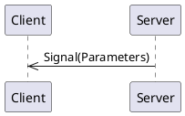
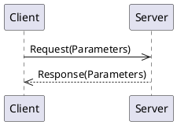
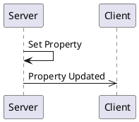

# _weather_ API Overview

[[_TOC_]]

## Connections

A connection object is a wrapper around an MQTT client and provides specific functionality to support both clients and servers.
Generally, you only need one connection object per daemon/program, as it can support multiple clients and servers.  

### Connection code Examples

<details>
  <summary>Python</summary>

```python
from connection import DefaultConnection

connection_object = DefaultConnection('localhost', 1883)
```

The `connection_object` will be passed to client and server constructors.

</details>

<details>
  <summary>C++</summary>

```c++
#include "broker.hpp"

auto connection_object = std::make_shared<DefaultConnection>("localhost", 1883, "Weather");
```

The `connection_object` will be passed to client and server constructors.

</details>

## Server

A server is a _provider_ of functionality.  It sends signals, handles method calls, and owns property values.

### Server Code Examples

<details>
  <summary>Python Server</summary>

```python
from weatheripc.client import WeatherServer

server = WeatherServer(connection_object)
```

The `server` object provides methods for emitting signals and updating properties.  It also allows for decorators to indicate method call handlers.

A full example can be viewed by looking at the `if __name__ == "__main__":` section of the generated `weatheripc.server.py` module.

</details>

<details>
  <summary>C++ Client</summary>


A full example can be viewed by looking at the generated `examples/server_main.cpp` file.`

</details>

<details>
  <summary>C++ Server</summary>

```c++

```

The `server` object provides methods for emitting signals and updating properties.  It also allows for decorators to indicate method call handlers.

A full example can be viewed by looking at the generated `examples/server_main.cpp` file.`

</details>

## Client


## Signals

Signals are messages from a server to clients.



### Signal `current_time`

Once in a while (at intervals decided by the provider) the current date
and time will be published.  (Mostly for example purposes).


#### Signal Parameters for `current_time`

| Name          | Type     |Description|
|---------------|----------|-----------|
|  current_time |  string  ||

#### Code Examples

<details>
  <summary>Python Client</summary>

The `current_time` signal can be subscribed to by using the client's `receive_current_time` decorator on a callback function. The name of the function does not matter. The function is called any time the signal is received.

```python
@client.receive_current_time
def on_current_time(current_time: str):
    print(f"Got a 'current_time' signal: current_time={ current_time } ")
```

</details>

<details>
  <summary>Python Server</summary>

A server can emit a `current_time` signal simply by calling the server's `emit_current_time` method.

```python
server.emit_current_time("apples")
```

</details>

<details>
  <summary>Rust Client</summary>

A Rust client receives signals through a `tokio::broadcast` channel.  Receiving from the channel returns a `Result<T, RecvError>` object.  

Since receiving a message through the channel blocks, it may be best to put this into a separate async task.

```rust
let mut current_time_signal_rx = client.get_current_time_receiver();
print("Got a 'current_time' signal: {:?}", current_time_signal_rx.recv().await);
```

</details>

<details>
  <summary>Rust Server</summary>

A server can emit a `current_time` signal simply by calling the server's `emit_current_time` method.

```rust
server.emit_current_time("apples".to_string()).await;
```

</details>

<details>
  <summary>C++ Client</summary>

A client can register a callback function to be called when a `current_time` signal is received.  The callback function should take the same parameters as the signal.  In this example, we are using a lambda as the callback function.

```cpp
client.registerCurrentTimeCallback([](const std::string& current_time) {
    std::cout << "current_time=" <<current_time <<  std::endl;
});
```

</details>

<details>
  <summary>C++ Server</summary>

A `current_time` signal can be emitted by calling the server's `emitCurrentTimeSignal` method.  This returns a `std::future` that can be waited on if desired.  The future is resolved when the signal is sent.

```cpp
auto currentTimeFuture = server.emitCurrentTimeSignal("apples");
currentTimeFuture.wait(); // Optional, to block until signal is sent.
```

</details>


## Methods

Methods are requests from a client to a server and the server provides a response back to the client:




### Method `refresh_daily_forecast`

When called, this method will force the retrieval of the daily weather forecast from
the NWS weather API.  

When called, the `daily_forecast` API property will be republished with the latest data.

This method has no arguments and provides no return values.


#### Request Parameters

There are no arguments for this request.

#### Return Parameters

There is no return value for this method call.

### Method `refresh_hourly_forecast`

When called, this method will force the retrieval of the hourly weather forecast from
the NWS weather API.  

When called, the `hourly_forecast` API property will be republished with the latest data.

This method has no arguments and provides no return values.


#### Request Parameters

There are no arguments for this request.

#### Return Parameters

There is no return value for this method call.

### Method `refresh_current_conditions`

When called, this method will force the retrieval of the latest weather conditions
from the nearest weather station.  It also forces a re-calculation of the current
temperature.

When called, the `current_temperature` and `current_condition` API properties are
republished with the latest value.

This method has no arguments and provides no return values.


#### Request Parameters

There are no arguments for this request.

#### Return Parameters

There is no return value for this method call.

## Properties

Properties are values (or a set of values) held by the server.   They are re-published when the value changes. 



### Property `location`

Weather will be retrieved for the provided location.


| Name          | Type     |Description|
|---------------|----------|-----------|
|    latitude   |  number  ||
|   longitude   |  number  ||

### Property `current_temperature`

This is the current (estimated) temperature in degrees fahrenheit.  This values
is regularly updated.  The value is extrapolated from the hourly forecast, but
adjusted based on the latest conditions at the nearest weather station.


This property is **read-only**.  It can only be modified by the server.

| Name          | Type     |Description|
|---------------|----------|-----------|
| temperature_f |  number  ||

### Property `current_condition`

This is the current weather outside.  This comes from the hourly forecast and is
updated about once per hour.


This property is **read-only**.  It can only be modified by the server.

| Name          | Type     |Description|
|---------------|----------|-----------|
|   condition   |[Enum WeatherCondition](#enum-WeatherCondition)||
|  description  |  string  ||

### Property `daily_forecast`

This contains the weather forecast for each day of the next few days.  It is updated
a couple of times a day.  The current day may not have the high or low temperature
provided.  This is an example which shows only a few days.  The actual implementation
will have a value for each day of the week.


This property is **read-only**.  It can only be modified by the server.

| Name          | Type     |Description|
|---------------|----------|-----------|
|     monday    |[Struct ForecastForDay](#enum-ForecastForDay)|This is the forecast for Monday.|
|    tuesday    |[Struct ForecastForDay](#enum-ForecastForDay)||
|   wednesday   |[Struct ForecastForDay](#enum-ForecastForDay)||

### Property `hourly_forecast`

This contains the weather forecast for each hour of the next 24 hours.  The data source
us updated a couple of times per day, but this API property is updated every hour on the
hour.


This property is **read-only**.  It can only be modified by the server.

| Name          | Type     |Description|
|---------------|----------|-----------|
|     hour_0    |[Struct ForecastForHour](#enum-ForecastForHour)|This is the forecast for the current hour.|
|     hour_1    |[Struct ForecastForHour](#enum-ForecastForHour)|This is the forecast for the next hour.|
|     hour_2    |[Struct ForecastForHour](#enum-ForecastForHour)||
|     hour_3    |[Struct ForecastForHour](#enum-ForecastForHour)||

### Property `current_condition_refresh_interval`

This is the maximum interval, in seconds, that the latest weather conditions at the nearest weather
station are retrieved.


| Name          | Type     |Description|
|---------------|----------|-----------|
|    seconds    | integer  ||

### Property `hourly_forecast_refresh_interval`

This is the maximum interval, in seconds, that the hourly forecast data is retrieved.


| Name          | Type     |Description|
|---------------|----------|-----------|
|    seconds    | integer  |Interval duration in seconds.|

### Property `daily_forecast_refresh_interval`

This is the maximum interval, in seconds, that the daily forecast data is retrieved.


| Name          | Type     |Description|
|---------------|----------|-----------|
|    seconds    | integer  ||


## Enums

### Enum `WeatherCondition`

<a name="Enum-WeatherCondition"></a>_No description exists for this enumeration._

* rainy (1)
* sunny (2)
* partly_cloudy (3)
* mostly_cloudy (4)
* overcast (5)
* windy (6)
* snowy (7)


## Structures

Structures are a group of values and may be used as an argument in signals, methods, or properties.  Defining a structure allows for easy reuse.

### Struct `ForecastForHour`

<a name="Struct-ForecastForHour"></a>This structure contains the forecast for a single hour.


| Name          | Type     |Description|
|---------------|----------|-----------|
|  temperature  |  number  |Forecasted temperature in degrees fahrenheit.|
|   starttime   |  string  |Forecast is valid for the hour starting at this time.|
|   condition   |[Enum WeatherCondition](#enum-WeatherCondition)||

### Struct `ForecastForDay`

<a name="Struct-ForecastForDay"></a>This structure contains the forecast for a single day.  The high or low temperature
may be missing for the current day.


| Name          | Type     |Description|
|---------------|----------|-----------|
|high_temperature|  number  |High temperature for the day in degrees fahrenheit.|
|low_temperature|  number  |Low temperature for the day in degrees fahrenheit.|
|   condition   |[Enum WeatherCondition](#enum-WeatherCondition)||
|   start_time  |  string  ||
|    end_time   |  string  ||
