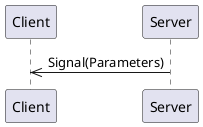
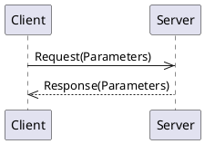
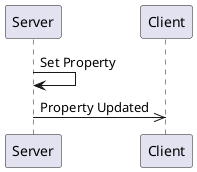

# _weather-forecast_ API Overview 

## Signals

Signals are messages from the server to clients.

### current_time

_No documentation for this signal_

#### Signal Parameters

|Name           |Type      |Description|
|---------------|----------|-----------|
|  current_time |  string  ||

## Methods

Methods are requests from a client to a server and the server provides a response back to the client:

### refresh_daily_forecast

_No documentation for this method_

#### Request Parameters

There are no arguments for this request.

#### Return Parameters

There is no return value for this method call.

### refresh_hourly_forecast

_No documentation for this method_

#### Request Parameters

There are no arguments for this request.

#### Return Parameters

There is no return value for this method call.

### refresh_current_conditions

_No documentation for this method_

#### Request Parameters

There are no arguments for this request.

#### Return Parameters

There is no return value for this method call.

## Properties

Properties are values (or a set of values) held by the server.   They are re-published when the value changes. 

### location

_No documentation for this property_

| Name          | Type     |Description|
|---------------|----------|-----------|
|    latitude   |  number  ||
|   longitude   |  number  ||

### current_temperature

_No documentation for this property_

| Name          | Type     |Description|
|---------------|----------|-----------|
| temperature_f |  number  ||

### current_condition

_No documentation for this property_

| Name          | Type     |Description|
|---------------|----------|-----------|
|   condition   |[Enum WeatherCondition](#enum-WeatherCondition)||
|  description  |  string  ||

### daily_forecast

_No documentation for this property_

| Name          | Type     |Description|
|---------------|----------|-----------|
|     monday    |          ||
|    tuesday    |          ||
|   wednesday   |          ||

### hourly_forecast

_No documentation for this property_

| Name          | Type     |Description|
|---------------|----------|-----------|
|     hour_0    |          ||
|     hour_1    |          ||
|     hour_2    |          ||
|     hour_3    |          ||

### current_condition_refresh_interval

_No documentation for this property_

| Name          | Type     |Description|
|---------------|----------|-----------|
|    seconds    | integer  ||

### hourly_forecast_refresh_interval

_No documentation for this property_

| Name          | Type     |Description|
|---------------|----------|-----------|
|    seconds    | integer  ||

### daily_forecast_refresh_interval

_No documentation for this property_

| Name          | Type     |Description|
|---------------|----------|-----------|
|    seconds    | integer  ||

## Enums

### Enum `WeatherCondition`

_No description exists for this enumeration._

* rainy (1)
* sunny (2)
* partly_cloudy (3)
* mostly_cloudy (4)
* overcast (5)
* windy (6)
* snowy (7)

## Structures

Structures are a group of values and may be used as an argument in signals, methods, or properties.  Defining a structure allows for easy reuse.

### Struct `ForecastForHour`

_No general description exists for this structure_

| Name          | Type     |Description|
|---------------|----------|-----------|
|  temperature  |  number  ||
|   starttime   |  string  ||
|   condition   |[Enum WeatherCondition](#enum-WeatherCondition)||

### Struct `ForecastForDay`

_No general description exists for this structure_

| Name          | Type     |Description|
|---------------|----------|-----------|
|high_temperature|  number  ||
|low_temperature|  number  ||
|   condition   |[Enum WeatherCondition](#enum-WeatherCondition)||
|   start_time  |  string  ||
|    end_time   |  string  ||
