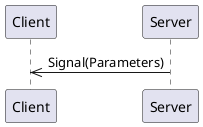
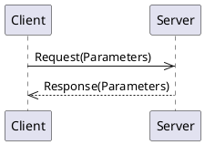
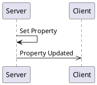

# _NWS weather forecast_ API Overview 
_Current conditions, daily and hourly forecasts from the NWS API_


[[_TOC_]]

## Connections

A connection object is a wrapper around an MQTT client and provides specific functionality to support both clients and servers.
Generally, you only need one connection object per daemon/program, as it can support multiple clients and servers.  

### Connection code Examples

<details>
  <summary>Python</summary>

```python
from connection import MqttBrokerConnection, MqttTransportType, MqttTransport

transport = MqttTransport(MqttTransportType.TCP, "localhost", 1883) # Or: MqttTransport(MqttTransportType.UNIX, socket_path="/path/to/socket")
connection_object = MqttBrokerConnection(transport)
```

The `connection_object` will be passed to client and server constructors.

</details>

<details>
  <summary>Rust</summary>

Rust implementations use the [MQTTier](https://crates.io/crates/mqttier) crate for MQTT connectivity.  MQTTier is a wrapper around the [rumqttc](https://crates.io/crates/rumqttc) crate and handles serialization, message queuing, and acknowledgments.

```rust
use mqttier::{MqttierClient, MqttierOptions};

  let conn_opts = MqttierOptionsBuilder::new()
      .connection(Connection::TcpLocalhost(1883)) // Connection::UnixSocket("/path/to/socket") is also supported.
      .build()
      .unwrap()
      .expect("Failed to build MQTT connection options");
  let mut connection = MqttierClient::new(conn_opts).unwrap().expect("Failed to create MQTT client");
```

The `connection_object` will be passed to client and server constructors.

</details>

<details>
  <summary>C++</summary>

The C++ connection object is a wrapper around the [libmosquitto](https://mosquitto.org/api/files/mosquitto-h.html) C library.  This library only supports TCP and WebSocket connections.  Unix Domain Socket support may be added in the future.

```c++
#include "broker.hpp"

auto connection_object = std::make_shared<MqttBrokerConnection>("localhost", 1883, "daemon-name");
```

The `connection_object` will be passed to client and server constructors.

</details>

## Server

A server is a _provider_ of functionality.  It sends signals, handles method calls, and owns property values.

### Server Code Examples

<details>
  <summary>Python Server</summary>

```python
from weatheripc.client import WeatherServer

server = WeatherServer(connection_object)
```

The `server` object provides methods for emitting signals and updating properties.  It also allows for decorators to indicate method call handlers.

A full example can be viewed by looking at the `if __name__ == "__main__":` section of the generated `weatheripc.server.py` module.

</details>


<details>
  <summary>C++ Server</summary>

```c++

```

The `server` object provides methods for emitting signals and updating properties.  It also allows for decorators to indicate method call handlers.

A full example can be viewed by looking at the generated `examples/server_main.cpp` file.`

</details>

## Client

A client is a _utilizer_ of functionality.  It receives signals, makes method calls, reads property values, or requests updates to property values.

<details>
  <summary>Rust</summary>

```rust
let mut api_client = WeatherClient::new(&mut connection).await;
```

A full example can be viewed by looking at the generated `client/examples/client.rs` file.

</details>

<details>
  <summary>C++ Client</summary>

A full example can be viewed by looking at the generated `examples/client_main.cpp` file.

</details>


## Signals

Signals are messages from a server to clients.



### Signal `current_time`

Once in a while (at intervals decided by the provider) the current date
and time will be published.  (Mostly for example purposes).


#### Signal Parameters for `current_time`

| Name          | Type     |Description|
|---------------|----------|-----------|
|  current_time |  string  ||

#### Code Examples

<details>
  <summary>Python Client</summary>

The `current_time` signal can be subscribed to by using the client's `receive_current_time` decorator on a callback function. The name of the function does not matter. The function is called any time the signal is received.

```python
@client.receive_current_time
def on_current_time(current_time: str):
    print(f"Got a 'current_time' signal: current_time={ current_time } ")
```

</details>

<details>
  <summary>Python Server</summary>

A server can emit a `current_time` signal simply by calling the server's `emit_current_time` method.

```python
server.emit_current_time("apples")
```

</details>

<details>
  <summary>Rust Client</summary>

A Rust client receives signals through a `tokio::broadcast` channel.  Receiving from the channel returns a `Result<T, RecvError>` object.  

Since receiving a message through the channel blocks, it may be best to put this into a separate async task.

```rust
let mut current_time_signal_rx = client.get_current_time_receiver();
print("Got a 'current_time' signal: {:?}", current_time_signal_rx.recv().await);
```

</details>

<details>
  <summary>Rust Server</summary>

A server can emit a `current_time` signal simply by calling the server's `emit_current_time` method.

```rust
let publish_result = server.emit_current_time("apples".to_string()).await;
```

The return type is a **Pinned Boxed Future** that resolves to a `Result<(), MethodReturnCode>`.  The future is resolved when the signal is sent (with "publish complete" acknowledgment) or when an error occurs.  If you need to block until the signal is received by the MQTT broker, you can `.await` the future.

</details>

<details>
  <summary>C++ Client</summary>

A client can register a callback function to be called when a `current_time` signal is received.  The callback function should take the same parameters as the signal.  In this example, we are using a lambda as the callback function.

```cpp
client.registerCurrentTimeCallback([](const std::string& current_time) {
    std::cout << "current_time=" <<current_time <<  std::endl;
});
```

</details>

<details>
  <summary>C++ Server</summary>

A `current_time` signal can be emitted by calling the server's `emitCurrentTimeSignal` method.  This returns a `std::future` that can be waited on if desired.  The future is resolved when the signal is sent.

```cpp
auto currentTimeFuture = server.emitCurrentTimeSignal("apples");
currentTimeFuture.wait(); // Optional, to block until signal is sent.
```

</details>


## Methods

Methods are requests from a client to a server and the server provides a response back to the client:




### Method `refresh_daily_forecast`

When called, this method will force the retrieval of the daily weather forecast from
the NWS weather API.  

When called, the `daily_forecast` API property will be republished with the latest data.

This method has no arguments and provides no return values.


#### Request Parameters

There are no arguments for this request.

#### Return Parameters

There is no return value for this method call.
#### Code Examples

<details>
  <summary>Python Client</summary>

The `refresh_daily_forecast` method can be called by calling the clients's `refresh_daily_forecast` method.
This returns a `Future` object.  In this example, we wait up to 5 seconds for the result.

```python
from futures import Future

future = client.refresh_daily_forecast()
try:
    print(f"RESULT:  {future.result(5)}")
except futures.TimeoutError:
    print(f"Timed out waiting for response to 'refresh_daily_forecast' call")
```

</details>

<details>
  <summary>Python Server</summary>

The server provides an implementation for the `refresh_daily_forecast` method by using the `@server.handle_refresh_daily_forecast` decorator on a function.  The name of the function does not matter. 
The decorated method is called everytime the a request for the method is received.  In an error, the method can raise on of the exceptions found in `method_codes.py`.

```python
@server.handle_refresh_daily_forecast 
def refresh_daily_forecast() -> :
    """ This is an example handler for the 'refresh_daily_forecast' method.  """
    print(f"Running refresh_daily_forecast'()'")
    return None
```

</details>

<details>
  <summary>Rust Client</summary>

The `WeatherClient` provides an implementation for the `refresh_daily_forecast` method.  It will block and return a Result object of either the return payload value, or an error.

```rust
let result = api_client.refresh_daily_forecast().await.expect("Failed to call refresh_daily_forecast");
println!("refresh_daily_forecast response: {:?}", result);
```

</details>


### Method `refresh_hourly_forecast`

When called, this method will force the retrieval of the hourly weather forecast from
the NWS weather API.  

When called, the `hourly_forecast` API property will be republished with the latest data.

This method has no arguments and provides no return values.


#### Request Parameters

There are no arguments for this request.

#### Return Parameters

There is no return value for this method call.
#### Code Examples

<details>
  <summary>Python Client</summary>

The `refresh_hourly_forecast` method can be called by calling the clients's `refresh_hourly_forecast` method.
This returns a `Future` object.  In this example, we wait up to 5 seconds for the result.

```python
from futures import Future

future = client.refresh_hourly_forecast()
try:
    print(f"RESULT:  {future.result(5)}")
except futures.TimeoutError:
    print(f"Timed out waiting for response to 'refresh_hourly_forecast' call")
```

</details>

<details>
  <summary>Python Server</summary>

The server provides an implementation for the `refresh_hourly_forecast` method by using the `@server.handle_refresh_hourly_forecast` decorator on a function.  The name of the function does not matter. 
The decorated method is called everytime the a request for the method is received.  In an error, the method can raise on of the exceptions found in `method_codes.py`.

```python
@server.handle_refresh_hourly_forecast 
def refresh_hourly_forecast() -> :
    """ This is an example handler for the 'refresh_hourly_forecast' method.  """
    print(f"Running refresh_hourly_forecast'()'")
    return None
```

</details>

<details>
  <summary>Rust Client</summary>

The `WeatherClient` provides an implementation for the `refresh_hourly_forecast` method.  It will block and return a Result object of either the return payload value, or an error.

```rust
let result = api_client.refresh_hourly_forecast().await.expect("Failed to call refresh_hourly_forecast");
println!("refresh_hourly_forecast response: {:?}", result);
```

</details>


### Method `refresh_current_conditions`

When called, this method will force the retrieval of the latest weather conditions
from the nearest weather station.  It also forces a re-calculation of the current
temperature.

When called, the `current_temperature` and `current_condition` API properties are
republished with the latest value.

This method has no arguments and provides no return values.


#### Request Parameters

There are no arguments for this request.

#### Return Parameters

There is no return value for this method call.
#### Code Examples

<details>
  <summary>Python Client</summary>

The `refresh_current_conditions` method can be called by calling the clients's `refresh_current_conditions` method.
This returns a `Future` object.  In this example, we wait up to 5 seconds for the result.

```python
from futures import Future

future = client.refresh_current_conditions()
try:
    print(f"RESULT:  {future.result(5)}")
except futures.TimeoutError:
    print(f"Timed out waiting for response to 'refresh_current_conditions' call")
```

</details>

<details>
  <summary>Python Server</summary>

The server provides an implementation for the `refresh_current_conditions` method by using the `@server.handle_refresh_current_conditions` decorator on a function.  The name of the function does not matter. 
The decorated method is called everytime the a request for the method is received.  In an error, the method can raise on of the exceptions found in `method_codes.py`.

```python
@server.handle_refresh_current_conditions 
def refresh_current_conditions() -> :
    """ This is an example handler for the 'refresh_current_conditions' method.  """
    print(f"Running refresh_current_conditions'()'")
    return None
```

</details>

<details>
  <summary>Rust Client</summary>

The `WeatherClient` provides an implementation for the `refresh_current_conditions` method.  It will block and return a Result object of either the return payload value, or an error.

```rust
let result = api_client.refresh_current_conditions().await.expect("Failed to call refresh_current_conditions");
println!("refresh_current_conditions response: {:?}", result);
```

</details>


## Properties

Properties are values (or a set of values) held by the server.   They are re-published when the value changes. 



### Property `location`

Weather will be retrieved for the provided location.


| Name          | Type     |Description|
|---------------|----------|-----------|
|    latitude   |  number  ||
|   longitude   |  number  ||

### Code Examples

<details>
  <summary>Rust Server</summary>

A server hold the "source of truth" for the value of `location`.  The value can be changed by calling the server's `set_location` method:

```rust
let property_set_future: SentMessageFuture = server.set_location(3.14).await;
```

The return type is a **Pinned Boxed Future** that resolves to a `Result<(), MethodReturnCode>`. 
The future is resolved with `Ok(())` if the value didn't change or when the MQTT broker responds with a "publish acknowledgment" on the publishing of the updated value.  Otherwise, the future resolves to an error code.

The application code should call the `set_location()` method with an initial value when starting up, and then whenever the value changes.

The property can also be changed by a client request via MQTT.  When this happens, the server will send to a `tokio::watch` channel with the updated property value.
Application code can get a `watch::Receiver<Option<LocationProperty>>` by calling the server's `get_location_receiver()` method.  The receiver can be used to get the current value of the property, and to be notified when the value changes.

```rust
let mut on_location_changed = server.watch_location();

while let Some(new_value) = on_location_changed.recv().await {
    println!("Property 'location' changed to: {:?}", new_value);
}
```

</details>


### Property `current_temperature`

This is the current (estimated) temperature in degrees fahrenheit.  This values
is regularly updated.  The value is extrapolated from the hourly forecast, but
adjusted based on the latest conditions at the nearest weather station.


This property is **read-only**.  It can only be modified by the server.

| Name          | Type     |Description|
|---------------|----------|-----------|
| temperature_f |  number  ||

### Code Examples

<details>
  <summary>Rust Server</summary>

A server hold the "source of truth" for the value of `current_temperature`.  The value can be changed by calling the server's `set_current_temperature` method:

```rust
let property_set_future: SentMessageFuture = server.set_current_temperature(3.14).await;
```

The return type is a **Pinned Boxed Future** that resolves to a `Result<(), MethodReturnCode>`. 
The future is resolved with `Ok(())` if the value didn't change or when the MQTT broker responds with a "publish acknowledgment" on the publishing of the updated value.  Otherwise, the future resolves to an error code.

The application code should call the `set_current_temperature()` method with an initial value when starting up, and then whenever the value changes.

</details>


### Property `current_condition`

This is the current weather outside.  This comes from the hourly forecast and is
updated about once per hour.


This property is **read-only**.  It can only be modified by the server.

| Name          | Type     |Description|
|---------------|----------|-----------|
|   condition   |[Enum WeatherCondition](#enum-WeatherCondition)||
|  description  |  string  ||

### Code Examples

<details>
  <summary>Rust Server</summary>

A server hold the "source of truth" for the value of `current_condition`.  The value can be changed by calling the server's `set_current_condition` method:

```rust
let property_set_future: SentMessageFuture = server.set_current_condition(WeatherCondition::Sunny).await;
```

The return type is a **Pinned Boxed Future** that resolves to a `Result<(), MethodReturnCode>`. 
The future is resolved with `Ok(())` if the value didn't change or when the MQTT broker responds with a "publish acknowledgment" on the publishing of the updated value.  Otherwise, the future resolves to an error code.

The application code should call the `set_current_condition()` method with an initial value when starting up, and then whenever the value changes.

</details>


### Property `daily_forecast`

This contains the weather forecast for each day of the next few days.  It is updated
a couple of times a day.  The current day may not have the high or low temperature
provided.  This is an example which shows only a few days.  The actual implementation
will have a value for each day of the week.


This property is **read-only**.  It can only be modified by the server.

| Name          | Type     |Description|
|---------------|----------|-----------|
|     monday    |[Struct ForecastForDay](#enum-ForecastForDay)|This is the forecast for Monday.|
|    tuesday    |[Struct ForecastForDay](#enum-ForecastForDay)||
|   wednesday   |[Struct ForecastForDay](#enum-ForecastForDay)||

### Code Examples

<details>
  <summary>Rust Server</summary>

A server hold the "source of truth" for the value of `daily_forecast`.  The value can be changed by calling the server's `set_daily_forecast` method:

```rust
let property_set_future: SentMessageFuture = server.set_daily_forecast(ForecastForDay {high_temperature: 3.14, low_temperature: 3.14, condition: WeatherCondition::Sunny, start_time: "apples".to_string(), end_time: "apples".to_string()}).await;
```

The return type is a **Pinned Boxed Future** that resolves to a `Result<(), MethodReturnCode>`. 
The future is resolved with `Ok(())` if the value didn't change or when the MQTT broker responds with a "publish acknowledgment" on the publishing of the updated value.  Otherwise, the future resolves to an error code.

The application code should call the `set_daily_forecast()` method with an initial value when starting up, and then whenever the value changes.

</details>


### Property `hourly_forecast`

This contains the weather forecast for each hour of the next 24 hours.  The data source
us updated a couple of times per day, but this API property is updated every hour on the
hour.


This property is **read-only**.  It can only be modified by the server.

| Name          | Type     |Description|
|---------------|----------|-----------|
|     hour_0    |[Struct ForecastForHour](#enum-ForecastForHour)|This is the forecast for the current hour.|
|     hour_1    |[Struct ForecastForHour](#enum-ForecastForHour)|This is the forecast for the next hour.|
|     hour_2    |[Struct ForecastForHour](#enum-ForecastForHour)||
|     hour_3    |[Struct ForecastForHour](#enum-ForecastForHour)||

### Code Examples

<details>
  <summary>Rust Server</summary>

A server hold the "source of truth" for the value of `hourly_forecast`.  The value can be changed by calling the server's `set_hourly_forecast` method:

```rust
let property_set_future: SentMessageFuture = server.set_hourly_forecast(ForecastForHour {temperature: 3.14, starttime: "apples".to_string(), condition: WeatherCondition::Sunny}).await;
```

The return type is a **Pinned Boxed Future** that resolves to a `Result<(), MethodReturnCode>`. 
The future is resolved with `Ok(())` if the value didn't change or when the MQTT broker responds with a "publish acknowledgment" on the publishing of the updated value.  Otherwise, the future resolves to an error code.

The application code should call the `set_hourly_forecast()` method with an initial value when starting up, and then whenever the value changes.

</details>


### Property `current_condition_refresh_interval`

This is the maximum interval, in seconds, that the latest weather conditions at the nearest weather
station are retrieved.


| Name          | Type     |Description|
|---------------|----------|-----------|
|    seconds    | integer  ||

### Code Examples

<details>
  <summary>Rust Server</summary>

A server hold the "source of truth" for the value of `current_condition_refresh_interval`.  The value can be changed by calling the server's `set_current_condition_refresh_interval` method:

```rust
let property_set_future: SentMessageFuture = server.set_current_condition_refresh_interval(42).await;
```

The return type is a **Pinned Boxed Future** that resolves to a `Result<(), MethodReturnCode>`. 
The future is resolved with `Ok(())` if the value didn't change or when the MQTT broker responds with a "publish acknowledgment" on the publishing of the updated value.  Otherwise, the future resolves to an error code.

The application code should call the `set_current_condition_refresh_interval()` method with an initial value when starting up, and then whenever the value changes.

The property can also be changed by a client request via MQTT.  When this happens, the server will send to a `tokio::watch` channel with the updated property value.
Application code can get a `watch::Receiver<Option<i32>>` by calling the server's `get_current_condition_refresh_interval_receiver()` method.  The receiver can be used to get the current value of the property, and to be notified when the value changes.

```rust
let mut on_current_condition_refresh_interval_changed = server.watch_current_condition_refresh_interval();

while let Some(new_value) = on_current_condition_refresh_interval_changed.recv().await {
    println!("Property 'current_condition_refresh_interval' changed to: {:?}", new_value);
}
```

</details>


### Property `hourly_forecast_refresh_interval`

This is the maximum interval, in seconds, that the hourly forecast data is retrieved.


| Name          | Type     |Description|
|---------------|----------|-----------|
|    seconds    | integer  |Interval duration in seconds.|

### Code Examples

<details>
  <summary>Rust Server</summary>

A server hold the "source of truth" for the value of `hourly_forecast_refresh_interval`.  The value can be changed by calling the server's `set_hourly_forecast_refresh_interval` method:

```rust
let property_set_future: SentMessageFuture = server.set_hourly_forecast_refresh_interval(42).await;
```

The return type is a **Pinned Boxed Future** that resolves to a `Result<(), MethodReturnCode>`. 
The future is resolved with `Ok(())` if the value didn't change or when the MQTT broker responds with a "publish acknowledgment" on the publishing of the updated value.  Otherwise, the future resolves to an error code.

The application code should call the `set_hourly_forecast_refresh_interval()` method with an initial value when starting up, and then whenever the value changes.

The property can also be changed by a client request via MQTT.  When this happens, the server will send to a `tokio::watch` channel with the updated property value.
Application code can get a `watch::Receiver<Option<i32>>` by calling the server's `get_hourly_forecast_refresh_interval_receiver()` method.  The receiver can be used to get the current value of the property, and to be notified when the value changes.

```rust
let mut on_hourly_forecast_refresh_interval_changed = server.watch_hourly_forecast_refresh_interval();

while let Some(new_value) = on_hourly_forecast_refresh_interval_changed.recv().await {
    println!("Property 'hourly_forecast_refresh_interval' changed to: {:?}", new_value);
}
```

</details>


### Property `daily_forecast_refresh_interval`

This is the maximum interval, in seconds, that the daily forecast data is retrieved.


| Name          | Type     |Description|
|---------------|----------|-----------|
|    seconds    | integer  ||

### Code Examples

<details>
  <summary>Rust Server</summary>

A server hold the "source of truth" for the value of `daily_forecast_refresh_interval`.  The value can be changed by calling the server's `set_daily_forecast_refresh_interval` method:

```rust
let property_set_future: SentMessageFuture = server.set_daily_forecast_refresh_interval(42).await;
```

The return type is a **Pinned Boxed Future** that resolves to a `Result<(), MethodReturnCode>`. 
The future is resolved with `Ok(())` if the value didn't change or when the MQTT broker responds with a "publish acknowledgment" on the publishing of the updated value.  Otherwise, the future resolves to an error code.

The application code should call the `set_daily_forecast_refresh_interval()` method with an initial value when starting up, and then whenever the value changes.

The property can also be changed by a client request via MQTT.  When this happens, the server will send to a `tokio::watch` channel with the updated property value.
Application code can get a `watch::Receiver<Option<i32>>` by calling the server's `get_daily_forecast_refresh_interval_receiver()` method.  The receiver can be used to get the current value of the property, and to be notified when the value changes.

```rust
let mut on_daily_forecast_refresh_interval_changed = server.watch_daily_forecast_refresh_interval();

while let Some(new_value) = on_daily_forecast_refresh_interval_changed.recv().await {
    println!("Property 'daily_forecast_refresh_interval' changed to: {:?}", new_value);
}
```

</details>


## Enums


### Enum `WeatherCondition`

<a name="Enum-WeatherCondition"></a>_No description exists for this enumeration._

* rainy (1)
* sunny (2)
* partly_cloudy (3)
* mostly_cloudy (4)
* overcast (5)
* windy (6)
* snowy (7)


## Structures

Structures are a group of values and may be used as an argument in signals, methods, or properties.  Defining a structure allows for easy reuse.

### Struct `ForecastForHour`

<a name="Struct-ForecastForHour"></a>This structure contains the forecast for a single hour.


| Name          | Type     |Description|
|---------------|----------|-----------|
|  temperature  |  number  |Forecasted temperature in degrees fahrenheit.|
|   starttime   |  string  |Forecast is valid for the hour starting at this time.|
|   condition   |[Enum WeatherCondition](#enum-WeatherCondition)||

### Struct `ForecastForDay`

<a name="Struct-ForecastForDay"></a>This structure contains the forecast for a single day.  The high or low temperature
may be missing for the current day.


| Name          | Type     |Description|
|---------------|----------|-----------|
|high_temperature|  number  |High temperature for the day in degrees fahrenheit.|
|low_temperature|  number  |Low temperature for the day in degrees fahrenheit.|
|   condition   |[Enum WeatherCondition](#enum-WeatherCondition)||
|   start_time  |  string  ||
|    end_time   |  string  ||
