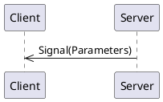
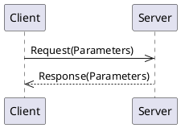
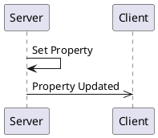

# _NWS weather forecast_ API Overview 

<!--
This is automatically generated documentation.
LICENSE: This generated content is not subject to any license restrictions.
TODO: Get license text from stinger file
--> 
_Current conditions, daily and hourly forecasts from the NWS API_


[[_TOC_]]

## Connections

A connection object is a wrapper around an MQTT client and provides specific functionality to support both clients and servers.
Generally, you only need one connection object per daemon/program, as it can support multiple clients and servers.  
For most languages, Stinger-IPC does not require a specific connection object implementation, as long as it implements the required interface.

The application code is responsible for creating and managing the connection object, including connecting to the MQTT broker.

### Connection code Examples

<details>
  <summary>Python MQTT Connection Example</summary>

Rather than including connection code in each generated client and server, Stinger-IPC for Python uses the [PYQTtier](https://pypi.org/project/pyqttier/) library to provide MQTT connection objects.  PYQTtier is a wrapper around the [paho-mqtt](https://pypi.org/project/paho-mqtt/) library and handles serialization, message queuing, and acknowledgments.

```python
from pyqttier import Mqtt5Connection, MqttTransportType, MqttTransport

transport = MqttTransport(MqttTransportType.TCP, "localhost", 1883) # Or: MqttTransport(MqttTransportType.UNIX, socket_path="/path/to/socket")
connection_object = Mqtt5Connection(transport)
```

The `connection_object` will be passed to client and server constructors.

</details>

<details>
  <summary>Rust MQTT Connection Example</summary>

Stinger-IPC instances only require an MQTT connection object that implements the [`stinger_mqtt_trait::Mqtt5PubSub` trait](https://docs.rs/stinger-mqtt-trait/latest/stinger_mqtt_trait/trait.Mqtt5PubSub.html). 

The [MQTTier](https://crates.io/crates/mqttier) crate provides an implementation of the `Mqtt5PubSub` trait, and is shown in this documentation as an example.  MQTTier is a wrapper around the [rumqttc](https://crates.io/crates/rumqttc) crate and handles serialization, message queuing, and acknowledgments.'

Here is an example showing how to create an MQTTier client connection object:

```rust
use mqttier::{MqttierClient, MqttierOptionsBuilder, Connection};

let mqttier_options = MqttierOptionsBuilder::default()
    .connection(Connection::TcpLocalhost(1883))
    .client_id("rust-client-demo".to_string())
    .build().unwrap();
let mut connection_object = MqttierClient::new(mqttier_options).unwrap();
let _ = connection_object.start().await;
```

The `connection_object` will be passed to client and server constructors.

</details>

<details>
  <summary>C++ MQTT Connection Example</summary>

The C++ connection object is a wrapper around the [libmosquitto](https://mosquitto.org/api/files/mosquitto-h.html) C library.  This library only supports TCP and WebSocket connections.  Unix Domain Socket support may be added in the future.

```c++
#include "broker.hpp"

auto connection_object = std::make_shared<MqttBrokerConnection>("localhost", 1883, "daemon-name");
```

The `connection_object` will be passed to client and server constructors.

</details>

## Discovery

Because there may be multiple instances of the same Stinger Interface, a discovery mechanism is provided to find and connect to them.  A discovery class is provided which connects to
the MQTT broker and listens for Stinger Interface announcements.  The discovery class can then provide WeatherClient client instances.  Additionally, the discovery class
find all the current property values for discovered interfaces in order to initialize the client instance.

### Discovery Code Examples

<details>
  <summary>Python Discovery Example</summary>

```python
from weatheripc.client import WeatherClientDiscoverer

discovery = WeatherClientDiscoverer(connection_object)

# To get a single client instance (waits until one is found):
client = discovery.get_singleton_client().result()

# To get all currently available client instances (does not wait):
discovered_service_ids = discovery.get_service_instance_ids()
clients = [discovery.get_client_for_instance(service_id) for service_id in discovered_service_ids]
```
</details>

<details>
  <summary>Rust Discovery Example</summary>

```rust
use weather_ipc::discovery::WeatherDiscovery;

let discovered_singleton_info = {
    let service_discovery = WeatherDiscovery::new(&mut connection_object).await.unwrap();
    service_discovery.get_singleton_instance_info().await // Blocks until a service is discovered.
}
let weather_client = WeatherClient::new(&mut connection_object, &discovered_singleton_info).await;
```

</details>

## Server

A server is a _provider_ of functionality.  It sends signals and handles method calls and owns property values.

When constructing a server instance, a connection object and initial property values must be provided.

### Server Code Examples

<details>
  <summary>Python Server Object Construction</summary>

```python
from weatheripc.server import WeatherServer, WeatherInitialPropertyValues

# Ideally, you would load these initial property values from a configuration file or database.

initial_property_values = WeatherInitialPropertyValues(

    location=
        LocationProperty(
            
            latitude=3.14,
            
            longitude=3.14,
            
        ),
    location_version=1,

    current_temperature=3.14,
        
    current_temperature_version=2,

    current_condition=
        CurrentConditionProperty(
            
            condition=WeatherCondition.SNOWY,
            
            description="apples",
            
        ),
    current_condition_version=3,

    daily_forecast=
        DailyForecastProperty(
            
            monday=ForecastForDay(high_temperature=3.14, low_temperature=3.14, condition=WeatherCondition.SNOWY, start_time="apples", end_time="apples"),
            
            tuesday=ForecastForDay(high_temperature=3.14, low_temperature=3.14, condition=WeatherCondition.SNOWY, start_time="apples", end_time="apples"),
            
            wednesday=ForecastForDay(high_temperature=3.14, low_temperature=3.14, condition=WeatherCondition.SNOWY, start_time="apples", end_time="apples"),
            
        ),
    daily_forecast_version=4,

    hourly_forecast=
        HourlyForecastProperty(
            
            hour_0=ForecastForHour(temperature=3.14, starttime=datetime.now(UTC), condition=WeatherCondition.SNOWY),
            
            hour_1=ForecastForHour(temperature=3.14, starttime=datetime.now(UTC), condition=WeatherCondition.SNOWY),
            
            hour_2=ForecastForHour(temperature=3.14, starttime=datetime.now(UTC), condition=WeatherCondition.SNOWY),
            
            hour_3=ForecastForHour(temperature=3.14, starttime=datetime.now(UTC), condition=WeatherCondition.SNOWY),
            
        ),
    hourly_forecast_version=5,

    current_condition_refresh_interval=42,
        
    current_condition_refresh_interval_version=6,

    hourly_forecast_refresh_interval=42,
        
    hourly_forecast_refresh_interval_version=7,

    daily_forecast_refresh_interval=42,
        
    daily_forecast_refresh_interval_version=8,

)


service_id = "py-server-demo:1" # Can be anything. When there is a single instance of the interface, 'singleton' is often used.
server = WeatherServer(connection_object, service_id, initial_property_values)
```

The `server` object provides methods for emitting signals and updating properties.  It also allows for decorators to indicate method call handlers.

A full example can be viewed by looking at the `example/server_demo.py` file of the generated code.

When decorating class methods, especially when there might be multiple instances of the class with methods being decorated, the Python implementation provides a `WeatherClientBuilder`
class to help capture decorated methods and bind them to a specific instance at runtime. Here is an example of how to use it in a class:

```python
from weatheripc.client import WeatherClientBuilder

weather_builder = WeatherClientBuilder()

class MyClass:
    def __init__(self, label: str, connection: MqttBrokerConnection):
        instance_info = ... # Create manually or use discovery to get this
        self.client = weather_builder.build(connection_object, instance_info, binding=self) # The binding param binds all decorated methods to the `self` instance.

    @weather_builder.receive_a_signal
    def on_a_signal(self, param1: int, param2: str):
        ...
```

A more complete example, including use with the discovery mechanism, can be viewed by looking at the generated `examples/server_demo_classes.py` file.

</details>

<details>
  <summary>Rust Server Struct Creation</summary>

Service code for Rust is only available when using the `server` feature:

```sh
cargo add weather_ipc --features=server
```

Here is an example of how to create a server instance:

```rust
use weather_ipc::server::WeatherServer;
use weather_ipc::property::WeatherInitialPropertyValues;

let service_id = String::from("rust-server-demo:1");

let initial_property_values = WeatherInitialPropertyValues {
    
    location:LocationProperty {
            latitude: 3.14,
            longitude: 3.14,
    },
    location_version: 1,
    
    current_temperature:3.14,
    current_temperature_version: 1,
    
    current_condition:CurrentConditionProperty {
            condition: WeatherCondition::Snowy,
            description: "apples".to_string(),
    },
    current_condition_version: 1,
    
    daily_forecast:DailyForecastProperty {
            monday: ForecastForDay {high_temperature: 3.14, low_temperature: 3.14, condition: WeatherCondition::Snowy, start_time: "apples".to_string(), end_time: "apples".to_string()},
            tuesday: ForecastForDay {high_temperature: 3.14, low_temperature: 3.14, condition: WeatherCondition::Snowy, start_time: "apples".to_string(), end_time: "apples".to_string()},
            wednesday: ForecastForDay {high_temperature: 3.14, low_temperature: 3.14, condition: WeatherCondition::Snowy, start_time: "apples".to_string(), end_time: "apples".to_string()},
    },
    daily_forecast_version: 1,
    
    hourly_forecast:HourlyForecastProperty {
            hour_0: ForecastForHour {temperature: 3.14, starttime: chrono::Utc::now(), condition: WeatherCondition::Snowy},
            hour_1: ForecastForHour {temperature: 3.14, starttime: chrono::Utc::now(), condition: WeatherCondition::Snowy},
            hour_2: ForecastForHour {temperature: 3.14, starttime: chrono::Utc::now(), condition: WeatherCondition::Snowy},
            hour_3: ForecastForHour {temperature: 3.14, starttime: chrono::Utc::now(), condition: WeatherCondition::Snowy},
    },
    hourly_forecast_version: 1,
    
    current_condition_refresh_interval:42,
    current_condition_refresh_interval_version: 1,
    
    hourly_forecast_refresh_interval:42,
    hourly_forecast_refresh_interval_version: 1,
    
    daily_forecast_refresh_interval:42,
    daily_forecast_refresh_interval_version: 1,
    
};


// Create the server object.
let mut server = WeatherServer::new(connection_object, method_handlers.clone(), service_id, initial_property_values, ).await;


```

Providing method handlers is better described in the [Methods](#methods) section.  

A full example can be viewed by looking at the generated `examples/server_demo.rs` example and can be compiled with `cargo run --example weather_server_demo --features=server` in the generated Rust project.

</details>

<details>
  <summary>C++ Server Object Construction</summary>

```c++
// To be written
```

The `server` object provides methods for emitting signals and updating properties.  It also allows for decorators to indicate method call handlers.

A full example can be viewed by looking at the generated `examples/server_main.cpp` file.`

</details>

## Client

A client is a _utilizer_ of functionality.  It receives signals, makes method calls, reads property values, or requests updates to property values.

<details>
  <summary>Rust Client Struct Creation</summary>

The best way to create a client instance is to use the discovery class to find an instance of the service, and then create the client from the discovered instance information.
An example of that is shown in the [Discovery](#discovery) section.  However, if you already know the service instance IDand initial property values, you can create a client directly:

```rust
use weather_ipc::client::WeatherClient;

let instance_info = DiscoveredInstance {
    service_instance_id: String::from("singleton"),
    
    initial_property_values: WeatherInitialPropertyValues {
        
        location:LocationProperty {
                latitude: 3.14,
                longitude: 3.14,
        },
        location_version: 1,
        
        current_temperature:3.14,
        current_temperature_version: 1,
        
        current_condition:CurrentConditionProperty {
                condition: WeatherCondition::Snowy,
                description: "apples".to_string(),
        },
        current_condition_version: 1,
        
        daily_forecast:DailyForecastProperty {
                monday: ForecastForDay {high_temperature: 3.14, low_temperature: 3.14, condition: WeatherCondition::Snowy, start_time: "apples".to_string(), end_time: "apples".to_string()},
                tuesday: ForecastForDay {high_temperature: 3.14, low_temperature: 3.14, condition: WeatherCondition::Snowy, start_time: "apples".to_string(), end_time: "apples".to_string()},
                wednesday: ForecastForDay {high_temperature: 3.14, low_temperature: 3.14, condition: WeatherCondition::Snowy, start_time: "apples".to_string(), end_time: "apples".to_string()},
        },
        daily_forecast_version: 1,
        
        hourly_forecast:HourlyForecastProperty {
                hour_0: ForecastForHour {temperature: 3.14, starttime: chrono::Utc::now(), condition: WeatherCondition::Snowy},
                hour_1: ForecastForHour {temperature: 3.14, starttime: chrono::Utc::now(), condition: WeatherCondition::Snowy},
                hour_2: ForecastForHour {temperature: 3.14, starttime: chrono::Utc::now(), condition: WeatherCondition::Snowy},
                hour_3: ForecastForHour {temperature: 3.14, starttime: chrono::Utc::now(), condition: WeatherCondition::Snowy},
        },
        hourly_forecast_version: 1,
        
        current_condition_refresh_interval:42,
        current_condition_refresh_interval_version: 1,
        
        hourly_forecast_refresh_interval:42,
        hourly_forecast_refresh_interval_version: 1,
        
        daily_forecast_refresh_interval:42,
        daily_forecast_refresh_interval_version: 1,
        
    },
    
};

let mut weather_client = WeatherClient::new(connection_object.clone(), instance_info).await;
```

A full example can be viewed by looking at the generated `client/examples/client_demo.rs` file.

</details>

<details>
  <summary>Python Client Object Construction</summary>

```python
from weatheripc.server import WeatherServer, WeatherInitialPropertyValues


initial_property_values = WeatherInitialPropertyValues(

    location=
        LocationProperty(
            
            latitude=3.14,
            
            longitude=3.14,
            
        ),
    location_version=1,

    current_temperature=3.14,
        
    current_temperature_version=2,

    current_condition=
        CurrentConditionProperty(
            
            condition=WeatherCondition.SNOWY,
            
            description="apples",
            
        ),
    current_condition_version=3,

    daily_forecast=
        DailyForecastProperty(
            
            monday=ForecastForDay(high_temperature=3.14, low_temperature=3.14, condition=WeatherCondition.SNOWY, start_time="apples", end_time="apples"),
            
            tuesday=ForecastForDay(high_temperature=3.14, low_temperature=3.14, condition=WeatherCondition.SNOWY, start_time="apples", end_time="apples"),
            
            wednesday=ForecastForDay(high_temperature=3.14, low_temperature=3.14, condition=WeatherCondition.SNOWY, start_time="apples", end_time="apples"),
            
        ),
    daily_forecast_version=4,

    hourly_forecast=
        HourlyForecastProperty(
            
            hour_0=ForecastForHour(temperature=3.14, starttime=datetime.now(UTC), condition=WeatherCondition.SNOWY),
            
            hour_1=ForecastForHour(temperature=3.14, starttime=datetime.now(UTC), condition=WeatherCondition.SNOWY),
            
            hour_2=ForecastForHour(temperature=3.14, starttime=datetime.now(UTC), condition=WeatherCondition.SNOWY),
            
            hour_3=ForecastForHour(temperature=3.14, starttime=datetime.now(UTC), condition=WeatherCondition.SNOWY),
            
        ),
    hourly_forecast_version=5,

    current_condition_refresh_interval=42,
        
    current_condition_refresh_interval_version=6,

    hourly_forecast_refresh_interval=42,
        
    hourly_forecast_refresh_interval_version=7,

    daily_forecast_refresh_interval=42,
        
    daily_forecast_refresh_interval_version=8,

)


service_instance_id="singleton"
server = WeatherServer(connection_object, service_instance_id, initial_property_values)
```

A full example can be viewed by looking at the generated `examples/client_main.py` file.

Like the Python client, there is a `WeatherServerBuilder` class to help capture decorated methods and bind them to a specific instance at runtime.

```python

</details>

<details>
  <summary>C++ Client Object Construction</summary>

A full example can be viewed by looking at the generated `examples/client_main.cpp` file.

</details>

## Logging

Each generated language has different ways of handling logging.  

### Python

Python uses the standard Python `logging` module.  

### Rust

Rust uses the `tracing` crate for logging.

### C++

C++ uses a user-provided logging function.  The function should take two parameters: an integer log level and a string message. 

Log levels are re-used from the `syslog.h` header file, although no other syslog mechanisms are used.  Client and server classes use the logging provided by the `MqttBrokerConnection` object.

<details>
  <summary>Example C++ Log Setup</summary>

```c++
#include <syslog.h>

auto connection = std::make_shared<MqttBrokerConnection>(...);
connection->SetLogLevel(LOG_DEBUG);
connection->SetLogFunction([](int level, const char* msg)
{
    std::cout << "[" << level << "] " << msg << std::endl;
});
```

</details>


## Signals

Signals are messages from a server to clients.



### Signal `current_time`

Once in a while (at intervals decided by the provider) the current date
and time will be published.  (Mostly for example purposes).


#### Signal Parameters for `current_time`

| Name          | Type     |Description|
|---------------|----------|-----------|
|  current_time |  string  ||

#### Code Examples

<details>
  <summary>Python Client code for receiving 'current_time' signal</summary>

The `current_time` signal can be subscribed to by using the client's `receive_current_time` decorator on a callback function. The name of the function does not matter. The function is called any time the signal is received.

```python
@client.receive_current_time
def on_current_time(current_time: str):
    print(f"Got a 'current_time' signal: current_time={ current_time } ")
```

</details>

<details>
  <summary>Python Server code for emitting 'current_time' signal</summary>

A server can emit a `current_time` signal simply by calling the server's `emit_current_time` method.

```python
server.emit_current_time("apples")
```

</details>

<details>
  <summary>Rust Client code for receiving 'current_time' signal</summary>

A Rust client receives signals through a `tokio::broadcast` channel.  Receiving from the channel returns a `Result<T, RecvError>` object.  

Since receiving a message through the channel blocks, it may be best to put this into a separate async task.

```rust
let mut current_time_signal_rx = client.get_current_time_receiver();
print("Got a 'current_time' signal: {:?}", current_time_signal_rx.recv().await);
```

</details>

<details>
  <summary>Rust Server code for emitting 'current_time' signal</summary>

A server can emit a `current_time` signal simply by calling the server's `emit_current_time` method.

```rust
let publish_result = server.emit_current_time("apples".to_string()).await;
```

The return type is a **Pinned Boxed Future** that resolves to a `Result<(), MethodReturnCode>`.  The future is resolved when the signal is sent (with "publish complete" acknowledgment) or when an error occurs.  If you need to block until the signal is received by the MQTT broker, you can `.await` the future.

</details>

<details>
  <summary>C++ Client code for registering a 'current_time' signal callback</summary>

A client can register a callback function to be called when a `current_time` signal is received.  The callback function should take the same parameters as the signal.  In this example, we are using a lambda as the callback function.

```cpp
client.registerCurrentTimeCallback([](std::string current_time) {
    std::cout << "current_time=" <<current_time <<  std::endl;
});
```

</details>

<details>
  <summary>C++ Server code for emitting a 'current_time' signal</summary>

A `current_time` signal can be emitted by calling the server's `emitCurrentTimeSignal` method.  This returns a `std::future` that can be waited on if desired.  The future is resolved when the signal is sent.

```cpp
auto currentTimeFuture = server.emitCurrentTimeSignal("apples");
currentTimeFuture.wait(); // Optional, to block until signal is sent.
```

</details>


## Methods

Methods are requests from a client to a server and the server provides a response back to the client:




### Method `refresh_daily_forecast`

When called, this method will force the retrieval of the daily weather forecast from
the NWS weather API.  

When called, the `daily_forecast` API property will be republished with the latest data.

This method has no arguments and provides no return values.


#### Request Parameters

There are no arguments for this request.

#### Return Parameters

There is no return value for this method call.
#### Code Examples

<details>
  <summary>Python Client code for calling the 'refresh_daily_forecast' method</summary>

The `refresh_daily_forecast` method can be called by calling the clients's `refresh_daily_forecast` method.
This returns a `Future` object.  In this example, we wait up to 5 seconds for the result.

```python
from futures import Future

future = client.refresh_daily_forecast()
try:
    print(f"RESULT:  {future.result(5)}")
except futures.TimeoutError:
    print(f"Timed out waiting for response to 'refresh_daily_forecast' call")
```

</details>

<details>
  <summary>Python Server code for handling the 'refresh_daily_forecast' method</summary>

The server provides an implementation for the `refresh_daily_forecast` method by using the `@server.handle_refresh_daily_forecast` decorator on a function.  The name of the function does not matter. 
The decorated method is called everytime the a request for the method is received.  In an error, the method can raise on of the exceptions found in `method_codes.py`.

```python
@server.handle_refresh_daily_forecast 
def refresh_daily_forecast() -> None:
    """ This is an example handler for the 'refresh_daily_forecast' method.  """
    print(f"Running refresh_daily_forecast'()'")
    return None
```

</details>

<details>
  <summary>Rust Client code for calling the 'refresh_daily_forecast' method</summary>

The `WeatherClient` provides an implementation for the `refresh_daily_forecast` method.  It will block and return a Result object of either the return payload value, or an error.

```rust
let result = api_client.refresh_daily_forecast().await.expect("Failed to call refresh_daily_forecast");
println!("refresh_daily_forecast response: {:?}", result);
```

</details>


### Method `refresh_hourly_forecast`

When called, this method will force the retrieval of the hourly weather forecast from
the NWS weather API.  

When called, the `hourly_forecast` API property will be republished with the latest data.

This method has no arguments and provides no return values.


#### Request Parameters

There are no arguments for this request.

#### Return Parameters

There is no return value for this method call.
#### Code Examples

<details>
  <summary>Python Client code for calling the 'refresh_hourly_forecast' method</summary>

The `refresh_hourly_forecast` method can be called by calling the clients's `refresh_hourly_forecast` method.
This returns a `Future` object.  In this example, we wait up to 5 seconds for the result.

```python
from futures import Future

future = client.refresh_hourly_forecast()
try:
    print(f"RESULT:  {future.result(5)}")
except futures.TimeoutError:
    print(f"Timed out waiting for response to 'refresh_hourly_forecast' call")
```

</details>

<details>
  <summary>Python Server code for handling the 'refresh_hourly_forecast' method</summary>

The server provides an implementation for the `refresh_hourly_forecast` method by using the `@server.handle_refresh_hourly_forecast` decorator on a function.  The name of the function does not matter. 
The decorated method is called everytime the a request for the method is received.  In an error, the method can raise on of the exceptions found in `method_codes.py`.

```python
@server.handle_refresh_hourly_forecast 
def refresh_hourly_forecast() -> None:
    """ This is an example handler for the 'refresh_hourly_forecast' method.  """
    print(f"Running refresh_hourly_forecast'()'")
    return None
```

</details>

<details>
  <summary>Rust Client code for calling the 'refresh_hourly_forecast' method</summary>

The `WeatherClient` provides an implementation for the `refresh_hourly_forecast` method.  It will block and return a Result object of either the return payload value, or an error.

```rust
let result = api_client.refresh_hourly_forecast().await.expect("Failed to call refresh_hourly_forecast");
println!("refresh_hourly_forecast response: {:?}", result);
```

</details>


### Method `refresh_current_conditions`

When called, this method will force the retrieval of the latest weather conditions
from the nearest weather station.  It also forces a re-calculation of the current
temperature.

When called, the `current_temperature` and `current_condition` API properties are
republished with the latest value.

This method has no arguments and provides no return values.


#### Request Parameters

There are no arguments for this request.

#### Return Parameters

There is no return value for this method call.
#### Code Examples

<details>
  <summary>Python Client code for calling the 'refresh_current_conditions' method</summary>

The `refresh_current_conditions` method can be called by calling the clients's `refresh_current_conditions` method.
This returns a `Future` object.  In this example, we wait up to 5 seconds for the result.

```python
from futures import Future

future = client.refresh_current_conditions()
try:
    print(f"RESULT:  {future.result(5)}")
except futures.TimeoutError:
    print(f"Timed out waiting for response to 'refresh_current_conditions' call")
```

</details>

<details>
  <summary>Python Server code for handling the 'refresh_current_conditions' method</summary>

The server provides an implementation for the `refresh_current_conditions` method by using the `@server.handle_refresh_current_conditions` decorator on a function.  The name of the function does not matter. 
The decorated method is called everytime the a request for the method is received.  In an error, the method can raise on of the exceptions found in `method_codes.py`.

```python
@server.handle_refresh_current_conditions 
def refresh_current_conditions() -> None:
    """ This is an example handler for the 'refresh_current_conditions' method.  """
    print(f"Running refresh_current_conditions'()'")
    return None
```

</details>

<details>
  <summary>Rust Client code for calling the 'refresh_current_conditions' method</summary>

The `WeatherClient` provides an implementation for the `refresh_current_conditions` method.  It will block and return a Result object of either the return payload value, or an error.

```rust
let result = api_client.refresh_current_conditions().await.expect("Failed to call refresh_current_conditions");
println!("refresh_current_conditions response: {:?}", result);
```

</details>


## Properties

Properties are values (or a set of values) held by the server.   They are re-published when the value changes. 



### Property `location`

Weather will be retrieved for the provided location.


| Name          | Type     |Description|
|---------------|----------|-----------|
|    latitude   |  number  ||
|   longitude   |  number  ||

### Code Examples

<details>
  <summary>Rust Server code for reading and writing the 'location' property</summary>

A server hold the "source of truth" for the value of `location`.  An `Arc` pointer can be copied and moved that points to the server's property value.   Here is how to write a new value:

```rust
let location_handle = server.get_location_handle();
{
    let mut location_guard = location_handle.write().await;
    let new_location_value = LocationProperty {
            latitude: 1.0,
            longitude: 1.0,
    };
    *location_guard = new_location_value;
    // Optional, block until the property is published to the MQTT broker:
    location_guard.commit(std::time::Duration::from_secs(2)).await;

    // If not committed, the property will be published when the guard is dropped in "fire-and-forget" mode.
}

```

If only reading the value, a read guard can be used:

```rust
let location_guard = location_handle.read().await;
```

Application code can subscribe to property updates by subscribing to a `tokio::sync::watch` channel which can be obtained by:

```rust
let location_watch_rx = client.watch_location();

if location_watch_rx.changed().await.is_ok() {
    let latest = location_watch_rx.borrow().clone();
    println!("Property updated: {:?}", latest);
}
```
</details>

<details>
  <summary>Rust Client code for reading and writing  the 'location' property</summary>

  A Rust client works with properties the same was as the server.  
  When using the `commit()` method on the write guard, the client will send a request to the server to update the property value and block until the server acknowledges the update.
  

</details>


### Property `current_temperature`

This is the current (estimated) temperature in degrees fahrenheit.  This values
is regularly updated.  The value is extrapolated from the hourly forecast, but
adjusted based on the latest conditions at the nearest weather station.


This property is **read-only**.  It can only be modified by the server.

| Name          | Type     |Description|
|---------------|----------|-----------|
| temperature_f |  number  ||

### Code Examples

<details>
  <summary>Rust Server code for reading and writing the 'current_temperature' property</summary>

A server hold the "source of truth" for the value of `current_temperature`.  An `Arc` pointer can be copied and moved that points to the server's property value.   Here is how to write a new value:

```rust
let current_temperature_handle = server.get_current_temperature_handle();
{
    let mut current_temperature_guard = current_temperature_handle.write().await;
    *current_temperature_guard = 1.0;
    // Optional, block until the property is published to the MQTT broker:
    current_temperature_guard.commit(std::time::Duration::from_secs(2)).await;

    // If not committed, the property will be published when the guard is dropped in "fire-and-forget" mode.
}

```

If only reading the value, a read guard can be used:

```rust
let current_temperature_guard = current_temperature_handle.read().await;
```

Application code can subscribe to property updates by subscribing to a `tokio::sync::watch` channel which can be obtained by:

```rust
let current_temperature_watch_rx = client.watch_current_temperature();

if current_temperature_watch_rx.changed().await.is_ok() {
    let latest = current_temperature_watch_rx.borrow().clone();
    println!("Property updated: {:?}", latest);
}
```
</details>

<details>
  <summary>Rust Client code for reading  the 'current_temperature' property</summary>

  A Rust client works with properties the same was as the server.  However, since this property is read-only, the client cannot get a write handle to modify the value.
  

</details>


### Property `current_condition`

This is the current weather outside.  This comes from the hourly forecast and is
updated about once per hour.


This property is **read-only**.  It can only be modified by the server.

| Name          | Type     |Description|
|---------------|----------|-----------|
|   condition   |[Enum WeatherCondition](#enum-WeatherCondition)||
|  description  |  string  ||

### Code Examples

<details>
  <summary>Rust Server code for reading and writing the 'current_condition' property</summary>

A server hold the "source of truth" for the value of `current_condition`.  An `Arc` pointer can be copied and moved that points to the server's property value.   Here is how to write a new value:

```rust
let current_condition_handle = server.get_current_condition_handle();
{
    let mut current_condition_guard = current_condition_handle.write().await;
    let new_current_condition_value = CurrentConditionProperty {
            condition: WeatherCondition::Sunny,
            description: "foo".to_string(),
    };
    *current_condition_guard = new_current_condition_value;
    // Optional, block until the property is published to the MQTT broker:
    current_condition_guard.commit(std::time::Duration::from_secs(2)).await;

    // If not committed, the property will be published when the guard is dropped in "fire-and-forget" mode.
}

```

If only reading the value, a read guard can be used:

```rust
let current_condition_guard = current_condition_handle.read().await;
```

Application code can subscribe to property updates by subscribing to a `tokio::sync::watch` channel which can be obtained by:

```rust
let current_condition_watch_rx = client.watch_current_condition();

if current_condition_watch_rx.changed().await.is_ok() {
    let latest = current_condition_watch_rx.borrow().clone();
    println!("Property updated: {:?}", latest);
}
```
</details>

<details>
  <summary>Rust Client code for reading  the 'current_condition' property</summary>

  A Rust client works with properties the same was as the server.  However, since this property is read-only, the client cannot get a write handle to modify the value.
  

</details>


### Property `daily_forecast`

This contains the weather forecast for each day of the next few days.  It is updated
a couple of times a day.  The current day may not have the high or low temperature
provided.  This is an example which shows only a few days.  The actual implementation
will have a value for each day of the week.


This property is **read-only**.  It can only be modified by the server.

| Name          | Type     |Description|
|---------------|----------|-----------|
|     monday    |[Struct ForecastForDay](#enum-ForecastForDay)|This is the forecast for Monday.|
|    tuesday    |[Struct ForecastForDay](#enum-ForecastForDay)||
|   wednesday   |[Struct ForecastForDay](#enum-ForecastForDay)||

### Code Examples

<details>
  <summary>Rust Server code for reading and writing the 'daily_forecast' property</summary>

A server hold the "source of truth" for the value of `daily_forecast`.  An `Arc` pointer can be copied and moved that points to the server's property value.   Here is how to write a new value:

```rust
let daily_forecast_handle = server.get_daily_forecast_handle();
{
    let mut daily_forecast_guard = daily_forecast_handle.write().await;
    let new_daily_forecast_value = DailyForecastProperty {
            monday: ForecastForDay {high_temperature: 1.0, low_temperature: 1.0, condition: WeatherCondition::Sunny, start_time: "foo".to_string(), end_time: "foo".to_string()},
            tuesday: ForecastForDay {high_temperature: 1.0, low_temperature: 1.0, condition: WeatherCondition::Sunny, start_time: "foo".to_string(), end_time: "foo".to_string()},
            wednesday: ForecastForDay {high_temperature: 1.0, low_temperature: 1.0, condition: WeatherCondition::Sunny, start_time: "foo".to_string(), end_time: "foo".to_string()},
    };
    *daily_forecast_guard = new_daily_forecast_value;
    // Optional, block until the property is published to the MQTT broker:
    daily_forecast_guard.commit(std::time::Duration::from_secs(2)).await;

    // If not committed, the property will be published when the guard is dropped in "fire-and-forget" mode.
}

```

If only reading the value, a read guard can be used:

```rust
let daily_forecast_guard = daily_forecast_handle.read().await;
```

Application code can subscribe to property updates by subscribing to a `tokio::sync::watch` channel which can be obtained by:

```rust
let daily_forecast_watch_rx = client.watch_daily_forecast();

if daily_forecast_watch_rx.changed().await.is_ok() {
    let latest = daily_forecast_watch_rx.borrow().clone();
    println!("Property updated: {:?}", latest);
}
```
</details>

<details>
  <summary>Rust Client code for reading  the 'daily_forecast' property</summary>

  A Rust client works with properties the same was as the server.  However, since this property is read-only, the client cannot get a write handle to modify the value.
  

</details>


### Property `hourly_forecast`

This contains the weather forecast for each hour of the next 24 hours.  The data source
us updated a couple of times per day, but this API property is updated every hour on the
hour.


This property is **read-only**.  It can only be modified by the server.

| Name          | Type     |Description|
|---------------|----------|-----------|
|     hour_0    |[Struct ForecastForHour](#enum-ForecastForHour)|This is the forecast for the current hour.|
|     hour_1    |[Struct ForecastForHour](#enum-ForecastForHour)|This is the forecast for the next hour.|
|     hour_2    |[Struct ForecastForHour](#enum-ForecastForHour)||
|     hour_3    |[Struct ForecastForHour](#enum-ForecastForHour)||

### Code Examples

<details>
  <summary>Rust Server code for reading and writing the 'hourly_forecast' property</summary>

A server hold the "source of truth" for the value of `hourly_forecast`.  An `Arc` pointer can be copied and moved that points to the server's property value.   Here is how to write a new value:

```rust
let hourly_forecast_handle = server.get_hourly_forecast_handle();
{
    let mut hourly_forecast_guard = hourly_forecast_handle.write().await;
    let new_hourly_forecast_value = HourlyForecastProperty {
            hour_0: ForecastForHour {temperature: 1.0, starttime: chrono::Utc::now(), condition: WeatherCondition::Sunny},
            hour_1: ForecastForHour {temperature: 1.0, starttime: chrono::Utc::now(), condition: WeatherCondition::Sunny},
            hour_2: ForecastForHour {temperature: 1.0, starttime: chrono::Utc::now(), condition: WeatherCondition::Sunny},
            hour_3: ForecastForHour {temperature: 1.0, starttime: chrono::Utc::now(), condition: WeatherCondition::Sunny},
    };
    *hourly_forecast_guard = new_hourly_forecast_value;
    // Optional, block until the property is published to the MQTT broker:
    hourly_forecast_guard.commit(std::time::Duration::from_secs(2)).await;

    // If not committed, the property will be published when the guard is dropped in "fire-and-forget" mode.
}

```

If only reading the value, a read guard can be used:

```rust
let hourly_forecast_guard = hourly_forecast_handle.read().await;
```

Application code can subscribe to property updates by subscribing to a `tokio::sync::watch` channel which can be obtained by:

```rust
let hourly_forecast_watch_rx = client.watch_hourly_forecast();

if hourly_forecast_watch_rx.changed().await.is_ok() {
    let latest = hourly_forecast_watch_rx.borrow().clone();
    println!("Property updated: {:?}", latest);
}
```
</details>

<details>
  <summary>Rust Client code for reading  the 'hourly_forecast' property</summary>

  A Rust client works with properties the same was as the server.  However, since this property is read-only, the client cannot get a write handle to modify the value.
  

</details>


### Property `current_condition_refresh_interval`

This is the maximum interval, in seconds, that the latest weather conditions at the nearest weather
station are retrieved.


| Name          | Type     |Description|
|---------------|----------|-----------|
|    seconds    | integer  ||

### Code Examples

<details>
  <summary>Rust Server code for reading and writing the 'current_condition_refresh_interval' property</summary>

A server hold the "source of truth" for the value of `current_condition_refresh_interval`.  An `Arc` pointer can be copied and moved that points to the server's property value.   Here is how to write a new value:

```rust
let current_condition_refresh_interval_handle = server.get_current_condition_refresh_interval_handle();
{
    let mut current_condition_refresh_interval_guard = current_condition_refresh_interval_handle.write().await;
    *current_condition_refresh_interval_guard = 2022;
    // Optional, block until the property is published to the MQTT broker:
    current_condition_refresh_interval_guard.commit(std::time::Duration::from_secs(2)).await;

    // If not committed, the property will be published when the guard is dropped in "fire-and-forget" mode.
}

```

If only reading the value, a read guard can be used:

```rust
let current_condition_refresh_interval_guard = current_condition_refresh_interval_handle.read().await;
```

Application code can subscribe to property updates by subscribing to a `tokio::sync::watch` channel which can be obtained by:

```rust
let current_condition_refresh_interval_watch_rx = client.watch_current_condition_refresh_interval();

if current_condition_refresh_interval_watch_rx.changed().await.is_ok() {
    let latest = current_condition_refresh_interval_watch_rx.borrow().clone();
    println!("Property updated: {:?}", latest);
}
```
</details>

<details>
  <summary>Rust Client code for reading and writing  the 'current_condition_refresh_interval' property</summary>

  A Rust client works with properties the same was as the server.  
  When using the `commit()` method on the write guard, the client will send a request to the server to update the property value and block until the server acknowledges the update.
  

</details>


### Property `hourly_forecast_refresh_interval`

This is the maximum interval, in seconds, that the hourly forecast data is retrieved.


| Name          | Type     |Description|
|---------------|----------|-----------|
|    seconds    | integer  |Interval duration in seconds.|

### Code Examples

<details>
  <summary>Rust Server code for reading and writing the 'hourly_forecast_refresh_interval' property</summary>

A server hold the "source of truth" for the value of `hourly_forecast_refresh_interval`.  An `Arc` pointer can be copied and moved that points to the server's property value.   Here is how to write a new value:

```rust
let hourly_forecast_refresh_interval_handle = server.get_hourly_forecast_refresh_interval_handle();
{
    let mut hourly_forecast_refresh_interval_guard = hourly_forecast_refresh_interval_handle.write().await;
    *hourly_forecast_refresh_interval_guard = 2022;
    // Optional, block until the property is published to the MQTT broker:
    hourly_forecast_refresh_interval_guard.commit(std::time::Duration::from_secs(2)).await;

    // If not committed, the property will be published when the guard is dropped in "fire-and-forget" mode.
}

```

If only reading the value, a read guard can be used:

```rust
let hourly_forecast_refresh_interval_guard = hourly_forecast_refresh_interval_handle.read().await;
```

Application code can subscribe to property updates by subscribing to a `tokio::sync::watch` channel which can be obtained by:

```rust
let hourly_forecast_refresh_interval_watch_rx = client.watch_hourly_forecast_refresh_interval();

if hourly_forecast_refresh_interval_watch_rx.changed().await.is_ok() {
    let latest = hourly_forecast_refresh_interval_watch_rx.borrow().clone();
    println!("Property updated: {:?}", latest);
}
```
</details>

<details>
  <summary>Rust Client code for reading and writing  the 'hourly_forecast_refresh_interval' property</summary>

  A Rust client works with properties the same was as the server.  
  When using the `commit()` method on the write guard, the client will send a request to the server to update the property value and block until the server acknowledges the update.
  

</details>


### Property `daily_forecast_refresh_interval`

This is the maximum interval, in seconds, that the daily forecast data is retrieved.


| Name          | Type     |Description|
|---------------|----------|-----------|
|    seconds    | integer  ||

### Code Examples

<details>
  <summary>Rust Server code for reading and writing the 'daily_forecast_refresh_interval' property</summary>

A server hold the "source of truth" for the value of `daily_forecast_refresh_interval`.  An `Arc` pointer can be copied and moved that points to the server's property value.   Here is how to write a new value:

```rust
let daily_forecast_refresh_interval_handle = server.get_daily_forecast_refresh_interval_handle();
{
    let mut daily_forecast_refresh_interval_guard = daily_forecast_refresh_interval_handle.write().await;
    *daily_forecast_refresh_interval_guard = 2022;
    // Optional, block until the property is published to the MQTT broker:
    daily_forecast_refresh_interval_guard.commit(std::time::Duration::from_secs(2)).await;

    // If not committed, the property will be published when the guard is dropped in "fire-and-forget" mode.
}

```

If only reading the value, a read guard can be used:

```rust
let daily_forecast_refresh_interval_guard = daily_forecast_refresh_interval_handle.read().await;
```

Application code can subscribe to property updates by subscribing to a `tokio::sync::watch` channel which can be obtained by:

```rust
let daily_forecast_refresh_interval_watch_rx = client.watch_daily_forecast_refresh_interval();

if daily_forecast_refresh_interval_watch_rx.changed().await.is_ok() {
    let latest = daily_forecast_refresh_interval_watch_rx.borrow().clone();
    println!("Property updated: {:?}", latest);
}
```
</details>

<details>
  <summary>Rust Client code for reading and writing  the 'daily_forecast_refresh_interval' property</summary>

  A Rust client works with properties the same was as the server.  
  When using the `commit()` method on the write guard, the client will send a request to the server to update the property value and block until the server acknowledges the update.
  

</details>


## Enums


### Enum `WeatherCondition`

<a name="Enum-WeatherCondition"></a>_No description exists for this enumeration._

* rainy (1)
* sunny (2)
* partly_cloudy (3)
* mostly_cloudy (4)
* overcast (5)
* windy (6)
* snowy (7)


## Structures

Structures are a group of values and may be used as an argument in signals, methods, or properties.  Defining a structure allows for easy reuse.

### Struct `ForecastForHour`

<a name="Struct-ForecastForHour"></a>_No general description exists for this structure_

| Name          | Type     |Description|
|---------------|----------|-----------|
|  temperature  |  number  |Forecasted temperature in degrees fahrenheit.|
|   starttime   |          |Forecast is valid for the hour starting at this time.|
|   condition   |[Enum WeatherCondition](#enum-WeatherCondition)||

### Struct `ForecastForDay`

<a name="Struct-ForecastForDay"></a>_No general description exists for this structure_

| Name          | Type     |Description|
|---------------|----------|-----------|
|high_temperature|  number  |High temperature for the day in degrees fahrenheit.|
|low_temperature|  number  |Low temperature for the day in degrees fahrenheit.|
|   condition   |[Enum WeatherCondition](#enum-WeatherCondition)||
|   start_time  |  string  ||
|    end_time   |  string  ||
