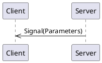
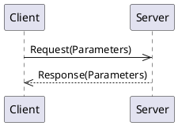
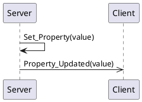
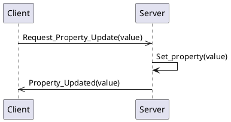

# Stinger Files

Stinger files are YAML files that describe interfaces for inter-process communication (IPC) using the Stinger IPC framework. These files define the structure and types of messages that can be sent and received between different components of a system.

## File Name

Stinger files should be named with the `.stinger.yaml` extension to indicate their purpose and format.
For example: `example_interface.stinger.yaml`

## Arguments

Structures, signals, methods, properties all take a list of arguments, though they might call the list different things:

Structures: `members`
Signals: `payload`
Methods: Have both `arguments` and `returnValues`
Properties: `values`

All arguments have required `name` and `type` fields.  See below for valid `type` values.

All arguments can have an optional `description` field which takes a string.  All arguments can have an optional `optional` field which takes a boolean; by default, arguments are not optional.

Structs and enums must have respective`structName` and `enumName` fields, where the value is the name of a struct or enum as defined in the stinger file.

Coming soon: Arguments can have a `schema` field consisting of JSON Schema.  The value of the argument is **runtime** evaluated against the schema.  The schema can restrict values.  For example, minimum and maximum on numbers, or a regex pattern on a string.

Example:

```yaml
- name: nick
  type: string
  optional: true
  description: A person's nick name
- name: age
  type: integer
  description: A person's age in years.
- name: address
  type: struct
  structName: addressFields
```

## Argument Types

* integer
* float
* boolean
* string
* datetime (coming soon)
* duration (coming soon)
* struct (see below)
* enum (see below)
* list (coming soon)

## Structure

A Stinger file typically contains the following:

- **Metadata**: Information about the interface, such as its name, version, title, and summary.
- **Types**: Enumerations and structures that define the data types used in the interface.
- **IPC Components**: Definitions of signals, methods, and properties that make up the interface.

## Minimal Example

Here is a minimal example that shows metadata and the sections for types and IPC components.  No types or components are defined in this example, which is why the sections are an empty mapping.

```yaml
stinger:
  version: 0.0.7

interface:
  name: example_interface
  version: 0.0.1
  title: Example Interface
  summary: An example Stinger interface
  documentation: |
    Markdown *documentation* can be provided.  It will be used in documentation and code generations.

enums: {}

structures: {}

signals: {}

methods: {}

properties: {}

```

## Enums

An example enumeration definition:

```yaml
enums:
  Color:
    documentation: An enumeration of colors
    values:
      - name: RED
        description: The color red
      - name: GREEN
        description: The color green
      - name: BLUE
        description: The color blue
      - name: YELLOW
        description: The color yellow
```

## Structs

```yaml
structures:
  Point:
    documentation: A 2D point
    members:
      - name: x
        type: float
        description: The x coordinate
      - name: y
        type: float
        description: The y coordinate
```

## Signals

Signals are messages from a server to clients.



```yaml
signals:
  PositionUpdated:
    documentation: Signal emitted when the position is updated
    payload:
      - name: position
        type: struct
        structName: Point
        description: The new position.
      - name: timestamp
        type: datetime
        description: The timestamp of the update.
```

## Methods

Methods are requests from a client to a server and the server provides a response back to the client:



Both `arguments` and `returnValues` are arrays which can have multiple elements.

```yaml
methods:
  MoveTo:
    documentation: Move to a new position
    arguments:
      - name: position
        type: struct
        structName: Point
        description: The target position.
    returnValues:
      - name: success
        type: boolean
        description: True if the move was successful, false otherwise.
```

## Properties

Properties are values (or a set of values) held by the server.   They are re-published when the value changes. 



If the property is not read only, the client may also request an update to a property.



```yaml
properties:
  position:
    documentation: The current position.
    values:
      - name: position
        type: struct
        structName: Point
        description: The current position.
      - name: color
        type: enum
        enumName: Color
        description: The color associated with the position.
```

## Validation

Stinger files can be validated against a schema to ensure they conform to the expected structure and types. 

Install `uv` ([install instructions](https://docs.astral.sh/uv/getting-started/installation/)) to use the uvx tool.

One line to validate your stinger file against the schema:

```bash
uvx stinger validate path/to/your_file.stinger.yaml
```
